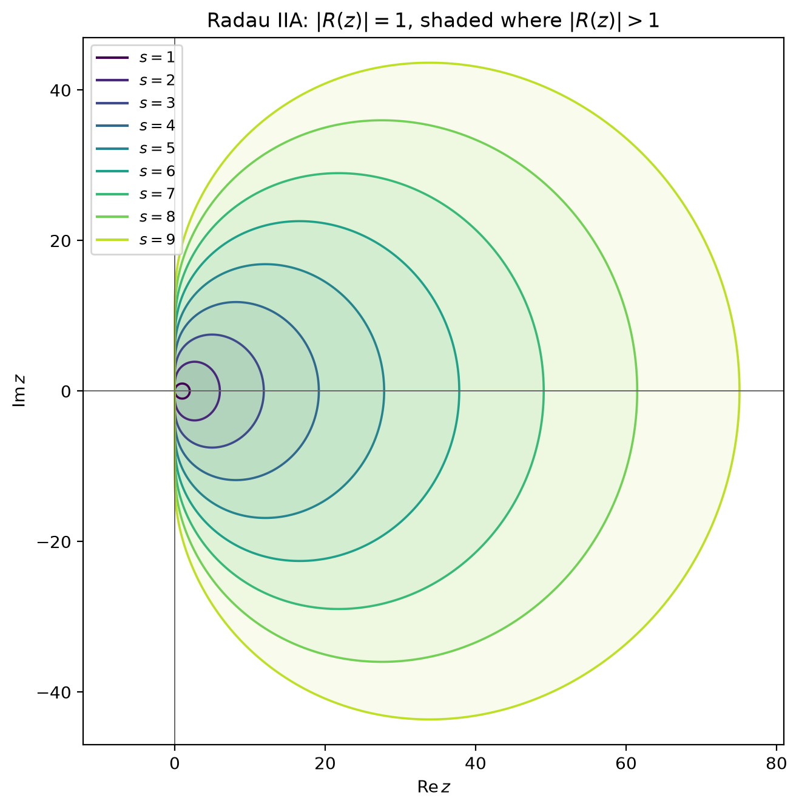
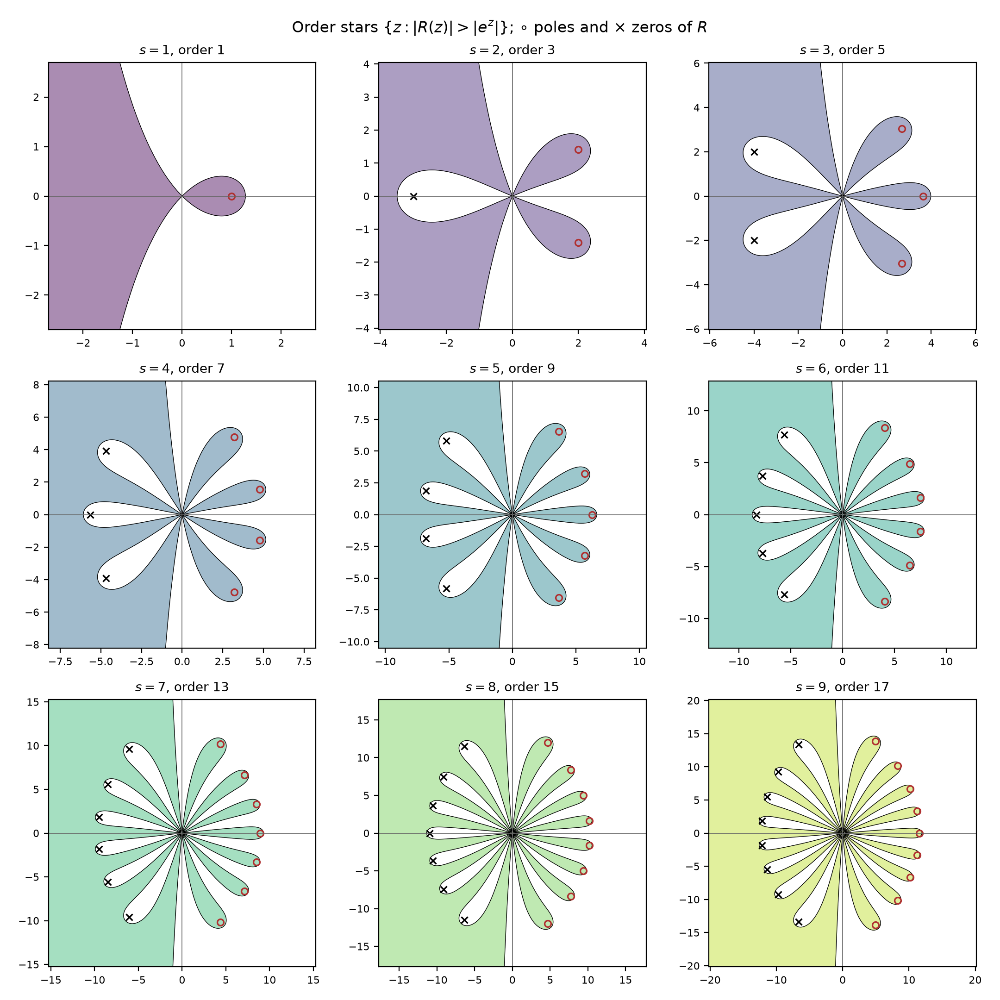
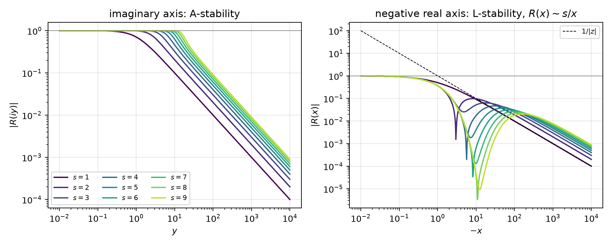
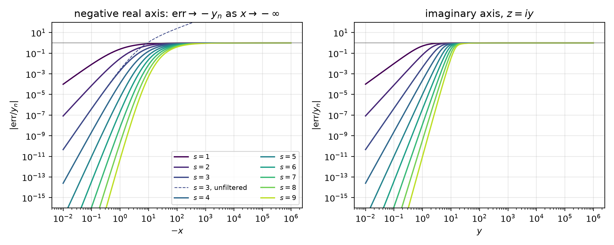

# FIRKODE v0.1.0 Design Document (October 2, 2026)

FIRKODE is a proposed SUNDIALS package for stiff initial value problems

$$
M \dot y = f(t, y), \quad y(t_0) = y_0, \quad y \in \mathbb{R}^N,
$$

integrated by the fully implicit Radau IIA Runge–Kutta methods.
This document is written for two groups:
the SUNDIALS developers and collaborators who decide whether the package belongs in the suite
(Chapters 1–3 and 5–7), and the implementer who builds it milestone by milestone (Chapters 4 and
8–11). The user guide is a deliverable of the milestones and is not duplicated here.

Status: a draft proposal based on SUNDIALS 7.9.0. The only pre-existing material is the supporting
tooling named in Appendix A (four stability figures and the script that draws them) and a Lean
pilot in `verification/lean`, cited only as evidence that the certification approach of
Milestone M7 is feasible.

Every claim that is not self-evident carries one of five evidence tags, so that the reader
can see what rests on a theorem, what on a computation, and what on nothing yet:

| Evidence tag         | Meaning                                                                                                |
| -------------------- | ------------------------------------------------------------------------------------------------------ |
| `[proved]`           | a theorem of the literature or a kernel-checked Lean statement                                         |
| `[derived]`          | computed from the method tables by a procedure described here and reproducible by the table generator  |
| `[cited]`            | a published result, with its reference                                                                 |
| `[fact: path]`       | read from the SUNDIALS sources at the given path (and line, where stable)                              |
| `[to measure]`       | no number exists; a measurement protocol and a milestone gate are given instead                        |

## 1. Summary

FIRKODE integrates $M \dot y = f(t, y)$ with constant nonsingular $M$ by the $s$-stage Radau IIA
collocation methods, which are A-stable, L-stable and stiffly accurate, with classical order $2s - 1$
and stage order $s$ `[proved]`. Version 0.1.0 ships the 3-stage method of order 5, the method of
Hairer and Wanner's RADAU5 [1996HW, 1999HW], with RADAU5's simplified Newton iteration, convergence
test, filtered error estimate and step-control heuristics. Later versions extend the same code path to
$1 \le s \le 9$ (orders 1 to 17), add RADAU's in situ order selection, and open the stage solver to
expert users.

### 1.1 What is new relative to RADAU5

RADAU5 transforms the $sN \times sN$ Newton
matrix to block-diagonal form and factors one real and $\left\lfloor \frac{s}{2} \right\rfloor$ complex $N \times N$
matrices. FIRKODE instead solves the stacked Newton system with flexible GMRES [1993S],
right-preconditioned by $I_s \otimes \left(M - h\gamma_0 J \right)$, where $\gamma_0$ is the reciprocal of the
real eigenvalue of $A^{-1}$. The preconditioner needs one real factorization per setup and is applied
by $s$ independent solves with the user's ordinary $N \times N$ `SUNLinearSolver`. Every linear
solver and preconditioner written for CVODE's or ARKODE's $M - \gamma J$ therefore works unchanged,
including matrix-free Krylov solvers, algebraic multigrid and batched GPU solvers, on any `N_Vector`.
The price is more block solves per Newton iteration than a direct complex factorization needs; Chapter
7 quantifies the break-even.

### 1.2 What FIRKODE adds to SUNDIALS

SUNDIALS has no fully implicit Runge–Kutta method. CVODE's
BDF methods are A-stable only up to order 2 [1963D], and ARKODE's diagonally implicit methods have stage
order at most 2 [2019KC], so neither offers a high-order L-stable method free of stage-order reduction on
stiff problems. Radau IIA is the classical answer to that gap, and SUNDIALS' shared vectors, linear
solvers, controllers, logging and profiling are what RADAU5 never had.

### 1.3 Design decisions

| ID | Decision                         | Verdict                                                                                                 | Principle | Revisit when                                           |
| -- | -------------------------------- | ------------------------------------------------------------------------------------------------------- | --------- | ------------------------------------------------------ |
| D1 | Position in SUNDIALS             | A standalone package, not an ARKODE stepper                                                             | P1, P3    | ARKODE gains a stage-coupled linear-solver interface   |
| D2 | Stage linear algebra             | Real FGMRES with the single-shift block preconditioner; no complex arithmetic                           | P4        | measured $k_{lin}$ for $s \ge 5$ exceeds about $2s$    |
| D3 | Nonlinear iteration              | An internal simplified-Newton loop with RADAU5's test, not a `SUNNonlinearSolver`                       | P4        | a semantic conflict with the hook interface disappears |
| D4 | Stage storage                    | An `NVECTOR_MANYVECTOR` of $s$ clones of the user's vector; `MPIMANYVECTOR` under MPI                   | P1        | GPU launch overhead is measured to dominate            |
| D5 | Step control                     | `SUNAdaptController` with $p = s$ plus RADAU5's safety, limits and dead band applied by FIRKODE         | P1        | never; only the defaults                               |
| D6 | Method tables                    | Generated decimal literals, checked in CI, optionally certified in Lean                                 | P1        | adding $s > 9$                                         |
| D7 | Order                            | v0.1.0: $s = 3$; v0.2: any $1 \le s \le 9$ in EXPERT mode; v0.3: in situ odd order in BEGINNER mode     | P2        | calibration data from v0.2                             |
| D8 | Modes                            | BEGINNER exposes the essentials and rejects every other setter; EXPERT unlocks everything               | P2        | user feedback                                          |
| D9 | Jacobian and factorization reuse | RADAU5's policy (BEGINNER default) or CVODE's periodic policy; the step driver decides, FIRKLS executes | P4        | M4 shows the better policy depends on the block solver |

*Table 1.1. Decision record; D-numbers refer to Chapter 5. The principles P1–P4 are stated in
Chapter 2.*

### 1.4 Scope

#### In v0.1.0

Milestones M0–M3 of Chapter 10, that is a RADAU5-equivalent integrator with
SUNDIALS' interfaces, rootfinding, a constant mass matrix, logging, profiling, command-line options,
and a validation suite that later versions run unchanged.

#### Not in v0.1.0

$s \ne 3$, order selection,
EXPERT hooks, SUNStepper glue, time-dependent or singular $M$, sensitivities, relaxation, resizing,
and language bindings. Chapter 7 states the costs and risks, and what is asked of the SUNDIALS
maintainers.

## 2. Guiding principles

Four principles decide every trade-off in this document. Each decision in Chapter 5 and each cut in
Chapter 10 names the principle it follows.

- **P1: Plan for the long term.** FIRKODE is unfunded work. Maintainability and a bounded maintenance
  surface take precedence over features. Shared SUNDIALS components are reused wherever they fit, and
  nothing is written that a shared component already provides. Every milestone is useful on its own
  and small enough for one person to finish and one reviewer to read.
- **P2: Limit the scope of v0.1.0.** No feature is added because it looks attractive. Version 0.1.0 is
  a RADAU5-equivalent integrator for $s = 3$. The method family, order selection, expert hooks and
  SUNStepper glue are versioned follow-ups with their own acceptance criteria, and BEGINNER mode
  exposes only what a user needs who has no deep understanding of fully implicit methods.
- **P3: Do not optimize for use as an inner step.** FIRK methods are not tuned for service as the
  implicit stage of multirate, splitting or other advanced methods. The SUNStepper interface is the
  last optional milestone, the argument for a standalone package does not rest on composability, and
  no example uses FIRKODE inside another integrator.
- **P4: Nonlinear-solver performance is critical.** The cost of a fully implicit method is the cost of
  its Newton iteration. The stacked iteration, the block-preconditioned stage solve, the Jacobian and
  factorization reuse policies, and the measurement gates on Krylov iteration counts are the centre of
  the architecture and of the cost model. The expert hooks of v0.4 exist to let users change the stage
  solver, not for generality.

## 3. Motivation

### 3.1 The gap in SUNDIALS

SUNDIALS has no integrator that is at the same time A-stable at order above 2, L-stable, free of
stage-order reduction, and one-step. Table 3.1 lists the suite's integrators and the properties that
matter for stiff problems.

| Integrator              | Methods and orders                                                                 | A-stable orders                                                        | L-stable orders           | Stage order                    | Stiffly accurate   | Mass matrix                 | Dense output                                                          | Variable order   |
| ----------------------- | ---------------------------------------------------------------------------------- | ---------------------------------------------------------------------- | ------------------------- | ------------------------------ | ------------------ | --------------------------- | --------------------------------------------------------------------- | ---------------- |
| CVODE, Adams            | Adams–Moulton 1–12 `[fact: src/cvode/cvode_impl.h]`                                | 1, 2 `[cited]`                                                         | 1                         | not applicable                 | no                 | no                          | Nordsieck polynomial, degree $q$                                      | yes              |
| CVODE, BDF              | BDF 1–5 `[fact: src/cvode/cvode_impl.h]`                                           | 1, 2; $A(\alpha)$ with $\alpha = 86^\circ, 73^\circ, 52^\circ$ for 3–5 [1996HW, §V.2] | 1, 2                      | not applicable                 | no (multistep)     | no                          | Nordsieck polynomial, degree $q$                                      | yes              |
| IDA                     | BDF 1–5 on $F(t, y, \dot y) = 0$ `[fact: src/ida/ida_impl.h]`                      | as CVODE BDF                                                           | 1, 2                      | not applicable                 | no                 | implicit form, index-1 DAEs | divided differences, degree $q$                                       | yes              |
| ARKStep, DIRK/ESDIRK    | tables of orders 2–5 `[fact: include/arkode/arkode_butcher_dirk.h]`                | tables of every order 2–5                                              | tables of every order 2–5 | 1 (SDIRK), 2 (ESDIRK) [2019KC] | many tables        | yes (ARKStep only)          | Hermite or Lagrange, degree $\le 5$ `[fact: include/arkode/arkode.h]` | no               |
| ARKStep, IMEX           | ARK pairs of orders 2–5                                                            | implicit part as above                                                 | as above                  | as above                       | as above           | yes                         | as above                                                              | no               |
| ERKStep                 | explicit tables of orders 2–9 `[fact: include/arkode/arkode_butcher_erk.h]`        | none                                                                   | none                      | 1                              | no                 | no                          | as above                                                              | no               |
| LSRKStep                | RKC and RKL (order 2), SSP (orders 2–4) `[fact: include/arkode/arkode_lsrkstep.h]` | none (explicit, extended real stability)                               | none                      | 1                              | no                 | no                          | as above                                                              | no               |
| SPRKStep                | symplectic partitioned, orders 1–10 `[fact: include/arkode/arkode_sprk.h]`         | none                                                                   | none                      | not applicable                 | no                 | no                          | as above                                                              | no               |
| MRIStep                 | MRI-GARK 1–4, IMEX-MRI-SR 2–4, MERK 2–5 `[fact: include/arkode/arkode_mristep.h]`  | slow implicit part as DIRK                                             | as DIRK                   | as DIRK                        | as DIRK            | no                          | as above                                                              | no               |
| FIRKODE (proposed)      | Radau IIA, $s = 3$ (order 5) in v0.1.0; $1 \le s \le 9$ (orders 1–17) from v0.2    | all `[proved]`                                                         | all `[proved]`            | $s$ `[proved]`                 | all `[proved]`     | yes, constant nonsingular   | collocation polynomial, degree $s$                                    | v0.3             |

*Table 3.1. Integrators of SUNDIALS 7.9.0 and the properties that matter for stiff problems. The*
$A(\alpha)$ *angles are rounded.*

Two consequences for stiff problems follow from the table.

- **Oscillatory stiff spectra.** When $J$ has eigenvalues of large modulus near the imaginary axis,
  for example in wave-dominated or weakly damped mechanical problems, BDF orders above 2 lose
  stability and CVODE must reduce its order. Radau IIA is A-stable at every order `[proved]`, so its
  order is limited by accuracy alone.
- **Stage-order reduction.** On stiff problems the observed order of a Runge–Kutta method is governed
  by its stage order rather than its classical order [1974PR, 1985FSU]. A DIRK method with stage order
  1 or 2 then converges at order about 2 to 3 whatever its classical order. Radau IIA has stage order
  $s$, so the 3-stage method keeps order at least 3, and typically more, on the same problems. Section
  4.2 states the result precisely, and the validation plan measures it on the Prothero–Robinson family.

### 3.2 Why fully implicit Runge–Kutta? Why Radau IIA?

Among implicit Runge–Kutta families, Radau IIA alone combines L-stability, stiff accuracy, stage
order $s$ and classical order $2s - 1$ [1996HW, §IV.5]. Table 3.2 lists the alternatives and what
rules each out as the primary method.

| Family                  | Order                | Stage order   | A-stable               | L-stable                          | Stiffly accurate       | Stage coupling                          | Reason not chosen                                                            |
| ----------------------- | -------------------- | ------------- | ---------------------- | --------------------------------- | ---------------------- | --------------------------------------- | ---------------------------------------------------------------------------- |
| Radau IIA               | $2s - 1$             | $s$           | yes                    | yes                               | yes                    | full, complex eigenvalues of $A$        | chosen                                                                       |
| Radau IA                | $2s - 1$             | $s$           | yes                    | yes                               | no                     | full                                    | not stiffly accurate; the update needs a quadrature of the stage derivatives |
| Gauss                   | $2s$                 | $s$           | yes                    | no, $\lvert R(\infty) \rvert = 1$ | no                     | full                                    | no damping of stiff components; not stiffly accurate                         |
| Lobatto IIIC            | $2s - 2$             | $s - 1$       | yes                    | yes                               | yes                    | full                                    | one order and one stage order less than Radau IIA for the same $s$           |
| SDIRK, ESDIRK           | $\le 5$ in practice  | 1, 2          | by construction        | by construction                   | by construction        | diagonal, one real eigenvalue           | stage-order reduction [2019KC]; already in ARKODE                            |
| Singly implicit (SIRK)  | $\le s + 1$ [1977NW] | $s$           | for suitable $\lambda$ | for suitable $\lambda$            | for suitable $\lambda$ | one real eigenvalue of multiplicity $s$ | order barrier $s + 1$; optional later milestone (M10)                        |
| Rosenbrock, W-methods   | $\le 4$ in practice  | low           | by construction        | by construction                   | no                     | linearly implicit                       | exact Jacobian every step, or order reduction with inexact $J$               |

*Table 3.2. Implicit Runge–Kutta families considered. Properties are classical results [1996HW, Ch.
IV]; the Radau IIA row is also machine-checked for* $s \le 9$ *`[proved]`.*

A one-step method brings further practical gains over the suite's multistep integrators: no startup
phase, step changes at no cost, and a collocation polynomial that serves dense output, rootfinding and
the Newton predictor without extra work (Section 4.9). The honest counterweight appears in Figure 3 of
Appendix A: the damping of stiff components per step, $\lvert R(z) \rvert \sim \frac{s}{\lvert z \rvert}$ as
$\lvert z \rvert \to \infty$, weakens as $s$ grows, which is one reason the default order range of
RADAU, and of FIRKODE from v0.3, stops at $s = 7$.

RADAU5 has a thirty-year production record and is the reference against which stiff solvers are still
compared [1996HW, §IV.10; 2025ESR]. All adaptive Radau codes in Chapter 6 keep its core: simplified
Newton with one Jacobian per step, a filtered embedded error estimate and Gustafsson's predictive
controller [1994G]. FIRKODE keeps that core and replaces the complex transformation.

### 3.3 Why now?

Two developments make a fully implicit package natural today, where it was not when CVODE and ARKODE
were designed.

First, the shared infrastructure that a block-preconditioned stage solver needs now exists in SUNDIALS.
Table 3.3 lists what FIRKODE reuses and the release that introduced it.

| Component                                  | Release `[fact: CHANGELOG.md]`   | FIRKODE uses it for                                                       | What would otherwise be written                          |
| ------------------------------------------ | -------------------------------- | ------------------------------------------------------------------------- | -------------------------------------------------------- |
| `NVECTOR_MANYVECTOR`, `MPIMANYVECTOR`      | 5.0.0                            | the stacked vector of $s$ stage increments on any backend                 | a stage multivector for every backend                    |
| `SUNLinSol_SPFGMR`                         | 3.0.0                            | the Krylov solver for the $sN$ Newton system                              | a flexible GMRES on stacked vectors                      |
| `SUNContext`, `SUNProfiler`                | 6.0.0                            | error handlers, profiling regions                                         | ad hoc error and timing code                             |
| `SUNLogger`                                | 6.2.0                            | per-step, per-iteration records in ARKODE's format                        | a private log format                                     |
| `SUNAdaptController`                       | 6.7.0                            | step control, with every built-in controller selectable                   | the controllers of Section 4.7                           |
| command-line option helpers (`SetOptions`) | 7.5.0                            | `firkode.key value` parsing, as ARKODE                                    | an option parser                                         |
| `SUNDomEigEstimator`                       | 7.5.0                            | spectral information for the v0.4 hooks                                   | a power iteration                                        |
| `SUNStepper`                               | 7.2.0                            | the optional glue of M8 only (P3)                                         | nothing in v0.1.0                                        |

*Table 3.3. Shared SUNDIALS infrastructure reused by FIRKODE.*

Second, the solver technology that makes fully implicit methods competitive at scale is recent and is
not available in any general-purpose C library: block preconditioners with mesh- and step-independent
bounds [2006SMN, 2007MNS, 2024GO], stage-parallel Radau IIA at the strong-scaling limit [2024M+],
monolithic multigrid for the stage system [2005VV, 2024K], real preconditioners for the complex
conjugate pairs [2022SKPD], and automated Radau IIA for finite elements in Irksome [2021FKM, 2025KM].
A fully adaptive Radau code in Julia reports gains over RADAU5 at tight tolerances [2025ESR]. FIRKODE
brings this class of method to the vectors, linear solvers and preconditioners that SUNDIALS users
already have.

### 3.4 Why this design?

Each decision below is argued in Chapter 5; this section states the thread that connects them.

- A standalone package, because the stage-coupled linear algebra and RADAU5's coupling of Newton rate,
  step control and order control do not fit ARKODE's per-stage interfaces (D1).
- One real shift and flexible GMRES, because SUNDIALS has no stable complex types and because the user's
  existing $N \times N$ solver and preconditioner are the asset to protect (D2).
- An internal Newton loop with RADAU5's three-way test, because the test's step-size recommendation
  has no channel through the `SUNNonlinearSolver` interface (D3).
- A ManyVector stack, because it costs no new vector code and runs on every backend (D4).
- RADAU5's heuristics generalized to any $s$ through `SUNAdaptController`, so that the suite's
  controllers are available and RADAU5's behavior is the BEGINNER default (D5).
- Generated, certified tables, because platform-independent literals are reviewable and provable
  (D6).

### 3.5 Scope and non-goals

In scope for v0.1.0: $M \dot y = f(t, y)$ with constant nonsingular $M$, forward and backward
integration, the 3-stage method, adaptive and fixed steps, rootfinding, dense output, the complete
CVODE and ARKODE linear-solver interface for the block $M - \gamma J$, logging, profiling, statistics,
command-line options and a validation suite.

Not in scope:

- **Singular** $M$ **and DAEs.** Radau IIA is a classical DAE method up to index 3 [1989HLR], but
  consistent initialization and index-aware error scaling are a project of their own. IDA covers
  index-1 DAEs today. Milestone M9 sketches time-dependent $M$; singular $M$ remains open.
- **Sensitivities, relaxation, resizing, constraints.** Not needed for the stiff-ODE use case and
  each would widen the maintenance surface (P1).
- **Language bindings.** The C API is kept bindable (Section 9.4); SWIG-Fortran and `sundials4py`
  bindings are a follow-up once the API has settled.
- **Device-specific kernels.** Any `N_Vector` works through its own operations. No GPU-specific code.

### 3.6 Migrate to FIRKODE

The target user integrates a stiff system with CVODE or ARKStep today and either needs higher order
with L-stability, has an oscillatory stiff spectrum, works at tight tolerances, or needs a mass
matrix with a stiffly accurate method. The interface is similar to CVODE and ARKODE: the same
callbacks, the same linear-solver attachment, the same tolerance and stop-time semantics.

| CVODE call                                                                                                                                                                       | FIRKODE call                                                     | Note                                                                                                                                         |
| -------------------------------------------------------------------------------------------------------------------------------------------------------------------------------- | ---------------------------------------------------------------- | -------------------------------------------------------------------------------------------------------------------------------------------- |
| `CVodeCreate(CV_BDF, sunctx)`                                                                                                                                                    | `FIRKodeCreate(sunctx)`                                          | one method family; `SetMaxOrd` has no analogue in v0.1.0                                                                                     |
| `CVodeInit(mem, f, t0, y0)`                                                                                                                                                      | `FIRKodeInit(mem, f, t0, y0)`                                    | identical RHS signature                                                                                                                      |
| `CVodeSStolerances`, `SVtolerances`, `WFtolerances`                                                                                                                              | same names                                                       | WRMS weights at $y_n$; no RADAU5 tolerance transformation                                                                                    |
| `CVodeSetLinearSolver(mem, LS, A)`                                                                                                                                               | `FIRKodeSetLinearSolver(mem, LS, A)`                             | the solver targets the block $M - \gamma J$; a Krylov `SUNLinearSolver` contributes only its preconditioner to the stage solve (Section 8.6) |
| `CVodeSetJacFn`, `SetJacTimes`, `SetPreconditioner`, `SetLinSysFn`, `SetEpsLin`, `SetLSetupFrequency`, `SetJacEvalFrequency`, `SetDeltaGammaMaxLSetup`, `SetDeltaGammaMaxBadJac` | same names                                                       | identical callback signatures; all evaluated at $(t_n, y_n)$ with $\gamma = h\gamma_0$                                                       |
| `CVodeSetMaxNonlinIters(3)`, `SetNonlinConvCoef(0.1)`                                                                                                                            | same names, defaults 7 and 0.1                                   | EXPERT mode                                                                                                                                  |
| `CVodeSetNonlinearSolver`                                                                                                                                                        | none                                                             | the Newton iteration is internal (D3)                                                                                                        |
| `CVode(mem, tout, y, &t, CV_NORMAL)`                                                                                                                                             | `FIRKodeEvolve(mem, tout, y, &t, FIRK_NORMAL)`                   | same `tstop`, root and one-step semantics                                                                                                    |
| `CVodeGetDky(mem, t, k, dky)`                                                                                                                                                    | `FIRKodeGetDky(mem, t, k, dky)`                                  | $0 \le k \le s$, collocation polynomial of the last step                                                                                     |
| `CVodeRootInit`, `SetRootDirection`, `GetRootInfo`                                                                                                                               | same names                                                       | ARKODE's Illinois rootfinder on the collocation polynomial                                                                                   |
| `CVodeSetStabLimDet`, `SetConstraints`, `SetUseIntegratorFusedKernels`, `CVodeResizeHistory`                                                                                     | none                                                             | no analogue                                                                                                                                  |
| `CVodeSetOptions(mem, "cvode", NULL, argc, argv)`                                                                                                                                | `FIRKodeSetOptions(mem, "firkode", NULL, argc, argv)`            | one key per scalar setter                                                                                                                    |
| `CV_*` return codes                                                                                                                                                              | `FIRK_*`                                                         | CVODE numbering where the meaning is shared (Table 8.2)                                                                                      |

*Table 3.4. Migrating from CVODE.*

| ARKStep call                                                                                                                                                         | FIRKODE call                                          | Note                                                                        |
| -------------------------------------------------------------------------------------------------------------------------------------------------------------------- | ----------------------------------------------------- | --------------------------------------------------------------------------- |
| `ARKStepCreate(NULL, fi, t0, y0, sunctx)`                                                                                                                            | `FIRKodeCreate`, `FIRKodeInit`                        | implicit RHS only                                                           |
| `ARKodeSetMassLinearSolver(mem, LS, M, time_dep)`                                                                                                                    | `FIRKodeSetMassLinearSolver(mem, LS, M, SUNFALSE)`    | `time_dep = SUNTRUE` is rejected in v0.1.0 (M9)                             |
| `ARKodeSetMassFn`, `SetMassTimes`, `SetMassPreconditioner`, `SetMassEpsLin`                                                                                          | same names                                            | identical signatures                                                        |
| `ARKodeSetAdaptController(mem, C)`                                                                                                                                   | same name                                             | EXPERT mode; the controller receives $p = s$, not an embedding order        |
| `ARKodeSetSafetyFactor`, `SetMaxGrowth`, `SetMinReduction`, `SetFixedStepBounds`, `SetMaxFirstGrowth`, `SetMaxEFailGrowth`, `SetSmallNumEFails`, `SetMaxCFailGrowth` | same names                                            | EXPERT mode; same semantics                                                 |
| `ARKStepSetTables`, `ARKodeSetOrder`                                                                                                                                 | `FIRKodeSetTable` (v0.4), `FIRKodeSetOrder` (v0.2)    | `SetOrder(q)` picks the smallest $s$ with $2s - 1 \ge q$                    |
| `ARKodeSetInterpolantType`, `SetInterpolantDegree`                                                                                                                   | none                                                  | the collocation polynomial is the interpolant                               |
| `ARKodeSetNonlinCRDown`, `SetNonlinRDiv`                                                                                                                             | `FIRKodeSetNonlinDivergenceRate`                      | RADAU5's test replaces the CVODE/ARKODE rate test                           |
| `ARKodeResize`, `SetRelaxFn`, `SetPostprocessStageFn`, `SetStagePredictFn`, `SetDeduceImplicitRhs`                                                                   | none                                                  | no analogue                                                                 |
| `ARKodeCreateSUNStepper`                                                                                                                                             | `FIRKodeCreateSUNStepper` (optional M8)               | not in v0.1.0 (P3)                                                          |

*Table 3.5. Migrating from ARKStep.*

Inside the suite, Table 6.3 says which package to reach for; FIRKODE is the answer for stiff problems
with oscillatory spectra, tight tolerances, or a mass matrix that needs a stiffly accurate high-order
method.

## 4. Mathematical formulation

This chapter defines the algorithms.
Decisions and their alternatives are in Chapter 5;
the data structures and control flow for the algorithms are in Chapter 8.

### 4.1 Problem class

$$
M \dot y = f(t, y),
\quad y(t_0) = y_0,
\quad y \in \mathbb{R}^N.
$$

- $M$ is constant and nonsingular. It is the identity unless a mass matrix is attached.
- Integration runs forward or backward in $t$.
- $J = \frac{\partial f}{\partial y}$ is the Jacobian, $u$ the unit roundoff, and $\lVert \cdot \rVert$ the
  WRMS norm with the weights $w_i = \frac{1}{\mathrm{rtol} \lvert y_i \rvert + \mathrm{atol}_i}$,
  evaluated at the start of each step.

### 4.2 Radau IIA methods

The $s$-stage Radau IIA method is the collocation method on the nodes $0 < c_1 < \dots < c_s = 1$,
the zeros of $P_s(2c - 1) - P_{s-1}(2c - 1)$ with $P_k$ the Legendre polynomial of degree $k$
[1964Bb, 1969A]. Its coefficients satisfy $C(s)$,

$$
\sum_{j=1}^{s} a_{ij} c_j^{k-1} = \frac{c_i^k}{k},
\quad i, k = 1, \dots, s,
$$

and $b_j = a_{sj}$, so the method is stiffly accurate.

- Order $2s - 1$, from $B(2s-1)$, $C(s)$ and $D(s-1)$ [1964Ba, 1993HNW]; stage order $s$ `[proved]`.
- The stability function is the $(s-1, s)$ Padé approximant of $e^z$ `[proved]`. The method is
  A-stable and L-stable [1978WHN, 1996HW] `[proved]`; Figures 1–3 in Appendix A plot $R(z)$ for
  $1 \le s \le 9$.
- On stiff problems the observed order lies between the stage order and the classical order. On the
  Prothero–Robinson problem it is at least $s$, and $s + 1$ in the stiff limit, where a DIRK method
  is limited to about its stage order plus one [1974PR, 1985FSU; 1996HW, §IV.15].
- $s = 3$ is RADAU5 and the only method of v0.1.0. Later versions provide $1 \le s \le 9$, orders 1
  to 17; $s = 1$ is the implicit Euler method.

### 4.3 Stage equations

With step size $h$ and stage increments $Z_i = Y_i - y_n$, one step solves the $sN$ equations

$$
M Z_i = h \sum_{j=1}^{s} a_{ij} f(t_n + c_j h, y_n + Z_j),
\quad i = 1, \dots, s,
$$

and then sets

$$
y_{n+1} = y_n + \sum_{j=1}^{s} d_j Z_j,
\quad d^T = b^T A^{-1}.
$$

#### Where does $d$ come from?

Write $F_j = f(t_n + c_j h, Y_j)$. The stage equations read
$(I_s \otimes M) Z = h (A \otimes I_N) F$, and $A$ is nonsingular for a collocation method
($\det A = \frac{\prod_i c_i}{s!}$). Hence $h F = (A^{-1} \otimes M) Z$, and the quadrature update
$M (y_{n+1} - y_n) = h \sum_j b_j F_j$ becomes $M \sum_j d_j Z_j$. The update needs neither the
$F_j$ nor $M^{-1}$.

#### Why is $d = \mathbf{e}_s$ for Radau IIA?

Let $\mathbf e_s = (0, \dots, 0, 1)^T$ be the last unit
vector of $\mathbb{R}^s$. Stiff accuracy means $b^T$ is the last row of $A$, that is
$b^T = \mathbf e_s^T A$, so $d^T = \mathbf e_s^T$ and $y_{n+1} = y_n + Z_s$ `[proved]`.
Equivalently, $c_s = 1$ puts the last collocation point at the end of the step, so the last stage
value is the collocation polynomial there. The step ends with one vector addition.

#### Why use increments?

The Newton iteration determines $Z$ to the tolerance $\epsilon_{nls}$. Any error
in $Y_j$ is amplified by $\lVert J \rVert$ in $F_j$, and $h \lVert J \rVert \gg 1$ on stiff
components, so the form $y_n + h \sum_j b_j F_j$ inherits that amplification while
$y_n + \sum_j d_j Z_j$ does not [1996HW, §IV.8]. The same holds for roundoff in $F_j$.

#### General tables

The integrator stores $d$ with every table and applies the sum above in general
form, so a table that is not stiffly accurate, a Gauss or a singly implicit one, runs on the same
core (Milestone M10). For Radau IIA the sum collapses to a copy of $Z_s$.

#### Notation notes

The bold $\mathbf{e}_s$ is the unit vector. The italic $e$ of Section 4.6 is the
estimate weight vector $e^T = (\hat b - b)^T A^{-1}$; its last entry is $e_s = (-1)^s \frac{\gamma_0}{s}$
`[proved]`.

### 4.4 Simplified Newton iteration

Stack the increments in $Z \in \mathbb{R}^{sN}$ and let $G(Z)$ be the residual of the stage
equations, $G_i(Z) = M Z_i - h \sum_j a_{ij} F_j$. Starting from the predictor $Z^{(0)}$ of Section
4.9, iteration $k = 1, 2, \dots, m$ computes

$$
(I_s \otimes M - hA \otimes J)\, \delta^{(k)} = -G(Z^{(k-1)}),
\quad Z^{(k)} = Z^{(k-1)} + \delta^{(k)},
$$

with $J$ evaluated at $(t_n, y_n)$ and reused over several steps. The convergence test is RADAU5's
[1996HW, §IV.8], in the WRMS norm over all $sN$ components, with every stage weighted by the weights of
$y_n$. Write $\hat\theta_k = \frac{\lVert \delta^{(k)} \rVert}{\lVert \delta^{(k-1)} \rVert}$ for the
ratio of successive increments.

#### Rate

$\theta_2 = \hat\theta_2$; for $3 \le k < m$, $\theta_k = \sqrt{\hat\theta_k \hat\theta_{k-1}}$,
the geometric mean of the last two ratios. The convergence factor is
$\eta_k = \frac{\theta_k}{1 - \theta_k}$.

#### First iteration

No rate exists, so $\eta_1 = \max(\eta_{\mathrm{prev}}, u)^{0.8}$, where
$\eta_{\mathrm{prev}}$ is the final factor of the previous Newton solve, 1 before the first.

#### Divergence

If $\theta_k \ge 0.99$ the solve fails and the step is halved.

#### Predicted failure

If $\eta_k\, \theta_k^{\,m-1-k}\, \lVert \delta^{(k)} \rVert > \epsilon_{nls}$,
convergence is not expected within the remaining iterations; the solve fails and the step is
multiplied by $0.8\, q^{-\frac{1}{4 + m - 1 - k}}$ with
$q = \mathrm{clamp}\Bigl(\frac{\eta_k \theta_k^{\,m-1-k} \lVert \delta^{(k)} \rVert}{\epsilon_{nls}},\ 10^{-4},\ 20\Bigr)$.
The exponent $m - 1 - k$ is RADAU5's; it predicts at the second-to-last iteration.

#### Stop

The update is applied, and the iteration stops when
$\eta_k \lVert \delta^{(k)} \rVert \le \epsilon_{nls}$, default $\epsilon_{nls} = 0.1$.

#### Exhaustion

If $k = m$ without convergence the solve fails and the step is halved. Default $m = 7$.

#### Order of the tests

The divergence and prediction tests precede the update of $Z$, and the stop test follows it, as in
RADAU5. The linear systems are solved inexactly, within the theory of [1982DES, 2000J]; Section 5.10
gives the inner tolerances. A linear problem converges in at most two iterations when $J$ is current,
which the Dahlquist test of Chapter 11 checks.

### 4.5 Single-shift block preconditioning

The Newton matrix $K = I_s \otimes M - hA \otimes J$ couples all stages. RADAU5 transforms $A^{-1}$ to
real block-diagonal form and factors one real and $\lfloor \frac{s}{2} \rfloor$ complex $N \times N$ matrices
[1976B, 1977B]. FIRKODE instead solves $K \delta = r$ with right-preconditioned flexible GMRES
[1993S] and the preconditioner

$$
P = I_s \otimes (M - \gamma J),
\quad \gamma = h \gamma_0.
$$

- Odd $s$: $\gamma_0 = \frac{1}{U_1}$, with $U_1$ the unique real eigenvalue of $A^{-1}$ `[proved]`. One
  mode is preconditioned exactly. For $s = 3$ this is RADAU5's real factor.
- Even $s$: $A^{-1}$ has no real eigenvalue `[proved]`. $\gamma_0 = \frac{1}{\mathrm{Re}\, \lambda_\ast}$, with $\lambda_\ast$ the eigenvalue of $A^{-1}$ of smallest modulus. This is a
  heuristic without an exactly preconditioned mode; even $s$ is an EXPERT-mode option (D7).
- Applying $P^{-1}$ costs $s$ independent solves with one matrix. For $s = 1$, $P = K$ and the
  Krylov iteration is skipped.

Assume $M^{-1} J = V \Lambda V^{-1}$ with $\mathrm{Re}\, \lambda \le 0$, and let $\mu_j$ be the
eigenvalues of $A$. Then $K P^{-1}$ is similar to a diagonal matrix with the entries

$$
w_j(z) = \frac{1 - z \mu_j}{1 - \gamma_0 z},
\quad z = h \lambda.
$$

Each $w_j$ is a Möbius map with its pole in the right half-plane, so it maps $\mathrm{Re}\, z \le 0$
onto a closed disk $D_j$ through $1$ and $\frac{\mu_j}{\gamma_0}$. The spectrum lies in $\cup_j D_j$ for
every $h$ and $N$. With $p(w) = \left(1 - \frac{w}{c}\right)^k$ in the GMRES bound [1986SS], exact block solves give

$$
\frac{\lVert r_k \rVert}{\lVert r_0 \rVert} \le \kappa\, \rho_\ast(\gamma_0)^k,
\quad
\rho_\ast(\gamma) = \min_{c > 0} \max_{w \in \cup_j D_j} \Bigl\lvert 1 - \frac{w}{c} \Bigr\rvert,
$$

where $\kappa$ collects the conditioning of the eigenvector matrices. The bound is independent of the
mesh and the step, the property that makes block preconditioners order-optimal for parabolic problems
[2006SMN, 2007MNS, 2024GO]. For a non-normal $J$ the dependence enters through $\kappa$.

| $s$                          | 2       | 3       | 4       | 5       | 6       | 7       | 8       | 9       |
| ---------------------------- | ------- | ------- | ------- | ------- | ------- | ------- | ------- | ------- |
| $\rho_\ast(\gamma_0)$        | 0.577   | 0.766   | 0.847   | 0.897   | 0.925   | 0.946   | 0.959   | 0.969   |
| $k$ for a 20-fold reduction  | 6       | 12      | 19      | 28      | 39      | 54      | 71      | 96      |

*Table 4.1. Worst-case contraction per FGMRES iteration and the iteration count* $k$ *that
guarantees a 20-fold residual reduction when* $\kappa = 1$ *`[derived]`. Appendix B describes the
computation; the table generator of Milestone M0 reproduces it with `--table1`.*

The bound is pessimistic: GMRES exploits the clustering of the spectrum on $s$ curves, and the
block solves are inexact in practice. Actual iteration counts for every $s$ are `[to measure]`
(Milestone M4, Section 11.4); until then the Krylov defaults of Section 5.10 are provisional. With
$\mathrm{maxl} = 3s$ and one restart, FGMRES allows $6s$ iterations, which falls below the
worst-case $k$ of Table 4.1 for $s \ge 7$.

### 4.6 Temporal error estimate

Let $\hat b$ be the embedded quadrature of order $s$ that adds the left end point with weight
$\gamma_0$, and let $e^T = (\hat b - b)^T A^{-1}$, so that $e_j = -\frac{\gamma_0\, l_j(0)}{c_j}$ with $l_j$
the Lagrange basis on the nodes `[proved]`. The estimate is

$$
\mathrm{err} = (M - \gamma J)^{-1} \Bigl[ \gamma f(t_n, y_n) + \sum_{i=1}^{s} e_i M Z_i \Bigr],
\quad \gamma = h \gamma_0,
$$

of order $p = s$, that is with local error $O(h^{s+1})$ [1996HW, 1999HW] `[proved]` for the
polynomial-exactness identity; the $O(h^{s+1})$ bound for smooth $f$ is the standard argument. For
$s = 3$ the weights are RADAU5's `[proved]`.

- The filter $(M - \gamma J)^{-1}$ reuses the preconditioner's matrix and keeps the estimate bounded
  for stiff components as $h \to \infty$ (Figure 4).
- $\mathrm{dsm} = \max(\lVert \mathrm{err} \rVert, 10^{-10})$; the floor is RADAU5's and also keeps
  the controller away from $\mathrm{dsm} = 0$. The step is accepted if $\mathrm{dsm} \le 1$.
- On the first step and after a rejection, a failing estimate is filtered again with
  $f(t_n, y_n + \mathrm{err})$ in place of $f(t_n, y_n)$, as in RADAU5. The refilter is on by
  default; turning it off is an EXPERT option.

### 4.7 Step-size control

The controllers of [2003S, 2025KC] have the form

$$
h_{n+1} = \kappa\, h_n
\Bigl( \frac{\epsilon}{\lVert \delta_n \rVert} \Bigr)^{\alpha}
\Bigl( \frac{\lVert \delta_{n-1} \rVert}{\epsilon} \Bigr)^{\beta}
\Bigl( \frac{\epsilon}{\lVert \delta_{n-2} \rVert} \Bigr)^{\gamma}
\Bigl( \frac{h_n}{h_{n-1}} \Bigr)^{a}
\Bigl( \frac{h_{n-1}}{h_{n-2}} \Bigr)^{b},
$$

with $\kappa$ the safety factor, $\delta_n$ the local error estimate of step $n$, and $k = p + 1$ in
the coefficients for error per step [2025KC, Table 2]:

| Controller | $\alpha$        | $\beta$          | $\gamma$         | $a$            | $b$            | In SUNDIALS                                                 |
| ---------- | --------------- | ---------------- | ---------------- | -------------- | -------------- | ----------------------------------------------------------- |
| I          | $\frac{1}{k}$   | 0                | 0                | 0              | 0              | `SUNAdaptController_I`                                      |
| H211       | $\frac{1}{4k}$  | $-\frac{1}{4k}$  | 0                | $-\frac{1}{4}$ | 0              | `SUNAdaptController_H211`                                   |
| PC         | $\frac{2}{k}$   | $\frac{1}{k}$    | 0                | 1              | 0              | `SUNAdaptController_ImpGus` with $k_1 = k_2 = 1$ (RADAU5's) |
| PID        | $\frac{1}{18k}$ | $-\frac{1}{9k}$  | $\frac{1}{18k}$  | 0              | 0              | `SUNAdaptController_PID`                                    |
| H312       | $\frac{1}{8k}$  | $-\frac{1}{4k}$  | $\frac{1}{8k}$   | $-\frac{3}{8}$ | $-\frac{1}{8}$ | `SUNAdaptController_H312`                                   |
| PPID       | $\frac{6}{20k}$ | $-\frac{1}{20k}$ | $-\frac{5}{20k}$ | 1              | 0              | `SUNAdaptController_Soderlind` with `SetParams_Soderlind`   |
| H321       | $\frac{1}{3k}$  | $-\frac{1}{18k}$ | $-\frac{5}{18k}$ | $\frac{5}{6}$  | $\frac{1}{6}$  | `SUNAdaptController_Soderlind` with `SetParams_Soderlind`   |

*Table 4.2. Step-size controllers and their SUNDIALS realizations. The generic
`SUNAdaptController_Soderlind` evaluates*
$h_{n+1} = h_n\, \varepsilon_n^{-\frac{k_1}{k}} \varepsilon_{n-1}^{-\frac{k_2}{k}} \varepsilon_{n-2}^{-\frac{k_3}{k}} \left(\frac{h_n}{h_{n-1}}\right)^{k_4} \left(\frac{h_{n-1}}{h_{n-2}}\right)^{k_5}$
*with* $\varepsilon = \mathrm{bias} \cdot \mathrm{dsm}$ *and* $k = p + 1$
*`[fact: src/sunadaptcontroller/soderlind/sunadaptcontroller_soderlind.c]`; the mapping is*
$(k_1, \dots, k_5) = (\alpha k, -\beta k, \gamma k, a, b)$. *There are no built-in PPID or H321
constructors.*

FIRKODE calls `SUNAdaptController_EstimateStep(C, h, p, dsm, &hnew)` with $p = s$, the order of the
estimate, and applies RADAU5's heuristics to the proposal afterwards, because the controller interface
has no hook for them:

- the safety factor $\kappa = 0.9 \min\Bigl(1, \frac{1 + 2m}{k_{nls} + 2m}\Bigr)$, with $k_{nls}$ the
  Newton iterations of the step, so that a step that needed many iterations grows less;
- in BEGINNER mode the smaller of the controller's proposal and the I-controller's
  $\kappa\, h_n\, \mathrm{dsm}^{-\frac{1}{s+1}}$, which is RADAU5's `QUOT = MAX(QUOT, FACGUS)`;
- the ratio limits $\frac{h_{n+1}}{h_n} \in [0.2, 8]$; $10^4$ on the first step; $0.1$ when the first step
  is rejected; $0.3$ after two consecutive error-test failures (an ARKODE safeguard, not in RADAU5);
  $0.5$ after a Newton divergence; `hmin` and `hmax` as set by the user;
- the dead band: an accepted step with $\frac{h_{n+1}}{h_n} \in [1, 1.2]$ and $\theta \le 10^{-3}$ keeps
  $h$, $\gamma$ and the factorization.

The default controller is `SUNAdaptController_ImpGus` with $k_1 = k_2 = 1$, Gustafsson's predictive
controller as RADAU5 uses it [1994G], which falls back to the I-controller until two accepted steps of
history exist. The controller's history is updated only on accepted steps, as the `SUNAdaptController`
contract requires, and it is reset at an order change because estimates of different order are not
comparable. [2025KC] recommends H321 or PPID; EXPERT mode may attach any controller.

### 4.8 Initial step

Without a user-supplied `h0`, FIRKODE uses CVODE's heuristic `[fact: src/cvode/cvode.c, cvHin]`: a
lower bound of $100 u \max(\lvert t_0 \rvert, \lvert t_{out} \rvert)$, an upper bound from
$0.1 \lvert t_{out} - t_0 \rvert$ and from $\lVert \dot y \rVert$ against $0.1 \lvert y \rvert + \frac{1}{w}$, a
geometric-mean trial, a finite-difference estimate of $\ddot y$, at most four refinements, and half the
resulting value. With a mass matrix, $\dot y = M^{-1} f(t_0, y_0)$ needs one mass solve; this and
rootfinding are the only two places where $M^{-1}$ is applied. RADAU5 instead starts from a fixed
default of $10^{-6}$; this is a deliberate deviation (Table 6.2).

### 4.9 Dense output and predictor

Within a step, the collocation polynomial

$$
u(t_n + \vartheta h) = y_n + \sum_{j=1}^{s} L_j(\vartheta)\, Z_j
= y_{n+1} + \sum_{j=1}^{s} \bigl(L_j(\vartheta) - \delta_{js}\bigr)\, Z_j
$$

is available at no extra cost. $L_j$ is the Lagrange basis on $0, c_1, \dots, c_s$ with $L_j(0) = 0$,
and the second form uses $y_{n+1} = y_n + Z_s$, so that the history of a step consists of $y_{n+1}$
and the $s$ increments and no copy of $y_n$ is kept. Derivatives are
$u^{(k)}(t_n + \vartheta h) = h^{-k} \sum_j L_j^{(k)}(\vartheta) Z_j$ for $0 \le k \le s$. The
interpolation error at interior points is $O(h^{s+1})$ [1993HNW, §II.7], and each derivative loses one
order. The polynomial serves

- `FIRKodeGetDky`, derivatives up to order $s$ on the last step `[proved]` for the interpolation
  identities;
- rootfinding (Section 4.10);
- the Newton predictor, by extrapolation of the previous step's polynomial to the nodes of the new
  step, $Z_i^{(0)} = u_{\mathrm{prev}}(t_n + c_i h) - y_n$; the trivial predictor $Z^{(0)} = 0$ is an
  option;
- from v0.3, the predictor across an order change, by evaluation at the new nodes. RADAU restarts
  from zero.

### 4.10 Rootfinding

FIRKODE locates sign changes of user functions $g_i(t, y)$ on the collocation polynomial with ARKODE's
algorithm `[fact: src/arkode/arkode_root.c]`: the functions are evaluated at the end of each step, a
sign change is bracketed, and the root is located by the Illinois method, a modified secant iteration,
to a tolerance of $100 u (\lvert t \rvert + \lvert h \rvert)$. Root directions, inactive-root
warnings and a root at the initial time follow CVODE's and ARKODE's semantics. Section 8.10 lists the
entry points.

### 4.11 In situ order selection (v0.3)

From v0.3 the order can be chosen at run time from what the current order costs, after RADAU
[1999HW, §6]. The candidates are odd, $s \in \{1, 3, 5, 7, 9\}$, within a range
$s_{\min} \le s \le s_{\max}$ (default $3 \le s \le 7$, as RADAU). Even $s$ have no exactly
preconditioned mode and are excluded.

Signals, recorded per accepted step:

- the Newton rate $\theta$ and its filtered value $\tilde\theta \leftarrow \min\Bigl(10, \max\bigl(\theta, \frac{\tilde\theta}{2}\bigr)\Bigr)$;
- the Newton count $k_{nls}$ and the FGMRES count per Newton iteration $k_{lin}$;
- the step ratio $\eta = \frac{h_{n+1}}{h_n}$ proposed by the controller;
- two flags: a Newton failure that reduced the step, and an unexpected rejection (singular
  $M - \gamma J$ or divergence).

Rule, evaluated whenever $M - \gamma J$ is refactored and at the latest after 10 kept steps:

- $s \to s + 2$ if $k_{nls} > 1$, $\tilde\theta \le 0.002$, $0.8 < \eta < 1.2$, and (FIRKODE only)
  $k_{lin} \le 2s$: the block preconditioner degrades with $s$ (Table 4.1), so slow stage solves veto
  a raise. No raise within 10 steps of the last change.
- $s \to s - 2$ if $\tilde\theta \ge 0.8$, or either flag is set.

The work per unit step,

$$
W(s) = \frac{k_{nls}\,\bigl[\, s\, C_f + k_{lin}\, s\, (C_{sol} + C_{Jv}) \,\bigr]}{h},
$$

with $C_f$, $C_{sol}$, $C_{Jv}$ the running average wall-clock costs of one RHS evaluation, block solve
and Jacobian product, is kept per order as an exponentially weighted average. In v0.3 it is logged and
breaks ties; the reuse-policy hook of v0.4 sees it. The thresholds are RADAU's; the $k_{lin}$ veto is
uncalibrated until the measurements of Milestone M4 exist `[to measure]`.

At a change: the table and $\gamma_0$ switch, the stage stack and the Krylov basis are reallocated,
the predictor evaluates the previous collocation polynomial at the new nodes, the controller is reset
(`SUNAdaptController_Reset`) and $h$ is kept.

## 5. Design decisions and alternatives considered

Each section states the context, the options, the verdict, the decisive reasons, the cost accepted,
the principle followed and the condition under which the decision is revisited. Each decision
carries an identifier by which other chapters cite it: D1–D9 have one section each (5.1–5.9);
D10–D14 are collected in Table 5.8.

### 5.1 D1: a standalone package, not an ARKODE stepper

#### Context

Every ARKODE method added since 2019 (MRIStep, SPRKStep, LSRKStep, SplittingStep,
ForcingStep) is an in-tree stepper behind ARKODE's private `step_*` function-pointer table
`[fact: src/arkode/arkode_impl.h:412–477]`, sharing the evolve loop, rootfinding, interpolation,
adaptivity, statistics, options and bindings. A SUNDIALS reviewer will ask why FIRKODE is not a
`FIRKStep`.

| ARKODE component              | ARKODE today `[fact]`                                                                                                                         | What Radau IIA needs                                                                                            | Core change a FIRKStep would require                                |
| ----------------------------- | --------------------------------------------------------------------------------------------------------------------------------------------- | --------------------------------------------------------------------------------------------------------------- | ------------------------------------------------------------------- |
| Butcher table check           | `arkStep_CheckButcherTables` rejects implicit tables with entries above the diagonal (`src/arkode/arkode_arkstep.c:2682`, message at `:2804`) | a dense $A$                                                                                                     | a new stepper, or a new table class                                 |
| Linear-solver interface       | ARKLS forms one shifted matrix per stage with $\gamma = h a_{ii}$ (`arkode_arkstep.c:3122`); the factorization is reused across stages        | one stage-coupled $sN \times sN$ system per Newton iteration, solved iteratively with $N \times N$ block solves | a second linear-solver interface inside ARKODE, or an ARKLS rewrite |
| Nonlinear solve               | per stage, through `SUNNonlinearSolver`, with the CVODE-style rate test                                                                       | one stacked iteration with RADAU5's three-way test and step-size recommendation                                 | bypassing `SUNNonlinearSolver` inside a stepper                     |
| Adaptivity                    | the controller receives the embedding order; safety and growth clamps are applied by ARKODE                                                   | $p = s$; RADAU5's Newton-count safety, I-controller minimum and $\theta$-dependent dead band                    | changes to `arkode_adapt.c` or duplication inside the stepper       |
| Interpolation                 | Hermite and Lagrange modules of degree $\le 5$                                                                                                | the collocation polynomial of degree $s$                                                                        | a third interpolation module                                        |
| Mass matrix                   | ARKStep only (`step_supports_massmatrix`, `src/arkode/arkode.c:1598`)                                                                         | yes                                                                                                             | enabling and testing the mass path in a new stepper                 |
| Variable order                | none in ARKODE                                                                                                                                | v0.3                                                                                                            | reallocation of stage storage inside a stepper                      |

*Table 5.1. What a FIRKStep would need from ARKODE.*

| Duplicated by a standalone package                      | Reference implementation `[fact]`                       | Lines      | Mitigation                                                     |
| ------------------------------------------------------- | ------------------------------------------------------- | ---------- | -------------------------------------------------------------- |
| evolve loop, stop tests, failure handling, initial step | `src/cvode/cvode.c`                                     | 5003       | the loop is small once the step attempt is separated           |
| rootfinding                                             | `src/arkode/arkode_root.c`                              | 961        | adapted verbatim; a shared module is proposed for after 1.0    |
| setters, getters, statistics                            | `src/cvode/cvode_io.c`                                  | 1841       | generated documentation tables keep them in step               |
| linear-solver and mass interface                        | `src/cvode/cvode_ls.c`, `src/arkode/arkode_ls.c`        | 1976, 4159 | the stacked solve is new anyway                                |
| command-line options                                    | `src/arkode/arkode_cli.c`                               | 328        | shared `sundials_cli.h` helpers                                |

*Table 5.2. What a standalone package duplicates, with the sizes of the reference implementations.*

#### Verdict

A standalone package `libsundials_firkode` with its own headers, examples, tests and
guide, built from `sundials_core` and the shared object libraries for ManyVector, SPFGMR and the
controllers. No ARKODE or CVODE source is included; callback types are redeclared with identical
signatures so that users pass the same functions.

#### Reasons

1. The stage solver is stage-coupled where ARKLS is per-stage. A FIRKStep would need a second
   linear-solver interface inside ARKODE, and the mass-matrix path that only ARKStep supports.
2. RADAU5's control logic couples the Newton rate, the step controller and the order rule. ARKODE
   splits these into modules with fixed contracts (Table 5.1); honoring the contracts would weaken
   the algorithm, bypassing them would weaken ARKODE.
3. The package touches no ARKODE file and decouples review and release cadence (P1). The real cost is
   the duplication of mature code in Table 5.2, which the milestone plan bounds by adapting rather
   than redesigning.

Composability through `SUNStepper` is not an argument for either side (P3): FIRKODE is not designed as
an inner stepper, and the glue is the last optional milestone (M8).

#### Cost

About 10 000 lines that track fixes in CVODE and ARKODE; a separate documentation tree; separate
binding work.

Revisit when ARKODE gains a stage-coupled linear-solver interface or a collocation interpolant, and in
any case before 1.0 (Chapter 12).

### 5.2 D2: one real shift and flexible GMRES, not the complex transformation

#### Context

RADAU5's transformation yields exact Newton solves with one real and $\lfloor \frac{s}{2} \rfloor$
complex factorizations per setup. SUNDIALS has real vectors, matrices and solvers only.

| Option                                                                          | Newton solve exact  | Factorizations per setup                            | Solves per Newton iteration                                  | Works with                                                            | New SUNDIALS types                                    | Status                                         |
| ------------------------------------------------------------------------------- | ------------------- | --------------------------------------------------- | ------------------------------------------------------------ | --------------------------------------------------------------------- | ----------------------------------------------------- | ---------------------------------------------- |
| (a) RADAU5 transformation, complex LU [1976B, 1977B]                            | yes                 | 1 real + $\lfloor \frac{s}{2} \rfloor$ complex      | $1 + \lfloor \frac{s}{2} \rfloor$ (complex counted once)     | dense and banded direct solvers                                       | complex `sunrealtype`, `SUNMatrix`, `SUNLinearSolver` | rejected                                       |
| (b) transformation with real $2N \times 2N$ blocks                              | yes                 | 1 real + $\lfloor \frac{s}{2} \rfloor$ of size $2N$ | as (a)                                                       | direct solvers; defeats $N \times N$ user preconditioners             | a $2N$ block interface                                | rejected                                       |
| (c) FGMRES with $I_s \otimes (M - h\gamma_0 J)$                                 | no, to tolerance    | 1 real                                              | $s\, k_{lin}$ block solves and $J$-products                  | every `SUNLinearSolver`, preconditioner-only Krylov, AMG, batched GPU | none                                                  | chosen                                         |
| (d) $s$ real factorizations with a real-spectrum $B \approx A$ [1991HS, 1997HS] | no, inner iteration | $s$ real                                            | $s$ independent                                              | direct solvers, stage-parallel                                        | none                                                  | possible EXPERT stage preconditioner (M6, M10) |
| (e) one real preconditioner per conjugate pair [2022SKPD, 2022SKP]              | no, to tolerance    | $\lceil \frac{s}{2} \rceil$ real                    | $\lceil \frac{s}{2} \rceil$ real solves per Krylov iteration | preconditioner-only solvers                                           | none                                                  | possible EXPERT stage preconditioner (M6)      |
| (f) user-supplied monolithic solver, e.g. multigrid [2005VV, 2024K]             | user's              | user's                                              | user's                                                       | PDE codes with a stage-system hierarchy                               | none                                                  | EXPERT hook `SetStageLinearSolver` (M6)        |

*Table 5.3. Options for the Newton systems.*

#### Verdict

Option (c), with (d), (e) and (f) reachable through the v0.4 hooks.

#### Reasons

1. SUNDIALS has no stable complex types, and a real $2N \times 2N$ embedding cannot be served by a user's
   $N \times N$ solver or preconditioner. Option (c) needs nothing new.
2. The user's CVODE and ARKODE linear-solver interface is reused unchanged: one block $M - \gamma J$,
   the same callbacks, the same reuse controls. Algebraic multigrid, batched GPU solvers and
   matrix-free Krylov solvers with user preconditioners all work (P4: the stage solve is where the
   time goes, and the user's best solver must be usable there).
3. One real factorization per setup for any $s$, and a residual bound independent of mesh and step
   (Section 4.5).

#### Cost

$s\, k_{lin}$ block solves and $J$-products per Newton iteration instead of
$1 + \lfloor \frac{s}{2} \rfloor$ exact solves; for small dense systems with infrequent setups the complex
factorization is cheaper in flops (Table 7.2). FGMRES stores $2\,\mathrm{maxl} + 4$ stacked vectors,
which dominate the memory footprint (Table 8.7).

#### Details

Flexible GMRES is required because iterative block solves are inexact and vary between
iterations [1993S]. With a matrix-free user solver, only the user's preconditioner is applied block
by block; the user's Krylov method serves the $s = 1$ Newton solve and the error estimate. The
products $J v$ use the saved matrix, the user's $Jv$ routine, or difference quotients [1989BH].

Revisit when the measured $k_{lin}$ for $s \ge 5$ exceeds about $2s$ on the PDE tests of Section 11.4,
or when small dense problems dominate the user base.

### 5.3 D3: an internal Newton loop, not a `SUNNonlinearSolver`

#### Context

CVODE, ARKStep, MRIStep and IDA drive their Newton iterations through
`SUNNonlinearSolver`, and `SUNNonlinSolSetConvTestFn` and `SUNNonlinSolSetNormFn` exist so that an
integrator can supply its own test and norm `[fact: include/sundials/sundials_nonlinearsolver.h]`.
Table 5.4 maps RADAU5's test onto that interface.

| RADAU5 element                                       | Through `SUNNonlinSol_Newton`                                                                                                                                     | Problem                                                                                                                              |
| ---------------------------------------------------- | ----------------------------------------------------------------------------------------------------------------------------------------------------------------- | ------------------------------------------------------------------------------------------------------------------------------------ |
| $\theta_k$, geometric mean, $\eta_k$                 | state in the test's data (the package memory)                                                                                                                     | none                                                                                                                                 |
| stop test $\eta_k \lVert \delta \rVert \le \epsilon$ | return `SUN_SUCCESS`                                                                                                                                              | none                                                                                                                                 |
| all-stage WRMS norm                                  | `SetNormFn` on the stacked vector                                                                                                                                 | none                                                                                                                                 |
| divergence and predicted failure                     | return `SUN_NLS_CONV_RECVR`, write the step factor into the package memory                                                                                        | the test is consulted after the update $Z \leftarrow Z + \delta$, RADAU5 tests before it; harmless but a second ordering to document |
| step-size recommendation                             | a side channel, since the return code carries none                                                                                                                | a hidden contract between two modules                                                                                                |
| no retry at the same $h$                             | `LSetup` must always report `jcur = TRUE`, or the module retries once at the same $h$ with a fresh Jacobian (`src/sunnonlinsol/newton/sunnonlinsol_newton.c:361`) | the module's retry policy must be neutralized to get RADAU5's policy of reducing $h$ first                                           |
| iteration count $m = 7$ and the index $k$            | `SetMaxIters(7)`; `GetCurIter` is 0-based and read before the increment                                                                                           | off-by-one hazards in the prediction exponent                                                                                        |

*Table 5.4. RADAU5's convergence test mapped onto `SUNNonlinSol_Newton`.*

#### Verdict

An internal loop in `firkode_nls.c` that owns the three exits and the step-size
recommendation. The hook signatures of v0.4 (`SetNlsConvTestFn`, `SetNlsNormFn`) mirror those of
`SUNNonlinearSolver`, so that a later migration to the shared module remains possible without an API
change. No `SetNonlinearSolver` is offered.

#### Reasons

1. RADAU5's test has three exits, two of which carry a step-size factor to the step driver and one of
   which is evaluated before the update. The `SUNNonlinearSolver` interface returns only
   `SUN_SUCCESS`, `SUN_NLS_CONTINUE` or `SUN_NLS_CONV_RECVR`, so the factor would travel through a
   hidden side channel.
2. The shared Newton module retries once at the same $h$ with a fresh Jacobian when the Jacobian is
   stale. RADAU5 reduces $h$ first and recomputes $J$ only if it was stale. Making the module follow
   RADAU5 requires neutralizing its retry, which leaves a pass-through object (P4: the Newton loop is
   the performance-critical component, and its policy must be explicit).
3. The stacked linear solve needs the iteration index anyway, because `SUNLS_RES_REDUCED` is accepted
   only at the first iteration (Section 8.6).

#### Cost

FIRKODE cannot host a user-supplied nonlinear solver, and its Newton statistics and log labels
are produced by the package rather than by the shared module. The counters and labels follow the
module's names so that `suntools` parses them.

Revisit when the hook interface can express the three exits and the retry policy, for example a
`SUNNonlinearSolver` return code that carries a step factor.

### 5.4 D4: the stage stack is an `NVECTOR_MANYVECTOR`

#### Context

The $s$ increments must live in one vector for FGMRES, and each stage must remain a vector
of the user's type for the RHS, Jacobian and block-solve callbacks.

| Option                                              | New vector code          | SPFGMR reuse         | GPU kernels per operation   | Reductions per dot product (MPI subvectors)   | Hazards `[fact: src/nvector/manyvector/nvector_manyvector.c]`                                                                                                                                                  |
| --------------------------------------------------- | ------------------------ | -------------------- | --------------------------- | --------------------------------------------- | -------------------------------------------------------------------------------------------------------------------------------------------------------------------------------------------------------------- |
| ManyVector of $s$ clones                            | none                     | unchanged            | $s$                         | $s$ (one allreduce per subvector)             | `N_VMaxNorm`, `N_VMin`, `N_VInvTest`, `N_VConstrMask`, `N_VMinQuotient` return rank-local values over MPI subvectors; `N_VGetLocalLength` has no op; `N_VLinearCombination` mallocs one pointer array per call |
| MPIManyVector over the user's communicator          | none                     | unchanged            | $s$                         | 1                                             | subvector communicators must be congruent; `N_VNew_MPIManyVector` returns NULL silently when no subvector has one; every clone performs a collective `MPI_Comm_dup`                                            |
| contiguous $N \times s$ multivector                 | a new module per backend | needs the new vector | 1                           | 1                                             | large new code surface                                                                                                                                                                                         |
| $s$ bare vectors with hand-written loops            | none                     | lost                 | $s$                         | $s$                                           | a private Krylov solver                                                                                                                                                                                        |

*Table 5.5. Options for stage storage.*

#### Verdict

A ManyVector of $s$ clones of the user's vector [2022G+]. When SUNDIALS is built with MPI and
`N_VGetCommunicator(y0)` is not `SUN_COMM_NULL`, FIRKODE builds an `NVECTOR_MPIMANYVECTOR` over that
communicator instead, so that each reduction is one allreduce. Stage access goes through one internal
accessor that dispatches on `N_VGetVectorID`. For $s = 1$ no stack exists. The stage solver uses only
operations that are correct on both variants: `N_VConst`, `N_VScale`, `N_VLinearSum`, `N_VProd`,
`N_VDiv`, `N_VDotProd`, `N_VWrmsNorm`, and inside SPFGMR `N_VDotProdMulti` and `N_VLinearCombination`;
the forbidden operations of Table 8.8 are enforced by a unit test with a trapping mock vector (H9).
Clones happen only at initialization and at order changes.

#### Reasons

1. No new vector code; SPFGMR runs unchanged on the $sN$ system (P1).
2. Any `N_Vector` implementation, serial, MPI or GPU, serves as the subvector.
3. The known hazards are avoidable by construction.

#### Cost

Each Newton iteration evaluates $f$ $s$ times; every stacked operation launches $s$ kernels on a
GPU; the plain ManyVector's fused operations allocate host memory per call, so the stage solver avoids
them outside SPFGMR and uses modified Gram–Schmidt by default.

Revisit when GPU launch overhead is measured to dominate, in favor of a contiguous multivector.

### 5.5 D5: `SUNAdaptController` with RADAU5's heuristics applied outside it

#### Context

RADAU5's step control is Gustafsson's predictive controller with safety, limits and a dead
band woven into one routine. SUNDIALS separates the controller from the clamps.

| Element                                | RADAU5                                                      | `SUNAdaptController_ImpGus` `[fact: src/sunadaptcontroller/soderlind/sunadaptcontroller_soderlind.c]` | FIRKODE                                                                                    |
| -------------------------------------- | ----------------------------------------------------------- | ----------------------------------------------------------------------------------------------------- | ------------------------------------------------------------------------------------------ |
| exponents                              | $\frac{1}{4}$ on both errors, $s = 3$                       | $k_1 = 0.98$, $k_2 = 0.95$ by default, with `ord` $= p + 1$                                           | $k_1 = k_2 = 1$ with $p = s$ in BEGINNER mode                                              |
| minimum with the I-controller proposal | yes                                                         | no                                                                                                    | applied by FIRKODE in BEGINNER mode                                                        |
| floor on the stored error              | $\max(10^{-2}, \mathrm{dsm})$ for the history               | none                                                                                                  | `dsm` floored at $10^{-10}$ before the call; the $10^{-2}$ history floor is not reproduced |
| first steps                            | I-controller until history exists                           | I-controller until history exists                                                                     | same                                                                                       |
| safety factor                          | $0.9 \min\Bigl(1, \frac{1 + 2m}{k_{nls} + 2m}\Bigr)$ inside | none                                                                                                  | applied to the proposal                                                                    |
| ratio limits, dead band                | inside                                                      | none                                                                                                  | applied to the proposal                                                                    |
| history update                         | on accepted steps                                           | `UpdateH` on accepted steps only                                                                      | same                                                                                       |
| `dsm = 0`                              | floored                                                     | `pow(0, negative)` is infinite                                                                        | floored                                                                                    |

*Table 5.6. RADAU5's controller against the SUNDIALS implementation.*

#### Verdict

Delegate the proposal to `SUNAdaptController` with $p = s$ and apply RADAU5's rules
afterwards (Section 4.7). BEGINNER default: `ImpGus` with $k_1 = k_2 = 1$. The $10^{-2}$ floor on the
stored error is not reproduced and is listed as a deviation (Table 6.2).

#### Reasons

1. Shared, tested, user-selectable controllers (P1).
2. ARKODE precedent for applying the clamps outside the controller.
3. The differences from RADAU5 are enumerable and recoverable through controller parameters.

#### Cost

The RADAU5 comparison of Milestone M2 must account for the one remaining difference.

Revisit never; only the defaults.

### 5.6 D6: tables as generated literals

#### Context

The coefficients of the $s$-stage method are algebraic numbers that can be computed at run
time or stored as literals.

#### Verdict

A Python generator `scripts/firkode_radau_tables.py` (Milestone M0) computes $c$, $A$,
$A^{-1}$, $b$, $d$, $e$, $\gamma_0$ and the dense-output coefficients $P$ for $1 \le s \le 9$ with
`mpmath` at 40 digits and emits `src/firkode/firkode_tables.c` as `SUN_RCONST` decimal literals with
21 significant digits, enough for extended precision. Nothing is computed at run time. The generator
has `--emit-c`, `--check` (fails CI when the emitted file is stale), `--table1` (Table 4.1) and
`--emit-lean` (Milestone M7). The stability-plot script of Appendix A imports the same generator as its
reference.

#### Reasons

1. Run-time construction in `long double` has no guard digits on Apple arm64 and MSVC, where
   `long double` is `double`; literals are identical on every platform.
2. Literals are reviewable and can be certified directly in Lean (Section 11.5), so the generator
   itself needs no trust (P1).
3. `FIRK_MAX_STAGES = 9` is fixed by the data. For $s = 9$ the smallest violated order condition,
   $B(18)$, has residual $9.4 \cdot 10^{-11}$ `[proved]`, about 50 times the double-precision
   tolerance of `FIRKodeTable_CheckOrder`; beyond $s = 9$ the order check itself becomes unreliable
   in double precision, and in single precision only $s \le 4$ can be verified.

#### Cost

A generated file and a CI check.

Revisit when adding $s > 9$.

### 5.7 D7: order, by version

#### Context

RADAU selects its order at run time and CVODE is variable-order, but the block preconditioner
degrades with $s$ (Table 4.1), so exposing every stage count before its Krylov counts are measured
would violate P2.

#### Verdict

- v0.1.0: $s = 3$ only (P2). `SetNumStages` and `SetOrder` exist in the API but accept only
  $s = 3$ and return `FIRK_ILL_INPUT` otherwise, so that the signature is stable.
- v0.2 (M4): any $1 \le s \le 9$ in EXPERT mode. Even $s$ use the heuristic $\gamma_0$ of Section
  4.5 and are EXPERT-only.
- v0.3 (M5): in situ odd order within $3 \le s \le 7$ becomes the BEGINNER default; EXPERT may fix
  $s$ or set another range.

#### Reasons

1. RADAU's precedent for variable order, and CVODE's within SUNDIALS.
2. The cost signals exist anyway ($\theta$, $k_{nls}$, $k_{lin}$).
3. The degradation of the preconditioner with $s$ makes a veto necessary (P4).

#### Cost

Three versions before the full family is the default; `SetNumStages` and `SetOrder` reject every
input but $s = 3$ until v0.2.

Revisit after the calibration data of M4.

### 5.8 D8: BEGINNER and EXPERT modes

#### Context

A user without a deep understanding of fully implicit methods should see a small, safe API.
No SUNDIALS package gates setters by mode today. Three options were considered: (i) runtime gating
with rejection; (ii) modes that change defaults and warn; (iii) documentation tiers only, as
ARKODE's guide.

#### Verdict

Option (i), runtime gating with rejection:

- `FIRKodeSetMode(mem, FIRK_BEGINNER | FIRK_EXPERT)`, default BEGINNER, allowed until the first step.
- BEGINNER accepts the essentials: `Create`, `Init`, `ReInit`, `Reset`, `Free`, the tolerance
  functions, `SetUserData`, `SetLinearSolver` with the Jacobian, $Jv$, preconditioner and linear-system
  callbacks, the mass-matrix interface, `SetStopTime`, `SetInterpolateStopTime`, `ClearStopTime`,
  `SetMaxNumSteps`, `SetInitStep`, `SetMinStep`, `SetMaxStep`, `SetFixedStep`, rootfinding,
  `Evolve`, `GetDky`, every getter and statistic, `WriteParameters`, `PrintAllStats`, `SetOptions`
  for the accepted keys, and `SetMode`. The minimal program is five calls: `Create`, `Init`,
  `SStolerances` or `SVtolerances`, `SetLinearSolver`, `Evolve`.
- Every other setter (Newton, adaptivity, controller, reuse policy, stage solver, method and table
  selection, hooks) returns `FIRK_ILL_INPUT` with a message naming the function and the remedy
  `FIRKodeSetMode(mem, FIRK_EXPERT)`.
- `WriteParameters` prints the mode and every effective value.

#### Reasons

1. A rejection is a return code, so bindings and command-line options are unaffected.
2. The guarantee that a BEGINNER run uses the validated defaults is absolute rather than advisory
   (P2).
3. Alternative (ii) gives the information without the guarantee; (iii) has precedent but no
   guarantee.

#### Cost

One mode check per setter, and a user-guide column stating the mode of every function.

Revisit on user feedback.

### 5.9 D9: reuse policies

#### Context

RADAU5 recomputes $J$ after almost every step and refactors whenever $h$ changes; CVODE reuses both
for many steps. The right choice depends on the cost of a setup relative to a Newton iteration.

#### Verdict

A reuse policy decides, at the start of each step attempt, whether to re-evaluate $J$
and whether to refactor $M - \gamma J$. It sees $\theta$, $k_{nls}$, $k_{lin}$, dsm, $\eta$,
$\frac{\Delta\gamma}{\gamma}$, the steps since the last $J$ and setup, and the failure flags. FIRKLS
executes the decision; it does not make it.

- `FIRK_POLICY_RADAU5`, the BEGINNER default: $J$ is recomputed after every accepted step unless
  $\theta \le 10^{-3}$; the factorization is redone when $h$ leaves the dead band, after any
  failure, and at an order change.
- `FIRK_POLICY_PERIODIC`, CVODE's: setup on the first step, after failures, every 20 steps and when
  $\gamma$ changed by more than 30%; $J$ on the first step, every 51 steps and after a convergence
  failure with a Jacobian that was not current `[fact: src/cvode/cvode_ls.c, cvLsSetup]`.
- After a convergence failure the step is reduced by the Newton driver's factor and $J$ is
  re-evaluated only if it was stale at the failed setup (D14). A Jacobian is never re-evaluated at
  the same $(t_n, y_n)$ (H8).

#### Reasons

1. RADAU5's policy makes step counts comparable with RADAU5.
2. CVODE's policy suits expensive block setups such as algebraic multigrid.
3. Everything is linearized at $(t_n, y_n)$, so a CVODE preconditioner for $I - \gamma J$ is reused
   unchanged.

#### Cost

Two policies to test under every failure path (Table 8.3). EXPERT mode (v0.4) adds a user policy.

Revisit after the M4 measurements with band, PCG and AMG block solvers (Section 11.4): if the
better of the two policies depends on the block solver, a cost-based policy on the step record, the
data the v0.4 hook already receives, becomes a third built-in policy and the BEGINNER default is
reconsidered.

### 5.10 Tolerances of the inner solves

A block solve gets its tolerance from its purpose. $\epsilon_L$ is set by `FIRKodeSetEpsLin`,
default 0.05. Tolerances are stated in the WRMS norm; Table 8.6 gives the conversion to the 2-norm
stopping tests of the SUNDIALS Krylov solvers.

| Purpose                                                    | Tolerance (WRMS)                                                                                                      | On non-convergence                       |
| ---------------------------------------------------------- | --------------------------------------------------------------------------------------------------------------------- | ---------------------------------------- |
| Newton system, $s = 1$                                     | $\epsilon_L \epsilon_{nls}$, as in CVODE                                                                              | recoverable failure                      |
| error estimate                                             | $\epsilon_L \min(\epsilon_{nls}, \lVert b \rVert)$, so that a small estimate is resolved rather than returned as zero | recoverable failure                      |
| preconditioner application                                 | $\epsilon_L \lVert b \rVert$, relative, since $b$ is a Krylov vector of arbitrary scale                               | accepted; FGMRES absorbs it              |
| mass solve ($\dot y$ for the initial step and rootfinding) | $\epsilon_{L,M} \epsilon_{nls}$, as in ARKLS                                                                          | `FIRK_MASSSOLVE_FAIL`                    |

*Table 5.7. Tolerances of the inner solves.*

The stacked FGMRES stops when the residual norm falls below $\epsilon_{stk} \epsilon_{nls}$, default
$\epsilon_{stk} = 0.05$. With right preconditioning this is the true residual. Krylov dimension
$\max(5, 3s)$, one restart, modified Gram–Schmidt; these defaults are provisional until Milestone M4
measures iteration counts.

### 5.11 Conventions

- Errors: `int` return codes `FIRK_*` and `FIRKLS_*` with the explicit numbering of Table 8.2 (D10).
  Messages go through `firkProcessError`, as in the other packages; warnings through the logger.
  `SUNCheckCall` and `SUNAssert` are used only in the optional `SUNStepper` glue, as ARKODE does
  `[fact: src/arkode/arkode_sunstepper.c]`.
- Logging: `SUNLogInfo` and `SUNLogDebug` records per step, Newton iteration and Krylov iteration
  with ARKODE's labels (Table 8.4), from the first milestone on.
- Profiling: `SUNDIALS_MARK_BEGIN` and `SUNDIALS_MARK_END` regions (Table 8.5).
- Host access: only the difference-quotient dense and band Jacobians touch raw vector data, on the
  user's subvectors.
- Naming: array parameters of public functions carry `_1d` or `_2d` suffixes and pointer outputs
  `_ptr` `[fact: doc/superbuild/source/developers/source_code/Naming.rst]`; no variadic public
  functions; callbacks carry `void* user_data`; C99 without variable-length arrays, so every per-stage
  scalar array has the fixed size `FIRK_MAX_STAGES`.

### 5.12 Smaller decisions

| ID  | Decision                                | Verdict                                                                                                                                                                                                                                                 |
| --- | --------------------------------------- | ------------------------------------------------------------------------------------------------------------------------------------------------------------------------------------------------------------------------------------------------------- |
| D10 | return codes                            | explicit table (8.2): CVODE's values where the meaning is shared; the range $-13 \dots -19$ is left unused because CVODE's nonlinear-solver codes and ARKODE's mass codes collide there; FIRKODE-only codes in $-40 \dots -49$; `FIRKLS_*` equals ARKLS |
| D11 | residual form                           | $G_i = M Z_i - h \sum_j a_{ij} F_j$, the form the preconditioner analysis assumes, not RADAU5's $A^{-1}$ form                                                                                                                                           |
| D12 | when $f(t_{n+1}, y_{n+1})$ is evaluated | at the start of the next step attempt under an `fn_current` flag; every RHS evaluation goes through one internal wrapper that counts calls and maps recoverable failures                                                                                |
| D13 | rootfinding                             | ARKODE's `arkode_root.c` adapted with FIRKODE names on the collocation polynomial; a shared SUNDIALS rootfinding module is proposed for after 1.0                                                                                                       |
| D14 | reaction to a convergence failure       | reduce $h$ by the Newton driver's factor; re-evaluate $J$ only if it was stale; no retry at the same $h$                                                                                                                                                |

*Table 5.8. Smaller decisions.*

### 5.13 Defaults

| Parameter                                   | Default                                                                                                                           |
| ------------------------------------------- | --------------------------------------------------------------------------------------------------------------------------------- |
| mode                                        | BEGINNER                                                                                                                          |
| stages                                      | v0.1.0: $s = 3$; v0.2 EXPERT: any $1 \le s \le 9$, default 3; v0.3 BEGINNER: in situ, $3 \le s \le 7$                             |
| $\epsilon_{nls}$, $m$, divergence threshold | 0.1, 7, 0.99                                                                                                                      |
| rate estimate, first-iteration exponent     | geometric mean of the last two ratios, 0.8                                                                                        |
| safety                                      | $0.9 \min\Bigl(1, \frac{1 + 2m}{k_{nls} + 2m}\Bigr)$                                                                              |
| step ratio limits                           | $[0.2, 8]$; $10^4$ on the first step; 0.1 when the first step is rejected; 0.3 after 2 error failures; 0.5 after a divergence     |
| dead band                                   | $[1, 1.2]$ when $\theta \le 10^{-3}$                                                                                              |
| dsm floor                                   | $10^{-10}$                                                                                                                        |
| controller                                  | `SUNAdaptController_ImpGus`, $k_1 = k_2 = 1$, with the I-controller minimum                                                       |
| reuse policy                                | `RADAU5`; `PERIODIC` uses 20 steps or $\Delta\gamma > 0.3$ for the setup and 51 steps for $J$                                     |
| $\epsilon_L$, $\epsilon_{stk}$              | 0.05, 0.05                                                                                                                        |
| FGMRES                                      | $\mathrm{maxl} = \max(5, 3s)$, one restart, modified Gram–Schmidt                                                                 |
| refilter, predictor                         | on, extrapolation                                                                                                                 |
| failure limits                              | 7 error-test failures, 10 convergence failures, 500 steps per `Evolve`, 10 warnings for $t + h = t$                               |
| order rule (v0.3)                           | raise at $\tilde\theta \le 0.002$, lower at $\tilde\theta \ge 0.8$, window $0.8 < \eta < 1.2$, hold 10 steps, veto $k_{lin} > 2s$ |

*Table 5.9. Default parameters.*

## 6. Comparison with other codes

### 6.1 Open-source Radau IIA and fully implicit Runge–Kutta codes

| Code                                | Methods                                                                              | Problem class                                                        | Stage linear algebra                                                               | Krylov, matrix-free                      | Parallelism                                | Step and order adaptivity                   | Licence     |
| ----------------------------------- | ------------------------------------------------------------------------------------ | -------------------------------------------------------------------- | ---------------------------------------------------------------------------------- | ---------------------------------------- | ------------------------------------------ | ------------------------------------------- | ----------- |
| RADAU5 [1996HW, 1999HW]             | Radau IIA, $s = 3$                                                                   | $M\dot y = f$, constant and possibly singular $M$, DAE index $\le 3$ | 1 real + 1 complex LU, dense or banded                                             | no                                       | serial                                     | step; fixed order                           | BSD-2-style |
| RADAU [1999HW]                      | $s \in \{1, 3, 5, 7\}$, orders 5, 9, 13 by default                                   | as RADAU5                                                            | 1 real + $\frac{s-1}{2}$ complex LU                                                | no                                       | serial                                     | step and order                              | BSD-2-style |
| SciPy `Radau` [2020V+]              | $s = 3$                                                                              | $\dot y = f$                                                         | 1 real + 1 complex LU                                                              | no                                       | serial                                     | step                                        | BSD-3       |
| OrdinaryDiffEq.jl [2017RN, 2025ESR] | RadauIIA3/5/9; `AdaptiveRadau`, odd $s$, arbitrary order                             | constant $M$, singular allowed                                       | 1 real + $\frac{s-1}{2}$ complex; any LinearSolve.jl solver                        | yes                                      | threads over the complex solves            | step and order                              | MIT         |
| PETSc `TSIRK`                       | Gauss–Legendre; user tableaus                                                        | $\dot y = f$                                                         | Newton on the monolithic $sN$ system                                               | any KSP/PC                               | MPI                                        | step through TSAdapt; no embedded estimator | BSD-2       |
| Irksome [2021FKM, 2025KM]           | Radau IIA (any $s$), Gauss, Lobatto, DIRKs                                           | finite-element forms with mass matrix; DAEs                          | monolithic stage-coupled system                                                    | GMRES with block or monolithic multigrid | MPI                                        | step                                        | LGPL-3      |
| PSIDE [1997HS]                      | Radau IIA, $s = 4$                                                                   | $g(t, y, \dot y) = 0$, index $\le 3$                                 | 4 independent real LUs                                                             | no                                       | 4-way shared memory                        | step                                        | not stated  |
| accelerInt [2017CNS]                | Radau IIA, $s = 3$                                                                   | $\dot y = f$, chemical kinetics                                      | dense LU per system                                                                | no                                       | CUDA, one ODE per thread                   | step                                        | MIT         |
| FIRKODE (proposed)                  | Radau IIA, $s = 3$ in v0.1.0; $1 \le s \le 9$ from v0.2; in situ odd order from v0.3 | $M\dot y = f$, constant nonsingular $M$                              | FGMRES with a single-shift block preconditioner; any SUNDIALS solver for the block | yes                                      | any `N_Vector`, MPI and GPU `[to measure]` | step; order from v0.3                       | BSD-3       |

*Table 6.1. Open-source Radau IIA and fully implicit RK codes, from their documentation and sources
as of September 2026 (see the software list after the references).*

deal.II, MFEM, Trilinos Tempus and diffrax offer only diagonally implicit RK methods; Boost.Odeint
offers implicit Euler and a Rosenbrock method; GSL offers implicit Gauss methods of orders 2 and 4;
Drake's `RadauIntegrator` has one or two stages. No general-purpose C library offers an adaptive
high-order Radau IIA method on user-supplied vectors and linear solvers.

### 6.2 Shared core and positioning

All adaptive Radau codes in Table 6.1 share RADAU5's core: simplified Newton with one $J$, a filtered
embedded estimate and a Gustafsson controller. FIRKODE keeps that core and replaces the complex
transformation. Among the codes surveyed:

- FIRKODE alone runs a stage-system Krylov solver on top of an arbitrary $N \times N$ user solver and
  any vector backend;
- FIRKODE and Irksome are the only MPI-capable codes with adaptive Radau IIA; PETSc `TSIRK` ships no
  embedded error estimator;
- RADAU5, RADAU and PSIDE handle a singular $M$ up to index 3; FIRKODE does not;
- no performance claim is made: iteration counts and run times are `[to measure]` (Section 11.4).

### 6.3 Deviations from RADAU5

The following differences from `radau5.f` are deliberate choices, listed because they change step
counts or make nominally equal runs different accuracy requests.

| Element                  | RADAU5                                                                                             | FIRKODE                                                  | Effect on comparisons                                                                                  |
| ------------------------ | -------------------------------------------------------------------------------------------------- | -------------------------------------------------------- | ------------------------------------------------------------------------------------------------------ |
| tolerances               | replaces $\mathrm{rtol}$ by $0.1\, \mathrm{rtol}^{\frac{2}{3}}$ and scales $\mathrm{atol}$ with it | uses the tolerances as given, as CVODE does              | equal nominal tolerances are different accuracy requests; the comparison harness of M2 transforms them |
| Newton tolerance         | $\max\Bigl(\frac{10u}{\mathrm{rtol}'}, \min(0.03, \sqrt{\mathrm{rtol}'})\Bigr)$                    | fixed $\epsilon_{nls} = 0.1$; EXPERT can set it          | Newton counts differ at loose tolerances                                                               |
| initial step             | fixed default $10^{-6}$                                                                            | CVODE's heuristic (Section 4.8)                          | the first steps differ                                                                                 |
| stage solve              | exact, complex LU                                                                                  | inexact FGMRES to $\epsilon_{stk} \epsilon_{nls}$        | Newton counts may differ by the inexactness; see [2000J]                                               |
| controller history floor | stored error floored at $10^{-2}$                                                                  | not floored                                              | second-order effect on the predictive controller                                                       |
| error-test failures      | I-controller with safety                                                                           | same, plus the factor 0.3 after two consecutive failures | rare                                                                                                   |
| norm                     | RMS with scale $\mathrm{atol} + \mathrm{rtol} \lvert y_n \rvert$                                   | WRMS with the same weights                               | identical                                                                                              |

*Table 6.2. Deviations from RADAU5. Everything else, including the rate estimate, the safety factor,
the dead band with* $\theta \le 10^{-3}$ *and the Jacobian policy, is adopted in BEGINNER mode.*

### 6.4 Choosing a SUNDIALS integrator

| Problem                                                                     | Package                          | Reason                                                                   |
| --------------------------------------------------------------------------- | -------------------------------- | ------------------------------------------------------------------------ |
| non-stiff                                                                   | CVODE Adams, ERKStep             | explicit or Adams methods are cheaper                                    |
| stiff with a real spectrum and moderate accuracy                            | CVODE BDF                        | one implicit solve per step with a cheap factorization reuse             |
| stiff with an oscillatory spectrum, or tight tolerances                     | FIRKODE                          | A- and L-stable at every order, stage order $s$, one-step                |
| stiff with a mass matrix and a stiffly accurate high-order method needed    | FIRKODE                          | $M \dot y = f$ with the same block interface                             |
| additively split stiff and non-stiff parts                                  | ARKStep IMEX                     | implicit treatment of the stiff part only                                |
| index-1 DAE, or $F(t, y, \dot y) = 0$                                       | IDA                              | consistent initialization and DAE error control                          |
| multiple time scales                                                        | MRIStep                          | multirate infrastructure                                                 |
| parabolic with explicit stabilization                                       | LSRKStep                         | extended real stability without a solve                                  |
| separable Hamiltonian                                                       | SPRKStep                         | symplectic methods                                                       |

*Table 6.3. Choosing a SUNDIALS integrator.*

## 7. Costs, risks and maintenance

### 7.1 Cost model

Table 7.1 counts the work of one step in units that the user controls: RHS evaluations, block solves
with $M - \gamma J$, products with $J$ and $M$, setups, and vectors of length $N$ stored. The FIRKODE
entries are `[derived]` from the algorithms of Chapter 4; $k_{nls}$ Newton iterations and $k_{lin}$
FGMRES iterations per Newton iteration are parameters until measured.

| Quantity per step                       | FIRKODE, $s$ stages                                                                                                              | CVODE BDF                          | ARKStep ESDIRK, $s_D$ implicit stages        | RADAU5, $s = 3$                                                                     |
| --------------------------------------- | -------------------------------------------------------------------------------------------------------------------------------- | ---------------------------------- | -------------------------------------------- | ----------------------------------------------------------------------------------- |
| RHS evaluations                         | $s\, k_{nls} + 1$ (+1 with refilter)                                                                                             | $k_{nls} + 1$                      | $\approx s_D\, k_{nls} + 1$                  | $3 k_{nls} + 1$ (+1 with refilter)                                                  |
| block solves with $M - \gamma J$        | $s\, k_{lin} k_{nls} + 1$ (+1 with refilter)                                                                                     | $k_{nls}$                          | $s_D\, k_{nls}$                              | $k_{nls}$ real and $k_{nls}$ complex (about $5 k_{nls}$ real-solve equivalents) + 1 |
| products $J v$                          | $s\, k_{lin} k_{nls}$ (or RHS evaluations with difference quotients)                                                             | 0                                  | 0                                            | 0                                                                                   |
| products $M v$ ($M \ne I$)              | $s\, k_{nls} (1 + k_{lin})$ + 1                                                                                                  | not applicable                     | $s_D k_{nls}$                                | folded into the transformation                                                      |
| setups                                  | 1 real factorization of $M - \gamma J$ per setup                                                                                 | 1 per setup                        | 1 per setup                                  | 1 real + 1 complex factorization (about 5 real LU equivalents) per setup            |
| vectors of length $N$ stored            | $11 + s(2\,\mathrm{maxl} + 10)$: 95 for $s = 3$, $\mathrm{maxl} = 9$                                                             | $q + 1$ Nordsieck + about 10       | $s_D$ stage RHS + about 10                   | about 12 plus the dense work array $4N^2$                                           |
| global reductions per Krylov iteration  | $j + 2$ dot products at Arnoldi step $j$, each one allreduce with MPIManyVector, $s$ with a plain ManyVector over MPI subvectors | solver's                           | solver's                                     | none (direct)                                                                       |

*Table 7.1. Work per step. The complex-arithmetic equivalents count a complex multiply-add as four
real ones.*

The break-even against RADAU5's dense path follows from flop counts `[derived]`: with a dense LU at
$\frac{2}{3} N^3$ flops, a triangular solve pair and a dense matrix-vector product at $2N^2$ each,
$s = 3$ and $k_{nls} = 2$:

| Setup frequency        | FIRKODE cheaper in flops when         | $k_{lin} = 4$   | $k_{lin} = 12$ (bound of Table 4.1)    |
| ---------------------- | ------------------------------------- | --------------- | -------------------------------------- |
| every step             | $N > 9\, k_{lin} - 7.5$               | $N > 29$        | $N > 101$                              |
| every 20 steps         | $N > 180\, k_{lin} - 150$             | $N > 570$       | $N > 2010$                             |

*Table 7.2. Break-even against a RADAU5-style complex LU for dense blocks. Memory: FIRKODE's*
$2N^2 + 95N$ *(two matrices and 95 vectors) is below RADAU5's* $4N^2 + 12N$ *for* $N > 41$.

The message is plain: for small dense systems under a CVODE-style reuse policy the complex
factorization is cheaper. FIRKODE's design pays off when setups are frequent (the RADAU5 policy),
when $N$ is in the hundreds or more, and whenever the block solver is iterative, matrix-free, batched
or on a GPU, where complex arithmetic is not available in SUNDIALS at all.

### 7.2 Risk register

| Risk                                                                 | Likelihood        | Impact | Evidence today                                                  | Mitigation                                                                                           | Gate                           |
| -------------------------------------------------------------------- | ----------------- | ------ | --------------------------------------------------------------- | ---------------------------------------------------------------------------------------------------- | ------------------------------ |
| FGMRES iteration counts for $s \ge 4$ are high                       | medium            | high   | Table 4.1 is a pessimistic bound; no measurement `[to measure]` | measurement protocol of Section 11.4; $k_{lin}$ veto in the order rule; EXPERT stage preconditioners | M4 gated on the measured table |
| Krylov defaults below the worst-case bound for $s \ge 7$             | high              | medium | $6s < k$ in Table 4.1                                           | defaults revisited after M4; restarts configurable                                                   | M4                             |
| rank-local reductions on a plain ManyVector over MPI subvectors      | high if unguarded | high   | `[fact]`, Table 5.5                                             | automatic MPIManyVector; operation whitelist; trapping-mock test (H9)                                | M1, M3                         |
| collective `MPI_Comm_dup` on every clone                             | medium            | medium | `[fact]`                                                        | clones only at `Init` and order changes; a clone counter test (H14)                                  | M3                             |
| memory at high $s$: 587 vectors for $s = 9$, $\mathrm{maxl} = 27$    | medium            | medium | Table 8.7                                                       | default range $3 \le s \le 7$; allocation at order changes only; `GetWorkSpace`                      | M4                             |
| single precision cannot verify $s \ge 5$                             | certain           | low    | $B(18)$ residual $9.4 \cdot 10^{-11}$ `[proved]`                | `exclude-single` for $s \ge 5$; tests for $s \le 4$                                                  | M0                             |
| extended-precision literals and `-Wdouble-promotion`, `-Wconversion` | medium            | low    | CI matrix `[fact: .github/workflows]`                           | `SUN_RCONST` literals with 21 digits; `sunindextype` throughout                                      | M0                             |
| $\gamma_0$ for even $s$ is a heuristic                               | certain           | low    | Lean items R6, R7 open                                          | EXPERT only; measured in M4                                                                          | M4                             |
| Krylov-path answer files differ across platforms                     | high              | medium | iteration counts are platform-dependent                         | exit-code tests for Krylov paths; answer files only for deterministic output                         | M3                             |
| the RADAU5 comparison is confounded by Table 6.2                     | medium            | medium | deviations are enumerated                                       | the harness transforms tolerances and uses the RADAU5 policy                                         | M2                             |
| duplicated rootfinder diverges from ARKODE's                         | low               | low    | Table 5.2                                                       | adapted verbatim; shared module proposed after 1.0                                                   | M2                             |
| bindings absent at first release                                     | certain           | medium | the developer checklist asks for SWIG and litgen runs           | bindable API (Section 9.4); dated follow-up                                                          | after v0.1.0                   |
| one external contributor                                             | certain           | high   | unfunded work (P1)                                              | small milestones, complete documentation, independent versioning, explicit maintenance table         | every release                  |

*Table 7.3. Risk register.*

### 7.3 Maintenance surfaces

| Path or process                                                                                                                                                                             | One-time                                                | Per release                                      |
| ------------------------------------------------------------------------------------------------------------------------------------------------------------------------------------------- | ------------------------------------------------------- | ------------------------------------------------ |
| `src/firkode`, `include/firkode`                                                                                                                                                            | the package                                             | fixes tracking CVODE and ARKODE                  |
| `doc/firkode/guide` and the superbuild registration (`doc/superbuild/source/index.rst`, `conf.py`, `*_package_links.rst`, `doc/shared/sundials_vars.py`, `doc/shared/sundials/Install.rst`) | guide and links                                         | version strings                                  |
| `examples/firkode`, `test/unit_tests/firkode`                                                                                                                                               | examples and tests                                      | answer-file refresh when output changes          |
| `test/answers` (the `sundials-codes/answers` repository)                                                                                                                                    | answer files for three precisions                       | same                                             |
| `scripts/firkode.sh`, `scripts/tarscript.sh`, `scripts/updateVersion.sh`, `scripts/startReleaseCycle.sh`                                                                                    | tarball list and version plumbing                       | version bump                                     |
| `CHANGELOG.md`, `doc/shared/RecentChanges.rst`, `CITATIONS.md`, `README.md`                                                                                                                 | announcement                                            | entries                                          |
| `scripts/spack/packages/sundials/package.py`                                                                                                                                                | a `firkode` variant                                     | none                                             |
| `swig/`, `bindings/sundials4py`                                                                                                                                                             | after the API settles                                   | regeneration                                     |
| `cmake/SundialsBuildOptionsPre.cmake`                                                                                                                                                       | `SUNDIALS_ENABLE_FIRKODE` with a ManyVector dependency  | none                                             |
| CI                                                                                                                                                                                          | none, if the conventions of Chapter 10 are followed     | none                                             |
| `verification/lean` (optional)                                                                                                                                                              | generator target, pinned toolchain, copyright handler   | toolchain pin                                    |

*Table 7.4. Maintenance surfaces.*

### 7.4 Effort by analogy

CVODE's core is about 9300 lines (`cvode.c` 5003, `cvode_ls.c` 1976, `cvode_io.c` 1841,
`cvode_nls.c` 490 `[fact]`), plus ARKODE's rootfinder (961) and option parser (328). FIRKODE's
v0.1.0 is of the same order of magnitude, plus tests, examples and a guide. The milestones of Chapter
10 are sized so that each is reviewable on its own (P1).

### 7.5 What is asked of the maintainers, and what is offered

#### What is asked

Review time for four milestones, CI minutes within the existing matrix, access to the answers
repository, and the release-checklist items of Table 7.4. The package is labelled experimental in the
changelog, is versioned independently of the suite, and stays behind `SUNDIALS_ENABLE_FIRKODE`.

#### What is offered

A stiffly accurate, L-stable, high-order integrator on SUNDIALS' vectors and solvers; a
stiff validation suite with stated pass criteria that other packages can reuse; the table generator
and its certificates as tooling; and a design document that is kept current with every milestone.
This is unfunded work by one contributor (P1); the plan is therefore conservative about scope and
explicit about what remains unverified.

## 8. Architecture

This chapter is the implementer's specification. Pseudocode is normative for control flow and for the
order of operations; names of internal functions are suggestions, names of public functions and
constants are binding (Chapter 9).

### 8.1 Package shape

- `libsundials_firkode` is built from `sundials_core` and the object libraries
  `sundials_nvecmanyvector_obj`, `sundials_sunlinsolspfgmr_obj` and
  `sundials_sunadaptcontrollersoderlind_obj`, plus `sundials_nvecmpimanyvector_obj` under
  `SUNDIALS_ENABLE_MPI`. The CMake option `SUNDIALS_ENABLE_FIRKODE` depends on
  `SUNDIALS_ENABLE_NVECTOR_MANYVECTOR`; configuration fails with a message when the latter is off.
- No header from `include/arkode` or `include/cvode` is included. Callback typedefs are redeclared
  with identical signatures (Table 9.2); C function-pointer compatibility lets users pass the same
  functions they pass to CVODE or ARKODE.
- Vocabulary: a *block* is an $N \times N$ object or a vector of length $N$; a *stacked* object has
  $sN$ rows. The user's `SUNLinearSolver` and `SUNMatrix` are block objects. The internal SPFGMR is
  the stacked solver.

### 8.2 Memory objects

| Object (header)                                   | Field groups                                                                                                                                                                                                                                                                                                                                                                                                                                                                                                                                                                                                                                                                                                                                                                                                                                                                                                                                                                                                                                                                                                                                                                                                                                             |
| ------------------------------------------------- | -------------------------------------------------------------------------------------------------------------------------------------------------------------------------------------------------------------------------------------------------------------------------------------------------------------------------------------------------------------------------------------------------------------------------------------------------------------------------------------------------------------------------------------------------------------------------------------------------------------------------------------------------------------------------------------------------------------------------------------------------------------------------------------------------------------------------------------------------------------------------------------------------------------------------------------------------------------------------------------------------------------------------------------------------------------------------------------------------------------------------------------------------------------------------------------------------------------------------------------------------------- |
| `FIRKodeMem` (`firkode_impl.h`)                   | problem: `f`, `user_data`, `sunctx`, `mode`; time and step: `tn`, `h`, `hprime`, `hu`, `h0u`, `hmin`, `hmax_inv`, `tstop`, `tstopset`, `tstopinterp`, `fixedstep`; tolerances: `itol`, `reltol`, `Sabstol`, `Vabstol`, `efun`, `e_data`, `ewt`; vectors: `yn`, `fn`, `fn_current`, `tempv1..3`, `err`; method: `s`, `tbl` (pointer to a `FIRKodeTableMem`), `smin`, `smax`; stack: `Z`, `F`, `G`, `delta`, `Jv`, `W` (weight view), `stack_kind`; Newton: `maxcor`, `nlscoef`, `div_rate`, `rate_pow`, `theta_jac`, `jac_bad_rate`, `eta_prev`, `nls_status`, `nls_iters`, `nls_theta`, `nls_hfac`, hook pointers; adaptivity: `C`, `own_C`, `safety`, `newton_safety`, `etamx1`, `growth`, `etamin`, `etamxf`, `small_nef`, `etacf`, `lbound`, `ubound`, `refilter`, `dsm_floor`, `dsm`, `eta`, `attempt_rejected`, `predictor`; reuse: `policy`, `policy_fn`, `policy_data`, `msbp`, `dgmax_lsetup`, `nstlp`, `gamma`, `gammap`, `gamrat`, `jcur`, `keep_setup`, `record`; history: `hist = {t, h, tbl, Z, valid}`; limits and counters: `mxstep`, `mxhnil`, `maxnef`, `maxncf`, `nst`, `nst_attempts`, `nfe`, `ncfn`, `nni`, `nnf`, `netf`, `nsetups`, `nhnil`, `tolsf`, `lrw`, `liw`; interfaces: `lmem`, `mass_mem`, `root_mem`, `order_mem` (v0.3) |
| `FIRKLsMem` (`firkode_ls_impl.h`)                 | block solver: `LS`, `A`, `savedJ`, `iterative`, `matrixbased`, `scalesol`, `x`, `ytemp`; Jacobian: `jac`, `user_jac`, `J_data`, `linsys`, `user_linsys`, `jtsetup`, `jtimes`, `jt_data`, `jtimesRhs`, `jbad`, `msbj`, `dgmax_jbad`, `nstlj`, `tnlj`; preconditioner: `pset`, `psolve`, `P_data`; tolerance: `eplifac`, `nrmfac`; stacked solver: `SPFGMR`, `maxl`, `maxrs`, `gstype`, `eps_stk`, `x_stk`; counters: `nje`, `nfeDQ`, `npe`, `nps`, `nli`, `ncfl`, `njtsetup`, `njtimes`, `nsli`, `nscf`, `nblocksolves`, `nblockfails`, `last_flag`; hooks (v0.4): `stage_pset`, `stage_psolve`, `stage_LS`                                                                                                                                                                                                                                                                                                                                                                                                                                                                                                                                                                                                                                               |
| `FIRKLsMassMem` (`firkode_ls_impl.h`)             | `LS`, `M`, `M_lu`, `mass`, `M_data`, `time_dependent` (must be false), `mtsetup`, `mtimes`, `mt_data`, `pset`, `psolve`, `P_data`, `eplifac`, `nrmfac`, `x`, `msetuptime`; counters: `nmsetups`, `nmsolves`, `nmmults`, `nmtsetup`, `nmpe`, `nmps`, `nmli`, `nmcfl`, `last_flag`                                                                                                                                                                                                                                                                                                                                                                                                                                                                                                                                                                                                                                                                                                                                                                                                                                                                                                                                                                         |
| `FIRKodeRootMem` (`firkode_root_impl.h`)          | `gfun`, `nrtfn`, `iroots`, `rootdir`, `gactive`, `glo`, `ghi`, `grout`, `tlo`, `thi`, `trout`, `toutc`, `ttol`, `taskc`, `irfnd`, `nge`, `mxgnull`; the user data pointer is read from `FIRKodeMem` at call time                                                                                                                                                                                                                                                                                                                                                                                                                                                                                                                                                                                                                                                                                                                                                                                                                                                                                                                                                                                                                                         |
| `FIRKodeTableMem` (public, `firkode_tables.h`)    | `s`, `q`, `p`, `c[]`, `A[]` (row-major), `b[]`, `Ainv[]`, `d[]`, `e[]`, `gamma0`, `P[]` (dense-output basis coefficients), `stiffly_accurate`, `owned`; the built-in tables point at `static const` literal arrays and allocate nothing                                                                                                                                                                                                                                                                                                                                                                                                                                                                                                                                                                                                                                                                                                                                                                                                                                                                                                                                                                                                                  |
| `FIRKodeOrderMem` (v0.3, `firkode_order_impl.h`)  | `theta_filt`, `knls_last`, `klin_avg`, `eta_last`, `flag_newton_fail`, `flag_unexpected_reject`, `steps_since_change`, `steps_since_eval`, `nchanges`, `nst_per_order[FIRK_MAX_STAGES + 1]`, `W[FIRK_MAX_STAGES + 1]`, cost samples `C_f`, `C_sol`, `C_Jv`                                                                                                                                                                                                                                                                                                                                                                                                                                                                                                                                                                                                                                                                                                                                                                                                                                                                                                                                                                                               |

*Table 8.1. Memory objects and their field groups. Every per-stage scalar array has the fixed size
`FIRK_MAX_STAGES` (C99, no variable-length arrays).*

### 8.3 The stage stack

#### Kind

`N_VNew_ManyVector(s, vecs, sunctx)` over $s$ clones of `y0`, or, when `SUNDIALS_ENABLE_MPI`
is defined and `N_VGetCommunicator(y0) != SUN_COMM_NULL`, `N_VMake_MPIManyVector(comm, s, vecs,
sunctx)` `[fact: include/nvector/nvector_mpimanyvector.h]`. A NULL return is a `FIRK_MEM_FAIL`. For
$s = 1$ there is no stack; the accessor returns the vector itself.

#### Accessor

One internal function `firkStage(stk, i)` dispatches on `N_VGetVectorID` and returns
the $i$-th subvector. All stage-wise work (predictor, residual, estimate, operator products) runs
on subvectors of length $N$; only SPFGMR and the stacked norm see the stacked object.

#### Weight view

The stacked weight vector `W` is a ManyVector whose $s$ subvector pointers all point
at `ewt`. It is created without data ownership, never cloned, and destroyed without freeing `ewt`
(H16). It is rebuilt at an order change.

#### Clones

Clones happen only in `FIRKodeInit` and at an order change (H14), since every clone of an
MPIManyVector performs a collective `MPI_Comm_dup` `[fact: src/nvector/manyvector/nvector_manyvector.c]`.

#### Permitted operations and vector budget

| Operation on a stacked vector                                                                                       | Status        | Reason                                                                                                             |
| ------------------------------------------------------------------------------------------------------------------- | ------------- | ------------------------------------------------------------------------------------------------------------------ |
| `N_VConst`, `N_VScale`, `N_VLinearSum`, `N_VProd`, `N_VDiv`, `N_VDotProd`, `N_VWrmsNorm`                            | permitted     | correct on both ManyVector kinds; one allreduce per subvector on the plain kind                                    |
| `N_VDotProdMulti`, `N_VLinearCombination`                                                                           | SPFGMR only   | the plain ManyVector allocates a host pointer array per call; FIRKODE's own code uses subvector loops              |
| `N_VMaxNorm`, `N_VMin`, `N_VInvTest`, `N_VConstrMask`, `N_VMinQuotient`                                             | forbidden     | rank-local results on a plain ManyVector over MPI subvectors `[fact: src/nvector/manyvector/nvector_manyvector.c]` |
| `N_VGetLocalLength`, `N_VGetArrayPointer`                                                                           | forbidden     | no such operation on a ManyVector; `N_VGetLength` is the sum of the subvector lengths                              |

*Table 8.8. Permitted and forbidden operations on the stack. A unit test with a mock subvector whose
forbidden operations trap enforces the table (H9).*

| Owner                  | Vectors of length $N$                                     | Count                                                                      |
| ---------------------- | --------------------------------------------------------- | -------------------------------------------------------------------------- |
| integrator             | `yn`, `fn`, `ewt`, `tempv1`, `tempv2`, `tempv3`, `err`    | 7                                                                          |
| history                | `hist.Z`                                                  | $s$                                                                        |
| Newton                 | `Z`, `F`, `G` ($b$ formed in place), `delta`              | $4s$                                                                       |
| stacked operator       | `Jv`, one $Mv$ temporary                                  | $s + 1$                                                                    |
| SPFGMR                 | $2\,\mathrm{maxl} + 4$ stacked vectors                    | $s(2\,\mathrm{maxl} + 4)$                                                  |
| FIRKLS block           | `x`, `ytemp`                                              | 2                                                                          |
| mass                   | `x`                                                       | 1                                                                          |
| weight view            | pointers only                                             | 0                                                                          |
| total ($s \ge 2$)      | $11 + s(2\,\mathrm{maxl} + 10)$                           | 95 for $s = 3$, $\mathrm{maxl} = 9$; 587 for $s = 9$, $\mathrm{maxl} = 27$ |

*Table 8.7. Vector budget. `FIRKodeGetWorkSpace` reports exactly this count (H27). For* $s = 1$ *the
stacked rows are absent.*

### 8.4 The evolve loop and one step

```
FIRKodeEvolve(mem, tout, yout, &tret, itask):
  check: mem, Init done, tolerances set, linear solver attached, itask in {FIRK_NORMAL, FIRK_ONE_STEP}
  if nst == 0:
    ewt <- weights(y0); a zero weight -> FIRK_ILL_INPUT
    fn <- firkRhs(t0, y0); failure -> FIRK_FIRST_RHSFUNC_ERR
    FIRKLS linit; mass linit and one setup of the constant M
    h <- fixed step if set, else SetInitStep value if set, else firkHin(tout)   # ydot = M^-1 f by one mass solve
    if the step would pass tstop: h <- (tstop - tn) (1 - 4u)
    rootfinding: RootCheck1
  else:
    rootfinding: RootCheck2
    if tstop was passed, or tout was reached by the last step: yout <- GetDky(.., 0); return
  loop:
    if steps in this call >= mxstep: return FIRK_TOO_MUCH_WORK
    ewt <- weights(yn); a zero weight -> FIRK_ILL_INPUT
    if u * ||yn||_W > 1: tolsf <- that value; return FIRK_TOO_MUCH_ACC
    if tn + h == tn: warn, at most mxhnil times
    if not fn_current: fn <- firkRhs(tn, yn); a recoverable failure here -> FIRK_UNREC_RHSFUNC_ERR   # D12
    (v0.3) order selection if due
    kflag <- firkStep()                                    # Listing 8.2
    if kflag < 0: return firkHandleFailure(kflag)
    rootfinding: RootCheck3 -> FIRK_ROOT_RETURN
    if (tn - tstop) h >= 0: tret <- tstop; yout <- interpolated or copied per SetInterpolateStopTime;
                            clear tstop; return FIRK_TSTOP_RETURN
    if itask == FIRK_ONE_STEP: tret <- tn; yout <- yn; return FIRK_SUCCESS
    if (tn - tout) h >= 0: tret <- tout; yout <- GetDky(tout, 0); return FIRK_SUCCESS
    if the next step would pass tstop: h <- (tstop - tn) (1 - 4u)
```

*Listing 8.1. The evolve loop, after `CVode` `[fact: src/cvode/cvode.c]`. The stop-time semantics
are CVODE's: `SetStopTime` after the time has passed is `FIRK_ILL_INPUT`; a `FIRK_TSTOP_RETURN`
clears the stop time; in fixed-step mode the last step is shortened and the fixed step resumes
afterwards (H21).*

```
firkStep():
  nflag <- FIRST_CALL; ncf <- 0; nef <- 0; attempt_rejected <- FALSE
  loop:
    gamma <- h * gamma0
    (jbad, need_setup) <- policy(nflag, record)            # D9
    firkPredict()                                           # Listing 8.7
    if need_setup:
      flag <- firkLsSetup(jbad, &jcur)                      # Listing 8.4
      if flag < 0: return FIRK_LSETUP_FAIL
      if flag > 0: nls <- FIRK_NLS_LSETUP_RECVR; goto handle
    nls <- firkNewton()                                     # Listing 8.3
  handle:
    kflag <- firkHandleNFlag(nls, &ncf)
    if kflag == PREDICT_AGAIN: nflag <- PREV_CONV_FAIL; continue
    if kflag < 0: return kflag
    dsm <- 0
    if not fixedstep:
      flag <- firkErrEstimate(&dsm)                         # Listing 8.5
      if flag > 0: nls <- FIRK_NLS_LSOLVE_RECVR; goto handle
      if flag < 0: return FIRK_LSOLVE_FAIL
      kflag <- firkCheckTemporalError(&nflag, &nef, dsm)    # Listing 8.6
      if kflag == TRY_AGAIN: attempt_rejected <- TRUE; continue
      if kflag < 0: return kflag
    firkCompleteStep(dsm)
    return FIRK_SUCCESS

firkHandleNFlag(nls, &ncf):
  if nls == FIRK_NLS_SUCCESS: return FIRK_SUCCESS
  ncfn += 1
  if nls < 0: return nls                                    # FIRK_RHSFUNC_FAIL, FIRK_LSOLVE_FAIL
  if fixedstep: return FIRK_CONV_FAILURE
  ncf += 1; nst_attempts += 1
  if ncf == maxncf or |h| <= hmin (1 + u):
    return (nls == FIRK_NLS_RHS_RECVR) ? FIRK_REPTD_RHSFUNC_ERR : FIRK_CONV_FAILURE
  eta <- max(nls_hfac, hmin / |h|); h <- eta * h            # Table 8.3, D14
  record.flag_newton_fail <- TRUE
  return PREDICT_AGAIN

firkCompleteStep(dsm):
  tn <- tn + h; hu <- h; nst += 1
  yn <- yn + sum_j d_j Z_j                                  # Radau IIA: one N_VLinearSum with Z_s
  history: swap Z and hist.Z when s is unchanged, else replace; hist <- {tn - h, h, tbl, valid}
  fn_current <- FALSE                                       # D12
  if not fixedstep: SUNAdaptController_UpdateH(C, h, dsm); eta <- firkAdapt(dsm, nls_iters); h <- eta * h
  record <- {nls_theta, nls_iters, k_lin of this step, eta, flags}; clear the flags
```

*Listing 8.2. One step attempt. `nflag`, `ncf` and `nef` are local to the attempt; `nst_attempts`
counts every attempt.*

| Outcome of the attempt                                                                             | $h$                                                | Setup at the next attempt            | $J$ re-evaluated                                      |
| -------------------------------------------------------------------------------------------------- | -------------------------------------------------- | ------------------------------------ | ----------------------------------------------------- |
| `FIRK_NLS_DIVERGED`, `FIRK_NLS_MAXITER`                                                            | $\times 0.5$                                       | yes ($\gamma$ changed)               | only if it was not current at the failed setup        |
| `FIRK_NLS_PREDICTED_FAIL`                                                                          | $\times\, 0.8\, q^{-\frac{1}{4+m-1-k}}$            | yes                                  | only if not current                                   |
| `FIRK_NLS_RHS_RECVR`, `FIRK_NLS_LSOLVE_RECVR`, `FIRK_NLS_LSETUP_RECVR`, recoverable estimate solve | $\times 0.25$                                      | yes                                  | only if not current                                   |
| error test failed, fewer than 2 consecutive failures                                               | $\times\, \eta$ from the controller                | yes                                  | per policy                                            |
| error test failed, 2 or more consecutive failures                                                  | $\times \min(\eta, 0.3)$; first step: $\times 0.1$ | yes                                  | per policy                                            |
| accepted, inside the dead band                                                                     | $\times 1$                                         | no                                   | no                                                    |
| accepted, outside the dead band                                                                    | $\times\, \eta$                                    | RADAU5 policy: yes; PERIODIC: if due | RADAU5: unless $\theta \le 10^{-3}$; PERIODIC: if due |

*Table 8.3. Step-driver outcomes and actions; the convergence-failure rows implement D14.*

### 8.5 The Newton driver

```
firkNewton():            # Z holds the predictor on entry; returns FIRK_NLS_*; sets nls_iters, nls_theta, nls_hfac
  eta <- max(eta_prev, u)^0.8; theta <- theta_jac (1e-3); dynold <- 0; ratio_prev <- 0
  status <- FIRK_NLS_MAXITER; hfac <- 0.5
  for k = 1 .. m:
    for i = 1..s: F_i <- firkRhs(tn + c_i h, yn + Z_i)       # nfe += s; recoverable -> status FIRK_NLS_RHS_RECVR, hfac 0.25, return
    for i = 1..s: G_i <- M Z_i - h sum_j a_ij F_j; b_i <- -G_i  # residual form D11; mass product or copy; one linear combination of s + 1 subvectors
    flag <- (s == 1) ? firkLsSolveBlock(b, delta, NEWTON, k) : firkLsSolveStacked(b, delta, k)
    if flag > 0: status <- FIRK_NLS_LSOLVE_RECVR; hfac <- 0.25; return
    if flag < 0: return FIRK_LSOLVE_FAIL
    dyno <- ||delta||_W                                        # WRMS over all sN components
    if 2 <= k < m:
      ratio <- dyno / dynold
      theta <- (k == 2) ? ratio : sqrt(ratio * ratio_prev); ratio_prev <- ratio
      if theta >= 0.99: status <- FIRK_NLS_DIVERGED; hfac <- 0.5; break
      eta <- theta / (1 - theta)
      dyth <- eta * dyno * theta^(m - 1 - k) / eps_nls
      if dyth >= 1: q <- clamp(dyth, 1e-4, 20); hfac <- 0.8 * q^(-1 / (4 + m - 1 - k));
                    status <- FIRK_NLS_PREDICTED_FAIL; break
    dynold <- max(dyno, u)
    Z <- Z + delta; nni += 1
    log nonlinear-iterate (k, nni, dyno, theta, eta)
    if eta * dyno <= eps_nls: status <- FIRK_NLS_SUCCESS; break
  eta_prev <- eta
  nls_iters <- k; nls_theta <- theta; nls_status <- status; nls_hfac <- hfac
  return status
```

*Listing 8.3. The Newton driver with RADAU5's test (Section 4.4). The v0.4 hooks `SetNlsConvTestFn`
and `SetNlsNormFn` replace the test block and the norm; a custom test must set `hfac` on failure.*

#### Contract

The Newton driver never changes `h`. It returns the status and writes `nls_hfac` in
$(0, 1]$; `firkHandleNFlag` is the only consumer. The `FIRK_NLS_*` values are a private positive enum
in `firkode_impl.h`; negative values are public `FIRK_*` codes passed through unchanged.

### 8.6 FIRKLS: the linear-solver interface

FIRKLS owns the user's block solver and matrix, the saved Jacobian, the stacked SPFGMR, the mass
interface and the difference-quotient routines. It does not decide when to set up; the reuse policy
does (D9).

```
firkLsSetup(jbad, &jcur):
  gamma <- h * gamma0
  if matrixbased:
    if user linsys: linsys(tn, yn, fn, A, M, jok = not jbad, &jcur, gamma, user_data, tmp1, tmp2, tmp3)
    else if jbad: SUNMatZero(A) for direct solvers; jac(tn, yn, fn, A, user_data, tmp1, tmp2, tmp3);
                  savedJ <- A; nje += 1; nstlj <- nst; jcur <- TRUE
    else:         A <- savedJ; jcur <- FALSE
    A <- (M attached) ? SUNMatScaleAdd(-gamma, A, M) : SUNMatScaleAddI(-gamma, A)
  else:
    jcur <- jbad                                           # the user psetup receives jok = not jbad and may change jcur
  flag <- SUNLinSolSetup(LS, A); npe += 1 if a preconditioner setup ran
  gammap <- gamma; nsetups += 1; nstlp <- nst
  return 0 | recoverable (FIRKLS_JACFUNC_RECVR, SUNLS_PSET_FAIL_REC) | unrecoverable (FIRKLS_SUNMAT_FAIL, FIRKLS_JACFUNC_UNRECVR, FIRKLS_SUNLS_FAIL)

firkLsSolveBlock(b, x, purpose, k):                        # one N x N solve with the current M - gamma J
  tol_wrms by purpose (Table 5.7); if iterative: SUNLinSolSetScalingVectors(LS, ewt, ewt); delta <- tol_wrms * nrmfac
  if purpose == NEWTON and k >= 2 and ||b||_W <= tol_wrms: x <- 0; return 0    # never for ESTIMATE or PRECOND (H17)
  if a jtsetup is attached and has not run for this outer solve: jtsetup(tn, yn, fn, user_data); njtsetup += 1
  SUNLinSolSetZeroGuess(LS, TRUE)                                                   # the flag resets after every solve (H11)
  flag <- SUNLinSolSolve(LS, A, x, b, delta); nli, nps, ncfl updated from the solver
  if purpose == NEWTON and direct solver and linear-solution scaling on: x <- x * 2 / (1 + gamma / gammap)
  map: 0 -> 0;  SUNLS_RES_REDUCED -> (purpose == NEWTON and k == 1) ? 0 : +1 (H18);
       SUNLS_CONV_FAIL, SUNLS_ATIMES_FAIL_REC, SUNLS_PSOLVE_FAIL_REC, SUNLS_PSET_FAIL_REC, SUNLS_QRFACT_FAIL, SUNLS_LUFACT_FAIL -> +1;
       SUNLS_GS_FAIL, SUNLS_QRSOL_FAIL, SUNLS_ATIMES_FAIL_UNREC, SUNLS_PSOLVE_FAIL_UNREC, SUNLS_PACKAGE_FAIL_UNREC -> -1
  for purpose PRECOND a +1 result is accepted and counted in nblockfails

firkLsSolveStacked(b, x, k):                                # s >= 2: the Newton system
  if a jtsetup is attached: jtsetup(tn, yn, fn, user_data) exactly once per Newton iteration; njtsetup += 1 (H6)
  SUNLinSolSetScalingVectors(SPFGMR, W, W); delta <- eps_stk * eps_nls * sqrt(s) * nrmfac
  SUNLinSolSetZeroGuess(SPFGMR, TRUE)
  flag <- SUNLinSolSolve(SPFGMR, NULL, x, b, delta); nsli, nscf updated
  same mapping as above; SUNLS_RES_REDUCED accepted only when k == 1

firkLsATimes(v, z):                                         # z = (I_s (x) M - h A (x) J) v
  for j: Jv_j <- savedJ ? SUNMatMatvec(savedJ, v_j) : jtimes attached ? jtimes(v_j, Jv_j, tn, yn, fn, user_data, tmp) :
                 difference quotient: sig <- ||v_j||_W; if sig == 0: Jv_j <- 0 (H7) else sig <- 1/sig;
                 Jv_j <- (firkRhs(tn, yn + sig v_j) - fn) / sig, up to 3 tries with sig <- sig/4 on a recoverable failure; nfeDQ += 1
  for i: z_i <- M v_i - h sum_j a_ij Jv_j                     # one linear combination of s + 1 subvectors
  return 0 | SUNLS_ATIMES_FAIL_REC | SUNLS_ATIMES_FAIL_UNREC

firkLsPSolve(r, z, tol, lr):                                # lr is SUN_PREC_RIGHT; tol is ignored (relative per block)
  for i: firkLsSolveBlock(r_i, z_i, PRECOND, -); nblocksolves += 1
  an unrecoverable block failure returns nonzero, which SPFGMR reports as SUNLS_PSOLVE_FAIL_UNREC
```

*Listing 8.4. The FIRKLS protocol. The stacked operator is the block product*
$\mathrm{vec}(MV - h\, J V A^T)$ *for* $V = [v_1, \dots, v_s]$ *[2000VL], which a future multivector
layout could exploit.*

| Solve                                     | Operator and solver                                                                     | Stopping test of the solver                                                                                        | `delta` passed                                                                                          | On non-convergence                                    |
| ----------------------------------------- | --------------------------------------------------------------------------------------- | ------------------------------------------------------------------------------------------------------------------ | ------------------------------------------------------------------------------------------------------- | ----------------------------------------------------- |
| Newton, $s \ge 2$                         | $I_s \otimes M - hA \otimes J$; internal SPFGMR, right preconditioned, scaling $(W, W)$ | $\lVert W \circ r \rVert_2 = \sqrt{sN}\, \lVert r \rVert_{WRMS}$ `[fact: src/sunlinsol/spfgmr/sunlinsol_spfgmr.c]` | $\epsilon_{stk}\, \epsilon_{nls}\, \sqrt{s}\; \mathrm{nrmfac}$                                          | recoverable; `SUNLS_RES_REDUCED` accepted iff $k = 1$ |
| Newton, $s = 1$                           | $M - \gamma J$; the user's solver, scaling $(w, w)$                                     | the solver's                                                                                                       | $\epsilon_L\, \epsilon_{nls}\; \mathrm{nrmfac}$ (CVLS)                                                  | recoverable                                           |
| error-estimate filter                     | $M - \gamma J$; the user's solver                                                       | the solver's                                                                                                       | $\epsilon_L \min(\epsilon_{nls}, \lVert b \rVert_{WRMS})\; \mathrm{nrmfac}$; no small-residual shortcut | recoverable, then $h \times 0.25$                     |
| preconditioner block                      | $M - \gamma J$; the user's solver                                                       | the solver's                                                                                                       | $\epsilon_L\, \lVert r_i \rVert_{WRMS}\; \mathrm{nrmfac}$                                               | accepted and counted                                  |
| mass solve                                | $M$; the user's mass solver                                                             | the solver's                                                                                                       | $\epsilon_{L,M}\, \epsilon_{nls}\; \mathrm{nrmfac}$ (ARKLS)                                             | `FIRK_MASSSOLVE_FAIL`                                 |

*Table 8.6. Tolerance conversions. The SUNDIALS Krylov solvers test the 2-norm of the scaled
residual, so the WRMS tolerances of Table 5.7 are multiplied by* $\mathrm{nrmfac} = \sqrt{N}$, *as
CVLS and ARKLS do `[fact: src/cvode/cvode_ls.c, src/arkode/arkode_ls.c]`; `SetLSNormFactor`
overrides it with ARKLS semantics.* $N$ *comes from `N_VGetLength`, never from `N_VGetLocalLength`
(H10). Direct solvers ignore `delta`.*

Further rules of the interface:

- Matrix-free block solvers: only the user's preconditioner is applied inside `firkLsPSolve`; the
  user's Krylov iteration serves the $s = 1$ Newton solve and the estimate. The $Jv$ products of the
  stacked operator use the saved matrix, the user's `jtimes`, or difference quotients [1989BH].
- `jok` and `jcur`: the user's `linsys` and `psetup` receive `jok = !jbad`, and whatever they report
  in `jcur` is recorded as the currency of the Jacobian (H29).
- Difference-quotient dense and band Jacobians follow CVLS: increments
  $\max\Bigl(\sqrt u\, \lvert y_j \rvert, \frac{\mathrm{minInc}}{w_j}\Bigr)$ with $\mathrm{minInc} = 1000 \lvert h \rvert\, u\, N\, \lVert f \rVert_{WRMS}$ or 1, and the perturbed component is restored even when the
  RHS reports a recoverable failure (H2). They are the only routines that read raw vector data.
- Mass matrix: $J$ and $M$ are both matrix-based or both matrix-free (ARKLS rule); `time_dep =
  SUNTRUE` is `FIRK_ILL_INPUT` until M9; the constant $M$ is set up once in `Init` and reused (H28).
  Mass products appear in the residual ($s$ per Newton iteration), in the stacked operator ($s$ per
  FGMRES iteration), and once in the estimate; mass solves only in the initial step and in
  rootfinding.
- Linear-solution scaling by $\frac{2}{1 + \frac{\gamma}{\gamma_p}}$ applies to direct block solvers in the
  $s = 1$ Newton solve only, as in CVODE; never inside the preconditioner.

### 8.7 The error estimate

```
firkErrEstimate(&dsm):
  v <- sum_i e_i Z_i; if M attached: v <- M v
  b <- gamma * fn + v
  flag <- firkLsSolveBlock(b, err, ESTIMATE, -)             # Table 8.6; no shortcut
  if flag > 0: return +1;  if flag < 0: return FIRK_LSOLVE_FAIL
  dsm <- max(||err||_w, dsm_floor)
  if dsm >= 1 and refilter and (nst == 0 or attempt_rejected):
    ytmp <- yn + err; flag <- firkRhs(tn, ytmp, ftmp); nfe += 1
    if flag == 0: b <- gamma * ftmp + v; solve again into err; dsm <- max(||err||_w, dsm_floor)
    else keep the first dsm (H20)
  keep err for GetEstLocalErrors
  return 0
```

*Listing 8.5. The filtered estimate with RADAU5's refilter (Section 4.6).*

### 8.8 Step control

```
firkAdapt(dsm, k_nls) -> eta, keep_setup:
  dsm <- max(dsm, dsm_floor)                                 # pow(0, negative) guard (H13)
  SUNAdaptController_EstimateStep(C, h, p = s, dsm, &hnew); failure -> FIRK_CONTROLLER_ERR
  kappa <- safety * (newton_safety ? min(1, (1 + 2m) / (k_nls + 2m)) : 1)
  hnew <- kappa * hnew
  if mode == BEGINNER: hnew <- sign(h) * min(|hnew|, kappa * |h| * dsm^(-1/(s+1)))   # RADAU5's I-controller minimum
  cap <- (nst == 0) ? etamx1 : growth;  |hnew| <- min(|hnew|, cap * |h|);  |hnew| <- max(|hnew|, etamin * |h|)
  keep_setup <- FALSE
  if dsm <= 1 and nls_theta <= theta_jac and lbound * |h| <= |hnew| <= ubound * |h|: hnew <- h; keep_setup <- TRUE
  eta <- hnew / h; eta <- max(eta, hmin / |h|); eta <- eta / max(1, |h| * hmax_inv * eta)
  log new-step-before-bounds, new-step-after-max-min-bounds, new-step-eta

firkCheckTemporalError(&nflag, &nef, dsm):
  eta <- firkAdapt(dsm, nls_iters)
  if dsm <= 1: return FIRK_SUCCESS
  nef += 1; netf += 1; nflag <- PREV_ERR_FAIL; nst_attempts += 1
  if nef == maxnef or |h| <= hmin (1 + u): return FIRK_ERR_FAILURE
  if nst == 0: eta <- min(eta, 0.1)                           # RADAU5: first step rejected
  else if nef >= small_nef: eta <- min(eta, etamxf)
  h <- eta * h; return TRY_AGAIN                               # gamma changed: the policy will set up
```

*Listing 8.6. Step control (Section 4.7). The controller's history is updated only in
`firkCompleteStep`.*

### 8.9 Dense output, predictor and order change

```
FIRKodeGetDky(mem, t, k, dky):
  require hist.valid, 0 <= k <= s_hist (FIRK_BAD_K), t within [tn - hu, tn] up to 100u(|tn| + |hu|) (FIRK_BAD_T), dky != NULL (FIRK_BAD_DKY)
  theta <- (t - hist.t) / hist.h
  coefficients c_j <- L_j^(k)(theta) / hist.h^k - [k == 0] [j == s]      # Horner on hist.tbl->P
  dky <- [k == 0] yn + sum_j c_j hist.Z_j

firkPredict():
  if not hist.valid or predictor == FIRK_PREDICT_TRIVIAL: Z <- 0; return
  for i: theta_i <- 1 + c_i h / hist.h; Z_i <- sum_j (L_j^hist(theta_i) - [j == s_hist]) hist.Z_j    # valid across an order change

firkOrderSelect() [v0.3; when a setup is due, or after 10 kept steps]:
  if s + 2 <= smax and knls_last > 1 and theta_filt <= 0.002 and 0.8 < eta_last < 1.2 and klin_avg <= 2s and steps_since_change >= 10: change to s + 2
  else if s - 2 >= smin and (theta_filt >= 0.8 or flag_newton_fail or flag_unexpected_reject): change to s - 2

firkChangeOrder(s_new):
  tbl <- FIRKodeTable_RadauIIA(s_new)                        # static, no allocation
  allocate Z, F, G, delta, Jv for s_new; rebuild W; destroy and recreate SPFGMR with maxl = max(5, 3 s_new), restarts, GS type, ATimes, PSolve, Initialize
  on any failure: restore the old objects; return FIRK_ORDER_CHANGE_FAIL (H33)
  need_setup <- TRUE (gamma0 changed, J kept); SUNAdaptController_Reset(C); h unchanged; steps_since_change <- 0; nchanges += 1
  log order-change; hist keeps the old table and increments until the next completion
```

*Listing 8.7. Dense output, predictor and the order change of v0.3.*

### 8.10 Rootfinding

`firkode_root.c` adapts `src/arkode/arkode_root.c` with FIRKODE names: `firkRootCheck1` (initial
time), `firkRootCheck2` (the last returned point), `firkRootCheck3` (the new step), `firkRootfind`
(Illinois iteration on `FIRKodeGetDky`), `ttol = 100 u (\lvert t \rvert + \lvert h \rvert)`, root
directions, the inactive-root warning and `mxgnull` (D13). The public functions are `RootInit`,
`SetRootDirection`, `SetNoInactiveRootWarn`, `GetRootInfo` and `GetNumGEvals`. `firkGetYdot`, which
needs one mass solve when $M \ne I$, serves only the initial-step heuristic and this module.

### 8.11 Error handling and return codes

| Range                                  | Codes                                                                                                                                                                                                                                                                                                                               |
| -------------------------------------- | ----------------------------------------------------------------------------------------------------------------------------------------------------------------------------------------------------------------------------------------------------------------------------------------------------------------------------------- |
| success and warnings                   | `FIRK_SUCCESS` 0, `FIRK_TSTOP_RETURN` 1, `FIRK_ROOT_RETURN` 2, `FIRK_WARNING` 99                                                                                                                                                                                                                                                    |
| shared with CVODE (same meaning)       | `FIRK_TOO_MUCH_WORK` −1, `FIRK_TOO_MUCH_ACC` −2, `FIRK_ERR_FAILURE` −3, `FIRK_CONV_FAILURE` −4, `FIRK_LINIT_FAIL` −5, `FIRK_LSETUP_FAIL` −6, `FIRK_LSOLVE_FAIL` −7, `FIRK_RHSFUNC_FAIL` −8, `FIRK_FIRST_RHSFUNC_ERR` −9, `FIRK_REPTD_RHSFUNC_ERR` −10, `FIRK_UNREC_RHSFUNC_ERR` −11, `FIRK_RTFUNC_FAIL` −12                         |
| unused                                 | −13 to −19: CVODE's nonlinear-solver codes and ARKODE's mass codes collide here `[fact: include/cvode/cvode.h, include/arkode/arkode.h]`                                                                                                                                                                                            |
| memory and input, shared with CVODE    | `FIRK_MEM_FAIL` −20, `FIRK_MEM_NULL` −21, `FIRK_ILL_INPUT` −22, `FIRK_NO_MALLOC` −23, `FIRK_BAD_K` −24, `FIRK_BAD_T` −25, `FIRK_BAD_DKY` −26, `FIRK_TOO_CLOSE` −27, `FIRK_VECTOROP_ERR` −28, `FIRK_CONTEXT_ERR` −32                                                                                                                 |
| FIRKODE only                           | `FIRK_MASSINIT_FAIL` −40, `FIRK_MASSSETUP_FAIL` −41, `FIRK_MASSSOLVE_FAIL` −42, `FIRK_MASSFREE_FAIL` −43, `FIRK_MASSMULT_FAIL` −44, `FIRK_INVALID_TABLE` −45, `FIRK_TABLE_FAIL` −46, `FIRK_CONTROLLER_ERR` −47, `FIRK_STEPPER_ERR` −48, `FIRK_ORDER_CHANGE_FAIL` −49, `FIRK_UNRECOGNIZED_ERR` −99                                   |
| FIRKLS (ARKLS values)                  | `FIRKLS_SUCCESS` 0, `FIRKLS_MEM_NULL` −1, `FIRKLS_LMEM_NULL` −2, `FIRKLS_ILL_INPUT` −3, `FIRKLS_MEM_FAIL` −4, `FIRKLS_PMEM_NULL` −5, `FIRKLS_MASSMEM_NULL` −6, `FIRKLS_JACFUNC_UNRECVR` −7, `FIRKLS_JACFUNC_RECVR` −8, `FIRKLS_MASSFUNC_UNRECVR` −9, `FIRKLS_MASSFUNC_RECVR` −10, `FIRKLS_SUNMAT_FAIL` −11, `FIRKLS_SUNLS_FAIL` −12 |
| private (`firkode_impl.h`)             | step flags `PREDICT_AGAIN` 3, `CONV_FAIL` 4, `TRY_AGAIN` 5, `FIRST_CALL` 6, `PREV_CONV_FAIL` 7, `PREV_ERR_FAIL` 8; Newton statuses `FIRK_NLS_SUCCESS`, `FIRK_NLS_MAXITER`, `FIRK_NLS_DIVERGED`, `FIRK_NLS_PREDICTED_FAIL`, `FIRK_NLS_RHS_RECVR`, `FIRK_NLS_LSOLVE_RECVR`, `FIRK_NLS_LSETUP_RECVR` (positive)                        |

*Table 8.2. Return codes (D10). `FIRKodeGetReturnFlagName` and `FIRKodeGetLinReturnFlagName` map
every value to its name.*

Errors are reported through `firkProcessError(firk, code, __LINE__, __func__, __FILE__, fmt, ...)`,
which forwards to the context's error handlers as `cvProcessError` does; warnings go to the logger at
the warning level. `SUNCheckCall` and `SUNAssert` appear only in `firkode_sunstepper.c` (M8). Every
example program returns a nonzero exit code when the solver fails (H34).

### 8.12 Logging and profiling

| Level         | Label                                                                     | Content                                                                                                                         |
| ------------- | ------------------------------------------------------------------------- | ------------------------------------------------------------------------------------------------------------------------------- |
| info          | `begin-step-attempt`                                                      | `step = %li, tn = %g, h = %g, s = %i`                                                                                           |
| info          | `end-step-attempt`                                                        | `status = success, dsm = %g, eta = %g`, or `status = failed error test, dsm = %g`, or `status = failed solve, nflag = %i`       |
| info          | `begin-nonlinear-solve`, `end-nonlinear-solve`                            | `tol = %g`; `status = success, iters = %li` or `status = failed, retval = %i, iters = %li, hfac = %g`                           |
| info          | `begin-linear-solve`, `end-linear-solve`                                  | per Newton linear solve: `iterative = %i, b-norm = %g, b-tol = %g`; `status = success, iters = %i, p-solves = %i, resnorm = %g` |
| info          | `begin-mass-linear-solve`, `end-mass-linear-solve`                        | as ARKODE                                                                                                                       |
| info          | `order-change` (v0.3)                                                     | `s-old = %i, s-new = %i, reason = raise or lower`                                                                               |
| debug         | `nonlinear-iterate`                                                       | `cur-iter = %i, total-iters = %li, update-norm = %g, theta = %g, eta = %g`                                                      |
| debug         | `newton-exit`, `lsetup`, `error-estimate`                                 | `status = %s, hfac = %g`; `jbad = %i, jcur = %i, gamma = %g`; `dsm = %g, refiltered = %i`                                       |
| debug         | `new-step-before-bounds`, `new-step-after-max-min-bounds`, `new-step-eta` | as ARKODE                                                                                                                       |
| extra debug   | `block-solve`, `predictor`                                                | per preconditioner block; the predictor vectors through `SUNLogExtraDebugVec`                                                   |

*Table 8.4. Log records. The ARKODE labels are kept so that `suntools/src/suntools/logs.py` parses
FIRKODE logs. Every exit path emits the matching `end-*` record (H31). `linear-iterate` records come
from SPFGMR. Logging compiles to nothing below `SUNDIALS_LOGGING_LEVEL` 3 `[fact:
cmake/SundialsBuildOptionsPre.cmake]`.*

| Region                                                                                                                                                                                                                            | Where                                                                                                                      |
| --------------------------------------------------------------------------------------------------------------------------------------------------------------------------------------------------------------------------------- | -------------------------------------------------------------------------------------------------------------------------- |
| `FIRKodeEvolve` (function region), `firkStep`, `firkNewton`, `firkLsSetup`, `firkLsSolveStacked`, `firkLsSolveBlock`, `firkRhs`, `firkMassMult`, `firkMassSolve`, `firkErrEstimate`, `firkRootfind`, `firkHin`, `firkChangeOrder` | `SUNDIALS_MARK_BEGIN` and `SUNDIALS_MARK_END` with `firk->sunctx->profiler`; active only under `SUNDIALS_ENABLE_PROFILING` |

*Table 8.5. Profiling regions.*

### 8.13 Files, build and wiring

| File                                                                     | Contents                                                                                     | Milestone   |
| ------------------------------------------------------------------------ | -------------------------------------------------------------------------------------------- | ----------- |
| `include/firkode/firkode.h`                                              | return codes, constants, callback typedefs, integrator prototypes                            | M0          |
| `include/firkode/firkode_ls.h`                                           | FIRKLS and mass-matrix prototypes and typedefs                                               | M0          |
| `include/firkode/firkode_tables.h`                                       | `FIRKodeTableMem`, `FIRKodeTable_*`                                                          | M0          |
| `src/firkode/firkode_tables.c` (generated)                               | literal tables, `FIRKodeTable_*`                                                             | M0          |
| `src/firkode/firkode_impl.h`, `firkode_ls_impl.h`, `firkode_root_impl.h` | the memory objects of Table 8.1, private flags and defaults                                  | M0, M1, M2  |
| `src/firkode/firkode.c`                                                  | create, init, free, evolve loop, initial step, failure handling, `GetDky` entry              | M1, M2      |
| `src/firkode/firkode_step.c`                                             | step attempt, Newton-flag handling, estimate, complete step                                  | M1, M2      |
| `src/firkode/firkode_nls.c`                                              | the Newton driver                                                                            | M1          |
| `src/firkode/firkode_dense.c`                                            | collocation polynomial: predictor, dense output                                              | M1          |
| `src/firkode/firkode_ls.c`                                               | FIRKLS: block and stacked solves, operator, preconditioner, difference quotients, mass       | M1          |
| `src/firkode/firkode_adapt.c`                                            | controller glue, reuse policies                                                              | M2          |
| `src/firkode/firkode_root.c`                                             | rootfinding                                                                                  | M2          |
| `src/firkode/firkode_io.c`, `firkode_cli.c`                              | setters, getters, statistics, `WriteParameters`, `PrintAllStats`; `SetOptions`               | M1, M2      |
| `src/firkode/firkode_order.c` (+ `_impl.h`)                              | order selection                                                                              | M5          |
| `src/firkode/firkode_sunstepper.c`                                       | `SUNStepper` glue                                                                            | M8          |
| `scripts/firkode_radau_tables.py`                                        | table generator: `--emit-c`, `--check`, `--table1`, `--emit-lean`                            | M0          |
| `src/firkode/CMakeLists.txt`, `README.md`, `LICENSE`                     | library definition and package metadata                                                      | M0          |

*Table 8.9. Planned file layout.*

Wiring that the first milestone performs, following the developer checklist
`[fact: doc/superbuild/source/developers/getting_started/Checklist.rst]`:

- CMake: `SUNDIALS_ENABLE_FIRKODE` in `cmake/SundialsBuildOptionsPre.cmake`, dependent on the
  ManyVector option; `firkodelib_VERSION` and `SOVERSION` in the root `CMakeLists.txt`;
  `sundials_add_library(sundials_firkode SOURCES ... HEADERS ... INCLUDE_SUBDIR firkode
  LINK_LIBRARIES PUBLIC sundials_core OBJECT_LIBRARIES ... OUTPUT_NAME sundials_firkode VERSION ...
  SOVERSION ...)`; subdirectory entries in `src/CMakeLists.txt`, `examples/CMakeLists.txt` and
  `test/unit_tests/CMakeLists.txt`.
- Examples: `examples/firkode/C_serial/CMakeLists.txt` with `sundials_add_executable`,
  `sundials_add_test(... ANSWER_DIR ... ANSWER_FILE ... EXAMPLE_TYPE ...)` and
  `sundials_install_examples`; `EXAMPLE_TYPE develop` for tests that need
  `SUNDIALS_TEST_ENABLE_DEV_TESTS`, `exclude-single` for tests that single precision cannot pass.
- Unit tests: `test/unit_tests/firkode/C_serial` (exit-code tests, linking
  `sundials_firkode_obj` for internal symbols) and `CXX_serial` (diffed developer tests).
- Documentation: `doc/firkode/guide`, registration in `doc/superbuild/source/index.rst` and
  `conf.py`, the `*_package_links.rst` files, `doc/shared/sundials_vars.py`,
  `doc/shared/sundials/Install.rst`, `doc/Makefile`, `CITATIONS.md`, `README.md`.
- Release: `scripts/firkode.sh`, `scripts/tarscript.sh`, `scripts/updateVersion.sh` (independent
  version), `scripts/startReleaseCycle.sh`, a `firkode` variant in
  `scripts/spack/packages/sundials/package.py`, `CHANGELOG.md` and `doc/shared/RecentChanges.rst`.
- CI: no new workflow; the generator's `--check` runs in the format-check job, and `ruff` formats
  the Python.

## 9. Public API

Function names omit the `FIRKode` prefix except where stated. The mode column says whether BEGINNER
mode accepts the call (B) or rejects it with `FIRK_ILL_INPUT` (E). The version column names the
release in which the function first does something; functions of later versions are absent from the
headers of earlier ones, except `SetNumStages` and `SetOrder`, which exist from v0.1.0 and accept
only $s = 3$ until v0.2.

### 9.1 Functions by group

| Group                          | Functions                                                                                                                                                                                                                                                                                                                                                                                                                                                     | Version                     | Mode                 |
| ------------------------------ | ------------------------------------------------------------------------------------------------------------------------------------------------------------------------------------------------------------------------------------------------------------------------------------------------------------------------------------------------------------------------------------------------------------------------------------------------------------- | --------------------------- | -------------------- |
| lifecycle                      | `Create(sunctx)`, `Init(mem, f, t0, y0)`, `ReInit(mem, t0, y0)` (zeroes the counters), `Reset(mem, tR, yR)` (keeps them), `Free(&mem)`, `SetMode(mem, FIRK_BEGINNER or FIRK_EXPERT)`, `GetMode`                                                                                                                                                                                                                                                               | v0.1.0                      | B                    |
| tolerances                     | `SStolerances(mem, rtol, atol)`, `SVtolerances(mem, rtol, atol_vec)`, `WFtolerances(mem, efun)`                                                                                                                                                                                                                                                                                                                                                               | v0.1.0                      | B                    |
| integration                    | `Evolve(mem, tout, yout, &tret, itask)` with `FIRK_NORMAL` or `FIRK_ONE_STEP`; `GetDky(mem, t, k, dky)`, $0 \le k \le s$                                                                                                                                                                                                                                                                                                                                      | v0.1.0                      | B                    |
| integrator options             | `SetUserData`, `SetFixedStep`, `SetStopTime`, `SetInterpolateStopTime`, `ClearStopTime`, `SetMaxNumSteps`, `SetMaxHnilWarns`, `SetInitStep`, `SetMinStep`, `SetMaxStep`                                                                                                                                                                                                                                                                                       | v0.1.0                      | B                    |
|                                | `SetMaxErrTestFails`, `SetMaxConvFails`, `SetPredictorMethod(FIRK_PREDICT_EXTRAPOLATE or FIRK_PREDICT_TRIVIAL)`, `SetErrorRefilter(on)`                                                                                                                                                                                                                                                                                                                       | v0.1.0                      | E                    |
| step adaptivity (ARKODE names) | `SetSafetyFactor`, `SetErrorBias`, `SetMaxGrowth`, `SetMinReduction`, `SetFixedStepBounds`, `SetMaxFirstGrowth`, `SetMaxEFailGrowth`, `SetSmallNumEFails`, `SetMaxCFailGrowth`, `SetNewtonCountSafety(on)`, `SetAdaptController(C)`, `SetAdaptControllerByName(name)`                                                                                                                                                                                         | v0.1.0                      | E                    |
| Newton                         | `SetMaxNonlinIters`, `SetNonlinConvCoef`, `SetNonlinDivergenceRate`, `SetNonlinRateExponent`, `SetJacReuseConvRate` ($\theta_{jac}$, shared by the dead band and the RADAU5 policy), `SetJacBadConvRate`                                                                                                                                                                                                                                                      | v0.1.0                      | E                    |
| reuse                          | `SetReusePolicy(FIRK_POLICY_RADAU5 or FIRK_POLICY_PERIODIC)`, `SetLSetupFrequency`, `SetDeltaGammaMaxLSetup`; in FIRKLS: `SetJacEvalFrequency`, `SetDeltaGammaMaxBadJac`                                                                                                                                                                                                                                                                                      | v0.1.0                      | E                    |
| method                         | `SetNumStages(s)`, `SetOrder(q)` (the smallest $s$ with $2s - 1 \ge q$; $q > 17$ is `FIRK_ILL_INPUT`), `GetNumStages`, `GetCurrentTable(mem, &tbl_ptr)` (not owned by the caller)                                                                                                                                                                                                                                                                             | v0.1.0 ($s = 3$ only), v0.2 | setters E, getters B |
| order adaptivity               | `SetOrderRange(smin, smax)` (odd), `GetNumOrderChanges`, `GetNumStepsPerOrder(mem, nst_1d)`                                                                                                                                                                                                                                                                                                                                                                   | v0.3                        | setter E, getters B  |
| tables                         | `SetTable(mem, tbl)`                                                                                                                                                                                                                                                                                                                                                                                                                                          | v0.4                        | E                    |
| tables (`firkode_tables.h`)    | `FIRKodeTable_RadauIIA(s)` returns a pointer to a static table; `FIRKodeTable_Alloc(s)`, `_Copy(tbl)`, `_Free(tbl)`, `_Write(tbl, FILE*)`, `_CheckOrder(tbl, &q, &p, &stage_order, FILE*)`                                                                                                                                                                                                                                                                    | v0.1.0                      | both                 |
| FIRKLS                         | `SetLinearSolver(mem, LS, A)`, `SetJacFn`, `SetLinSysFn`, `SetPreconditioner(mem, psetup, psolve)`, `SetJacTimes(mem, jtsetup, jtimes)`, `SetJacTimesRhsFn`, `SetEpsLin`, `SetLSNormFactor`, `SetLinearSolutionScaling`                                                                                                                                                                                                                                       | v0.1.0                      | B                    |
| stage solver                   | `SetStageSolverMaxl`, `SetStageSolverMaxRestarts`, `SetStageSolverGSType`, `SetStageEpsLin`                                                                                                                                                                                                                                                                                                                                                                   | v0.1.0                      | E                    |
|                                | `SetStagePreconditioner(mem, psetup, psolve)`, `SetStageLinearSolver(mem, LS)`                                                                                                                                                                                                                                                                                                                                                                                | v0.4                        | E                    |
| mass matrix                    | `SetMassLinearSolver(mem, LS, M, time_dep)`, `SetMassFn`, `SetMassTimes(mem, mtsetup, mtimes, mtimes_data)`, `SetMassPreconditioner`, `SetMassEpsLin`, `SetMassLSNormFactor`                                                                                                                                                                                                                                                                                  | v0.1.0                      | B                    |
| rootfinding                    | `RootInit(mem, nrtfn, g)`, `SetRootDirection(mem, rootdir_1d)`, `SetNoInactiveRootWarn`, `GetRootInfo(mem, rootsfound_1d)`, `GetNumGEvals`                                                                                                                                                                                                                                                                                                                    | v0.1.0                      | B                    |
| hooks                          | `SetReusePolicyFn(mem, fn, data)`, `SetNlsConvTestFn`, `SetNlsNormFn`, `SetPredictorFn`, `SetDomEigEstimator(mem, DEE)`, `SetDomEigFrequency`, `SetSpectralRadiusFn`, `SetPrecShift`                                                                                                                                                                                                                                                                          | v0.4                        | E                    |
| options and output             | `SetOptions(mem, "firkode", NULL, argc, argv)`, `WriteParameters(mem, FILE*)`, `PrintAllStats(mem, FILE*, SUNOutputFormat)`, `GetReturnFlagName(flag)`, `GetLinReturnFlagName(flag)`                                                                                                                                                                                                                                                                          | v0.1.0                      | B                    |
| integrator statistics          | `GetWorkSpace`, `GetNumSteps`, `GetNumStepAttempts`, `GetNumRhsEvals`, `GetNumLinSolvSetups`, `GetNumErrTestFails`, `GetNumStepSolveFails`, `GetNumNonlinSolvIters`, `GetNumNonlinSolvConvFails`, `GetNonlinSolvStats`, `GetLastNonlinConvRate`, `GetActualInitStep`, `GetLastStep`, `GetCurrentStep`, `GetCurrentTime`, `GetCurrentState`, `GetCurrentGamma`, `GetTolScaleFactor`, `GetErrWeights`, `GetEstLocalErrors`, `GetIntegratorStats`, `GetUserData` | v0.1.0                      | B                    |
| FIRKLS statistics              | `GetJac`, `GetJacTime`, `GetJacNumSteps`, `GetLinWorkSpace`, `GetNumJacEvals`, `GetNumPrecEvals`, `GetNumPrecSolves`, `GetNumLinIters`, `GetNumLinConvFails`, `GetNumJTSetupEvals`, `GetNumJtimesEvals`, `GetNumLinRhsEvals`, `GetLastLinFlag`, `GetNumStageLinIters`, `GetNumStageLinConvFails`, `GetNumBlockSolves`                                                                                                                                         | v0.1.0                      | B                    |
| mass statistics                | `GetCurrentMassMatrix`, `GetMassWorkSpace`, `GetNumMassSetups`, `GetNumMassMultSetups`, `GetNumMassMult`, `GetNumMassSolves`, `GetNumMassPrecEvals`, `GetNumMassPrecSolves`, `GetNumMassIters`, `GetNumMassConvFails`, `GetLastMassFlag`                                                                                                                                                                                                                      | v0.1.0                      | B                    |
| SUNStepper                     | `CreateSUNStepper(mem, &stepper)`, `SetStepDirection`                                                                                                                                                                                                                                                                                                                                                                                                         | optional M8                 | B                    |

*Table 9.1. Public functions by group.*

#### Constants

- `FIRK_NORMAL = 1`
- `FIRK_ONE_STEP = 2`
- `FIRK_BEGINNER = 0`
- `FIRK_EXPERT = 1`
- `FIRK_PREDICT_EXTRAPOLATE = 0`
- `FIRK_PREDICT_TRIVIAL = 1`
- `FIRK_POLICY_RADAU5 = 0`
- `FIRK_POLICY_PERIODIC = 1`
- `FIRK_MAX_STAGES = 9`
- `FIRK_DEFAULT_STAGES = 3`

#### Mode rules

The default is `FIRK_BEGINNER`; `SetMode` is accepted until the first step; a rejected
call returns `FIRK_ILL_INPUT` and reports "`<function>` requires `FIRKodeSetMode(mem, FIRK_EXPERT)`";
`WriteParameters` prints the mode first.

### 9.2 User-supplied functions

| Typedef                        | Signature                                                                                                                                  | Mirrors                     |
| ------------------------------ | ------------------------------------------------------------------------------------------------------------------------------------------ | --------------------------- |
| `FIRKRhsFn`                    | `int (t, N_Vector y, N_Vector ydot, void* user_data)`                                                                                      | `CVRhsFn`, `ARKRhsFn`       |
| `FIRKRootFn`                   | `int (t, N_Vector y, sunrealtype* gout_1d, void* user_data)`                                                                               | `ARKRootFn`                 |
| `FIRKEwtFn`                    | `int (N_Vector y, N_Vector ewt, void* user_data)`                                                                                          | `CVEwtFn`                   |
| `FIRKLsJacFn`                  | `int (t, y, fy, SUNMatrix Jac, void* user_data, N_Vector tmp1, tmp2, tmp3)`                                                                | `ARKLsJacFn`                |
| `FIRKLsLinSysFn`               | `int (t, y, fy, SUNMatrix A, SUNMatrix M, sunbooleantype jok, sunbooleantype* jcur, sunrealtype gamma, void* user_data, tmp1, tmp2, tmp3)` | `ARKLsLinSysFn`             |
| `FIRKLsPrecSetupFn`            | `int (t, y, fy, sunbooleantype jok, sunbooleantype* jcurPtr, sunrealtype gamma, void* user_data)`                                          | `ARKLsPrecSetupFn`          |
| `FIRKLsPrecSolveFn`            | `int (t, y, fy, N_Vector r, N_Vector z, sunrealtype gamma, sunrealtype delta, int lr, void* user_data)`                                    | `ARKLsPrecSolveFn`          |
| `FIRKLsJacTimesSetupFn`        | `int (t, y, fy, void* user_data)`                                                                                                          | `ARKLsJacTimesSetupFn`      |
| `FIRKLsJacTimesVecFn`          | `int (N_Vector v, N_Vector Jv, t, y, fy, void* user_data, N_Vector tmp)`                                                                   | `ARKLsJacTimesVecFn`        |
| `FIRKLsMassFn`                 | `int (t, SUNMatrix M, void* user_data, tmp1, tmp2, tmp3)`                                                                                  | `ARKLsMassFn`               |
| `FIRKLsMassTimesSetupFn`       | `int (t, void* mtimes_data)`                                                                                                               | `ARKLsMassTimesSetupFn`     |
| `FIRKLsMassTimesVecFn`         | `int (N_Vector v, N_Vector Mv, t, void* mtimes_data)`                                                                                      | `ARKLsMassTimesVecFn`       |
| `FIRKLsMassPrecSetupFn`        | `int (t, void* user_data)`                                                                                                                 | `ARKLsMassPrecSetupFn`      |
| `FIRKLsMassPrecSolveFn`        | `int (t, N_Vector r, N_Vector z, sunrealtype delta, int lr, void* user_data)`                                                              | `ARKLsMassPrecSolveFn`      |

*Table 9.2. User-supplied functions `[fact: include/arkode/arkode_ls.h, include/cvode/cvode.h]`.
Every Jacobian-related callback is evaluated at one point per step,* $(t_n, y_n, f(t_n, y_n))$,
*with `gamma`* $= h\gamma_0$. *Return conventions are CVODE's: 0 success, positive recoverable,
negative unrecoverable.*

### 9.3 Hooks (v0.4)

| Typedef                                              | Signature                                                                                                                                                                                                                                                                                        | Replaces                                        |
| ---------------------------------------------------- | ------------------------------------------------------------------------------------------------------------------------------------------------------------------------------------------------------------------------------------------------------------------------------------------------ | ----------------------------------------------- |
| `FIRKodeReusePolicyFn`                               | `int (void* firkode_mem, const FIRKodeStepRecord* rec, sunbooleantype* jbad_ptr, sunbooleantype* setup_ptr, void* data)`                                                                                                                                                                         | the built-in policies                           |
| `FIRKodeNlsConvTestFn`                               | `int (void* firkode_mem, int iter, N_Vector del, sunrealtype delnrm, sunrealtype tol, N_Vector ewt_stk, sunrealtype* hfac_ptr, void* data)` returning `FIRK_NLS_CONTINUE`, `FIRK_SUCCESS` or `FIRK_NLS_CONV_RECVR`                                                                               | the test block of Listing 8.3                   |
| `FIRKodeNlsNormFn`                                   | `int (N_Vector del, N_Vector w, sunrealtype* nrm_ptr, void* data)`                                                                                                                                                                                                                               | the stacked WRMS norm                           |
| `FIRKodePredictorFn`                                 | `int (void* firkode_mem, sunrealtype t, sunrealtype h, N_Vector* Z_1d, void* data)`                                                                                                                                                                                                              | the extrapolation predictor                     |
| `FIRKodeStagePrecSetupFn`, `FIRKodeStagePrecSolveFn` | `int (t, y, fy, sunbooleantype jok, sunbooleantype* jcurPtr, sunrealtype gamma, sunrealtype h, const FIRKodeTableMem* tbl, void* user_data)`; `int (t, y, fy, N_Vector r_stk, N_Vector z_stk, sunrealtype gamma, sunrealtype h, const FIRKodeTableMem* tbl, sunrealtype delta, void* user_data)` | the single-shift block preconditioner           |
| `FIRKodeSpectralRadiusFn`                            | `int (t, y, fy, sunrealtype* rho_ptr, void* user_data)`                                                                                                                                                                                                                                          | the dominant-eigenvalue estimator               |

*Table 9.3. Hook typedefs of v0.4. `FIRKodeStepRecord` is the public per-step record of Section
4.11* ($\theta$, $k_{nls}$, $k_{lin}$, *dsm,* $\eta$, $\frac{\Delta\gamma}{\gamma}$, *steps since
the last* $J$ *and setup, failure flags). The default path must be bit-identical when a hook is
unset.*

### 9.4 Options and bindability

- `SetOptions(mem, "firkode", NULL, argc, argv)` reads `firkode.<key> <value>` pairs with the key and
  the value as separate arguments, through the helpers of `src/sundials/sundials_cli.h` as
  `src/arkode/arkode_cli.c` does `[fact]`. There is one key per scalar setter, named after the setter
  in snake case: `firkode.max_nonlin_iters 7`, `firkode.reuse_policy radau5`,
  `firkode.scalar_tolerances 1e-6 1e-10`, `firkode.mode expert`. A key that maps to an EXPERT setter
  is rejected in BEGINNER mode like the setter. File-based options return `FIRK_ILL_INPUT`.
- Bindability rules, so that SWIG-Fortran and `sundials4py` can follow later without API changes:
  array parameters carry `_1d` or `_2d` suffixes and pointer outputs `_ptr`; no `**` or `***`
  parameters in public functions; no variadic public functions; every callback carries a
  `void* user_data` or `mtimes_data` pointer; pointers returned without ownership carry the
  `// nb::rv_policy::reference` hint `[fact: include/nvector/nvector_manyvector.h]`.
- A C++ view `firkode.hpp` with a deleter and a `sundials::experimental::FIRKodeView` follows the
  other packages.

## 10. Implementation milestones

Each milestone lists its goal, deliverables, tests, the hazard rows of Table 11.3 it must close, the
principle that sizes it, and the criteria that close it. Every criterion is a test in the tree or a
CI job. Every milestone also ships the user-guide pages for its API and an entry in `CHANGELOG.md`
and `doc/shared/RecentChanges.rst`.

| Milestone   | Version     | Goal                                                                 | Depends on   | Principle   |
| ----------- | ----------- | -------------------------------------------------------------------- | ------------ | ----------- |
| M0          | v0.1.0      | tables, generator, package skeleton, build and release wiring        | –            | P1          |
| M1          | v0.1.0      | fixed-step $s = 3$ with the final stage solver                       | M0           | P4          |
| M2          | v0.1.0      | adaptive $s = 3$: estimate, control, reuse, failures, roots, options | M1           | P2          |
| M3          | v0.1.0      | hardening, CI matrix, answer files, MPI example                      | M2           | P1          |
| M4          | v0.2        | the family $1 \le s \le 9$ at fixed order, with measurements         | M3           | P4          |
| M5          | v0.3        | in situ order selection                                              | M4           | P4          |
| M6          | v0.4        | EXPERT stage-solver hooks and spectral information                   | M4           | P4          |
| M7          | optional    | Lean certification of the generated literals                         | M0           | P1          |
| M8          | optional    | `SUNStepper` glue                                                    | M2           | P3 (last)   |
| M9          | optional    | time-dependent $M$                                                   | M4           | –           |
| M10         | optional    | singly implicit tables                                               | M6           | –           |

*Table 10.1. Milestones. M7 runs in parallel with everything after M0; M8–M10 are not scheduled.*

### 10.1 M0: tables and skeleton

#### Goal

every coefficient the integrator will use exists as a checked literal, and the empty package
builds in every CI configuration.

#### Deliverables


- `scripts/firkode_radau_tables.py`: nodes by bisection of $P_s(2c-1) - P_{s-1}(2c-1)$ with `mpmath`
  at 40 digits; $A$ from the collocation conditions; $A^{-1}$, $d$, $e$, $\gamma_0$ (Section 4.5) and
  the dense-output coefficients $P$; `--emit-c` writes `src/firkode/firkode_tables.c` with 21-digit
  `SUN_RCONST` literals for $1 \le s \le 9$ and a header comment with the generator version;
  `--check` exits nonzero when the file is stale; `--table1` prints Table 4.1; `--emit-lean` writes
  the exact rational data of M7. Formatted with `ruff`.
- `include/firkode/firkode.h`, `firkode_ls.h`, `firkode_tables.h`: all codes, constants and
  typedefs of Chapter 9; prototypes of the v0.1.0 functions.
- `FIRKodeTable_RadauIIA`, `_Alloc`, `_Copy`, `_Free`, `_Write`, `_CheckOrder` (order conditions
  $B$, $C$, $D$ in double precision with tolerance $10^3 s^2 u$, returning $q$, $p$ and the stage
  order).
- `src/firkode/CMakeLists.txt`, `firkode_impl.h` skeleton, `README.md`, `LICENSE`; the CMake, docs
  and release wiring of Section 8.13; the documentation skeleton `doc/firkode/guide/source`.
- `test/unit_tests/firkode/C_serial/firk_test_tables.c`.

#### Done when


- the library builds in every CI configuration: gcc int32 and int64 with double (Debug and
  Release), single and extended precision, clang with logging levels 0–5 and profiling on and off,
  ASan, oneAPI, macOS, MSVC, Intel and MinGW on Windows, all with `CMAKE_COMPILE_WARNING_AS_ERROR`
  and `SUNDIALS_ENABLE_ALL_WARNINGS` `[fact: .github/workflows]` (H24, H25);
- `firk_test_tables` passes for $s \le 9$ in double and extended precision and $s \le 4$ in single:
  nodes and $c_s = 1$, row sums, $B(2s-1)$, $C(s)$, $A^{-1} A = I$, $d = \mathbf e_s$,
  $e_s = (-1)^s \frac{\gamma_0}{s}$, $L_i(c_j) = \delta_{ij}$, $\det(A^{-1} - \gamma_0^{-1} I) = 0$ for odd
  $s$, RADAU5's constants for $s = 3$, and `CheckOrder` returning $(2s - 1, s, s)$ with negative
  controls (a perturbed table fails the right condition);
- `--check` is green in CI; the documentation builds.

### 10.2 M1: fixed-step RADAU5 with the final stage solver

#### Goal

a fixed-step $s = 3$ integrator whose stage solve is the final architecture (P4), so that
every later milestone changes control logic, never the solver.

#### Deliverables

`firkode.c` (`Create`, `Init`, `Free`, `Evolve` in both tasks with collocation output
at `tout`, `GetDky`, flag names, tolerances including `WFtolerances`, `SetFixedStep`, `SetStopTime`,
`SetUserData`), `firkode_step.c` without the estimate, `firkode_nls.c` (Listing 8.3),
`firkode_dense.c`, `firkode_ls.c` complete (Listing 8.4: block and stacked solves,
difference-quotient dense and band Jacobians, difference-quotient $Jv$, preconditioner, `linsys`,
constant mass matrix), `firkode_io.c` with the M1 setters, every counter and getter, the mode gate,
logging and profiling, the stage stack with its accessor and weight view, the example
`firk_analytic` with its answer file.

Tests (Chapter 11): `firk_test_dahlquist`, `firk_test_order` on Prothero–Robinson and
Kværnø–Prothero–Robinson in fixed-step mode, `firk_test_krylov`, `firk_test_mass`,
`firk_test_dense_output`, `firk_test_workspace`, `firk_test_stack_ops` (the trapping mock of H9),
`firk_test_mode`. Hazard rows H2, H4, H6, H7, H9–H11, H15–H18, H24, H25, H27–H29, H31, H35.

#### Done when


- Dahlquist: one fixed step reproduces $R(hL) y_0$ within $10^5 u (1 + \lVert y_{\mathrm{ref}} \rVert)$
  for real $h\lambda$ down to $-10^7$ and for complex rotation blocks; a linear problem takes at most
  2 Newton iterations;
- fixed-step order 5 on Kværnø–Prothero–Robinson and non-stiff Prothero–Robinson, at least 3 on
  stiff Prothero–Robinson ($\lambda = -10^4$); last observed order $\ge$ expected $- 0.3$;
- the matrix-free path (unpreconditioned FGMRES with difference-quotient $Jv$) agrees with the dense
  path to $10^{-8}$; $M \dot y = f$ agrees with $\dot y = M^{-1} f$ with dense and PCG mass solvers,
  and the mass counters equal $s(1 + k_{lin})$ products per Newton iteration;
- `GetDky` is exact for polynomial solutions of degree $\le s$ and fails for degree $s + 1$;
- `GetWorkSpace` equals Table 8.7;
- ASan and UBSan clean; builds and passes in single, double and extended precision.

### 10.3 M2: adaptive RADAU5

#### Goal

RADAU5's adaptive behavior for $s = 3$ plus the SUNDIALS conveniences (P2: this is the
functional content of v0.1.0).

#### Deliverables

the estimate with filter and refilter (Listing 8.5), `firkode_adapt.c` (Listing 8.6,
the reuse policies, `SetAdaptController` and the ARKODE-named adaptivity setters), the initial-step
heuristic, failure handling (Table 8.3, recoverable RHS and callback failures, the failure limits),
`ReInit`, `Reset`, backward integration, `SetInterpolateStopTime`, `ClearStopTime`, `firkode_root.c`,
`firkode_cli.c`, `WriteParameters`, `PrintAllStats`, `GetIntegratorStats`, `GetEstLocalErrors`, the
examples `firk_robertson`, `firk_robertson_root`, `firk_diurnal_kry`, `firk_heat1D_fem_mass`, and the
RADAU5 comparison harness: a script that runs `radau5.f` offline on Robertson, van der Pol
($\mu = 1000$) and the Oregonator with transformed tolerances and records the step sequences, committed
with the reference files under `test/`.

#### Tests

`firk_test_errest`, `firk_test_robertson`, `firk_test_vdp`, `firk_test_radau5_steps`,
`firk_test_tstop`, `firk_test_reset`, `firk_test_root`, `firk_test_recoverable`, `firk_test_options`,
`firk_test_logging`. Hazard rows H1, H3, H5, H8, H13, H19–H23, H30, H32, H34.

#### Done when


- the estimate order $p = 3$ is measured on a smooth problem (slope of $\mathrm{dsm}$ against $h$);
- Robertson and van der Pol reach the literature values within tolerance; the estimate agrees within
  50% between a dense and an iterative block solver;
- step counts on Robertson, van der Pol and the Oregonator are within 20% of `radau5.f` at equal
  transformed tolerances under the RADAU5 policy;
- stop-time semantics in adaptive and fixed-step mode, `ReInit` zeroing and `Reset` keeping every
  counter, backward integration, root locations and directions, every recoverable-failure path and
  every option key pass their tests;
- a level-4 log of a run parses with `suntools.logs` and every `begin-*` has its `end-*`.

### 10.4 M3: hardening and the validation matrix

#### Goal

the suite that later milestones run unchanged (P1), green in the complete CI matrix.

#### Deliverables

`examples/firkode/C_parallel` with `NVECTOR_PARALLEL` subvectors; a gated CUDA or HIP
smoke test; `test/unit_tests/firkode/CXX_serial` developer tests with answer files; answer files for
every diffed test in the `sundials-codes/answers` repository for single, double and extended
precision `[fact: test/env/docker.sh sets SUNDIALS_TEST_ANSWER_DIR]`; `sundials_install_examples`;
Jenkins and GitLab registration; the user guide complete for the v0.1.0 API with the mode of every
function; a developer page `doc/superbuild/source/developers/packages/firkode` with the step-attempt
flowchart.

#### Done when

`ctest -R firk` is green in every CI configuration including the answers path; the
1-rank and 4-rank MPI runs agree to $10^{-12}$ relative and perform no clone per step; every test
header states its pass criterion; every hazard row of Table 11.3 tagged M0–M3 has a test.

### 10.5 Release criteria for v0.1.0

- M0–M3 closed.
- `FIRKodeSetNumStages` and `SetOrder` accept $s = 3$ only and reject the rest with
  `FIRK_ILL_INPUT`; no EXPERT hook of v0.4 is declared.
- The guide documents every function with its mode; `CHANGELOG.md` and `RecentChanges.rst`
  announce the package as experimental with independent versioning; `CITATIONS.md` has an entry.
- The measurement table of Section 11.4 for $s = 3$ (FGMRES iterations per Newton iteration on the
  problem set) is recorded in the guide.

### 10.6 M4 (v0.2): the Radau IIA family

#### Goal

every $1 \le s \le 9$ on the same code path, in EXPERT mode (P4: the Krylov counts per $s$
are measured before the family is exposed).

#### Deliverables

the paths for general $s$ exercised ($s = 1$ with no stack and the block solver on the
Newton system; even $s$ with the heuristic $\gamma_0$), `SetNumStages`, `SetOrder`, `GetNumStages`,
`GetCurrentTable` unlocked, every M1–M2 test parametrized over $s$, the measurement script of Section
11.4, extended-precision table checks.

#### Done when

all tests pass for $s = 1, \dots, 9$ in double precision and $s \le 4$ in single;
fixed-step order $2s - 1$ on Kværnø–Prothero–Robinson and non-stiff Prothero–Robinson and at least $s$
on stiff Prothero–Robinson for every $s$; estimate order $p = s$ measured for every $s$;
`firk_analytic` runs for $s \in \{1, 2, 3, 5, 7, 9\}$ with answer files; the $\gamma_0$ literals
for even $s$ agree with an independent `mpmath` root of the Padé denominator; the $k_{lin}$ table
is recorded in this document and in the guide, and the Krylov defaults are revised if it says so.

### 10.7 M5 (v0.3): in situ order selection

#### Deliverables

`firkode_order.c` (Section 4.11, Listing 8.7), `SetOrderRange`, `GetNumOrderChanges`,
`GetNumStepsPerOrder`, the BEGINNER default $3 \le s \le 7$, the current $s$ in every log record.

#### Done when

on Robertson, van der Pol and the Oregonator the variable-order run needs at most 10% more
RHS evaluations than the best fixed odd $s$ and never fails where fixed $s = 3$ succeeds; on a linear
problem with a prescribed contractivity profile the order sequence equals RADAU's with `NSMIN = 3`,
`NSMAX = 7`; a stress test that forces a change every 10 steps is ASan-clean and keeps `GetDky` and
the root locations consistent across changes (H23, H33).

### 10.8 M6 (v0.4): EXPERT stage-solver hooks

#### Deliverables

`SetTable`; `SetStagePreconditioner` (replaces the single-shift block preconditioner
on the stacked vector) and `SetStageLinearSolver` (replaces the internal SPFGMR by a user solver for
the whole $sN$ system with the stacked operator as its `ATimes`), which admit monolithic multigrid
[2024K] and stage-parallel solvers [2024M+]; `SetReusePolicyFn`; `SetNlsConvTestFn`, `SetNlsNormFn`,
`SetPredictorFn`; `SetDomEigEstimator`, `SetDomEigFrequency` (as LSRKStep
`[fact: include/arkode/arkode_lsrkstep.h]`), `SetSpectralRadiusFn`, used for a bound on the initial
step, the Krylov dimension, a cap on the order range, and an optional separate preconditioner shift
`SetPrecShift`, which costs a second setup.

#### Done when

each hook has a unit test showing it is called with the documented arguments and the
default path is bit-identical when the hook is unset; BEGINNER mode rejects every hook with
`FIRK_ILL_INPUT`; the guide lists the mode of every setter.

### 10.9 Optional milestones

**M7: formal certification (optional).** `verification/lean/gen_firkode_tables.py` reads the
generated `firkode_tables.c`; a core-Lean package certifies each literal table against $C(s)$,
$B(2s-1)$, $e_s = (-1)^s \frac{\gamma_0}{s}$, the $\gamma_0$ definition and the dense-output coefficients
in exact rational arithmetic to half a unit in the last printed digit; a Mathlib package holds the
general theorems (Section 11.5); the axiom audit admits only `propext`, `Classical.choice` and
`Quot.sound`; a CI job runs the core package and `--check`. The pilot in `verification/lean`
demonstrates feasibility: it certifies the same claims for tables transcribed by hand. Done when both
packages build on the generated sources and the claim table of Section 11.5 is current.

**M8: `SUNStepper` glue (optional, last; P3).** `firkode_sunstepper.c` sets every `SUNStepper_Set*Fn`
operation (`Evolve`, `OneStep`, `FullRhs`, `ReInit`, `Reset`, `ResetCheckpointIndex`,
`SetStopTime`, `SetStepDirection`, `SetForcing`, `GetNumSteps`, `Destroy`), because
`SUNStepper_Create` leaves some operation pointers uninitialized `[fact:
src/sundials/sundials_stepper.c]` (H12); forcing terms are added inside the RHS wrapper; only
negative codes map to errors. Done when every operation responds in a unit test.

**M9: time-dependent** $M$ **(optional).** Unknowns become the stage derivatives $K_j$ with
$M(t_n + c_j h) K_j = f(t_n + c_j h, y_n + h \sum_l a_{jl} K_l)$ and $Z = hAK$; the Newton matrix
$I_s \otimes M(t_n) - hA \otimes J$ keeps the single-shift preconditioner; the estimate filter uses
$M(t_n)$ and its order must be re-derived; `time_dep = SUNTRUE` as in ARKODE, one mass setup per step
and $s$ mass evaluations per Newton iteration. A singular $M$ stays out: it needs consistent
initialization and index-aware error scaling [1989HLR]. Test: a time-dependent change of variables of
an explicit ODE against the explicit form.

**M10: singly implicit tables (optional).** A SIRK method of stage order $s$ is the collocation
method on $c_i = \lambda \xi_i$ with $\xi_i$ the zeros of the Laguerre polynomial $L_s$ [1976N,
1978B]; $A$ has the single eigenvalue $\lambda$ [1979B] and the order is at most $s + 1$ [1977NW];
L-stable choices with $\frac{1}{\lambda}$ a zero of $L_s$ exist for $s \le 8$ except $s = 7$ [2009B], with
abscissae beyond 1 for $s \ge 3$. With $\gamma_0 = \lambda$ the preconditioned operator is identity
plus nilpotent, so FGMRES with exact block solves terminates in at most $s$ iterations: tables
through `SetTable` and an embedded estimator suffice, with a `tstop` guard for abscissae beyond the
step. The same structure gives a preconditioner $I_s \otimes M - hB \otimes J$ with a singly implicit
$B \approx A$ for Radau IIA [1983CB], to be measured against Table 4.1; methods with distinct real
eigenvalues [1989K, 1997B] would decouple the stages exactly at a further loss of order.

## 11. Verification plan

### 11.1 Test taxonomy

| Kind                           | Where                                              | Registration                                                                        | Passes on                              | Precision                                      |
| ------------------------------ | -------------------------------------------------- | ----------------------------------------------------------------------------------- | -------------------------------------- | ---------------------------------------------- |
| C unit tests                   | `test/unit_tests/firkode/C_serial`                 | `add_test`, linking `sundials_firkode_obj` for internal symbols                     | exit code                              | every precision; $s \le 4$ in single           |
| C++ developer tests            | `test/unit_tests/firkode/CXX_serial`               | `sundials_add_test(... EXAMPLE_TYPE develop ...)` with answer files                 | exit code and answer-file diff         | `exclude-single` where the output cannot match |
| examples with self-checks      | `examples/firkode/C_serial`, `C_parallel`          | `sundials_add_test` with answer files; `exclude-single` where needed                | exit code and diff                     | double and extended                            |
| Krylov-path tests              | both trees                                         | `NODIFF` or exit-code only                                                          | exit code                              | all                                            |
| MPI and GPU tests              | `examples/firkode/C_parallel`, gated GPU directory | `MPI_NPROCS 4`; GPU behind the backend option                                       | exit code                              | double                                         |
| measurement scripts            | `test/` or `scripts/`                              | not run by CTest; produce the tables of Section 11.4                                | –                                      | double                                         |

*Table 11.1. Test taxonomy. Answer files for diffed tests must exist in the `sundials-codes/answers`
repository for every precision CI runs, because CI overrides the per-test answer directory
`[fact: cmake/macros/SundialsAddTest.cmake, test/env/docker.sh]`. Krylov paths are not diffed because
iteration counts differ across platforms.*

### 11.2 Problem set

| Problem                                                                         | Purpose                                                                       | Used in |
| ------------------------------------------------------------------------------- | ----------------------------------------------------------------------------- | ------- |
| Dahlquist $\dot y = \lambda y$, real and $2 \times 2$ rotation blocks           | one-step reproduction of $R(z)$, L-stability, Newton count on linear problems | M1      |
| Prothero–Robinson, $\lambda = -1$ and $-10^4$                                   | fixed-step order; stage-order reduction                                       | M1, M4  |
| Kværnø–Prothero–Robinson                                                        | fixed-step order on a coupled stiff and non-stiff pair                        | M1, M4  |
| polynomial solutions of degree $\le s + 1$                                      | dense output and its derivatives, negative control                            | M1      |
| analytic problem $\dot y = \lambda y + \frac{1}{1+t^2} - \lambda \arctan t$     | example, answer files per $s$                                                 | M1, M4  |
| Robertson kinetics, to $t = 10^{11}$                                            | stiff adaptive accuracy and cost; rootfinding; RADAU5 step counts             | M2, M5  |
| van der Pol, $\mu = 1000$                                                       | stiff adaptive accuracy; RADAU5 step counts                                   | M2, M5  |
| Oregonator                                                                      | RADAU5 step counts; order selection                                           | M2, M5  |
| 2-species diurnal kinetics PDE, $10 \times 10$                                  | matrix-free with user $Jv$ and block-diagonal preconditioner                  | M2      |
| 1-D heat equation, P1 finite elements with mass matrix                          | banded $M - \gamma J$ and $M$                                                 | M2      |
| constant $M = [[2, 1], [1, 3]]$ against $\dot y = M^{-1} f$                     | mass interface, dense and PCG                                                 | M1      |
| 2-D heat and advection–diffusion, $N = 10^4$ to $10^6$, band, PCG or AMG blocks | $k_{lin}$ measurements; MPI weak scaling                                      | M3, M4  |
| linear problem with a prescribed contractivity profile                          | the order sequence of RADAU                                                   | M5      |

*Table 11.2. Problem set.*

### 11.3 Hazard checklist

Each row is a requirement and the test that enforces it; the tag names the earliest milestone that
must close it.

| ID           | Requirement                                                                                                                                                                       | Test                                                                                           |
| ------------ | --------------------------------------------------------------------------------------------------------------------------------------------------------------------------------- | ---------------------------------------------------------------------------------------------- |
| H1 (M2)      | When the Newton rate of an accepted step exceeds the bad-convergence rate, the next setup re-evaluates $J$ and refactors, under both policies                                     | a counting Jacobian mock: `nje` increments after a slow step                                   |
| H2 (M1)      | The dense and band difference-quotient Jacobians restore the perturbed component after a recoverable RHS failure and return `FIRKLS_JACFUNC_RECVR`                                | RHS returns 1 when component $j$ is perturbed; `yn` unchanged bitwise; `Evolve` continues      |
| H3 (M2)      | `Reset` keeps every counter (integrator, FIRKLS, stage, mass, root); `ReInit` zeroes them all                                                                                     | read every getter before and after                                                             |
| H4 (M1)      | Stage-solver setters called after the first step never free a live object; they take effect at the next reallocation or return `FIRK_ILL_INPUT`                                   | `SetStageSolverMaxl` between two `Evolve` calls, then `Evolve`; ASan                           |
| H5 (M2)      | `SetUserData` propagates to the root, preconditioner, `jtimes`, mass and weight callbacks whenever it is called                                                                   | set after `RootInit` and `SetPreconditioner`; callbacks assert pointer identity                |
| H6 (M1)      | `jtsetup` runs exactly once per Newton iteration for every $s$, and once per estimate solve only with a matrix-free block solver                                                  | `njtsetup` equals `nni` plus the estimate solves for $s = 1$ and $s = 3$                       |
| H7 (M1)      | The difference-quotient $Jv$ with $\lVert v \rVert = 0$ returns $Jv = 0$ without a division                                                                                       | a unit test of the stacked operator with a zero stage block                                    |
| H8 (M2)      | $J$ is never re-evaluated at the same $(t_n, y_n)$: after a convergence failure with a current $J$ only the factorization is redone                                               | `nje == 1` across a step with two forced convergence failures                                  |
| H9 (M1)      | No forbidden operation of Table 8.8 is ever applied to a stacked vector                                                                                                           | a mock subvector whose forbidden operations trap; 1-rank and 4-rank MPI agreement              |
| H10 (M1)     | Lengths come from `N_VGetLength` only                                                                                                                                             | covered by the H9 mock                                                                         |
| H11 (M1)     | `SUNLinSolSetZeroGuess(.., SUNTRUE)` precedes every `SUNLinSolSolve` (stacked, block, mass)                                                                                       | a mock linear solver asserting the flag on each call                                           |
| H12 (M8)     | Every `SUNStepper` operation is set; positive FIRKODE codes are not errors in the glue                                                                                            | call every `SUNStepper_*` operation; `FIRK_TSTOP_RETURN` and `FIRK_ROOT_RETURN` map to success |
| H13 (M2)     | `dsm` is clamped to at least $10^{-10}$ before `EstimateStep`                                                                                                                     | a polynomial exact solution: `hnew` finite and the growth equals the cap                       |
| H14 (M3)     | A NULL return of the MPIManyVector constructor is handled; no clone after `Init`; identical allocation order on all ranks                                                         | a clone counter equal to 0 per step; a 4-rank run completes                                    |
| H15 (M1)     | No `N_VLinearCombination` or `N_VScaleAddMulti` on a stacked vector outside SPFGMR; modified Gram–Schmidt by default                                                              | an operation-counting mock on the stack                                                        |
| H16 (M1)     | The weight view is never cloned, is destroyed without ownership, and is rebuilt at an order change                                                                                | ASan in M1 and in the M5 stress test                                                           |
| H17 (M1)     | The estimate solve never takes the small-residual shortcut; only the `dsm` floor applies                                                                                          | dense against iterative estimate within 50%                                                    |
| H18 (M1)     | `SUNLS_RES_REDUCED` is accepted only at Newton iteration 1                                                                                                                        | a mock solver returning it at $k = 2$: recoverable, step reduced                               |
| H19 (M2)     | A recoverable RHS failure in a stage reduces $h$ by 0.25 and retries; `FIRK_REPTD_RHSFUNC_ERR` after `maxncf`; an unrecoverable failure returns `FIRK_RHSFUNC_FAIL`               | a domain-restricted RHS                                                                        |
| H20 (M2)     | A RHS failure in the refilter keeps the first estimate                                                                                                                            | a RHS that fails only at $y_n + \mathrm{err}$                                                  |
| H21 (M2)     | Stop time: clamp $(t_{stop} - t_n)(1 - 4u)$; `SetStopTime` after passing it is `FIRK_ILL_INPUT`; auto-clear on `FIRK_TSTOP_RETURN`; the fixed step resumes after a shortened step | `firk_test_tstop`, adaptive and fixed                                                          |
| H22 (M2)     | Rootfinding on the collocation polynomial with `ttol = 100u(\lvert t \rvert + \lvert h \rvert)`; directions; inactive-root warning; a root at $t_0$                               | `firk_test_root`                                                                               |
| H23 (M5)     | After an order change `GetDky` uses the history's own table; roots are located across the change                                                                                  | the forced-change stress test                                                                  |
| H24 (M0)     | Literals compile in single, double and extended precision under `-Wconversion` and `-Wdouble-promotion`; every constant through `SUN_RCONST`                                      | the CI matrix                                                                                  |
| H25 (M0)     | C99, no variable-length arrays, fixed `FIRK_MAX_STAGES` arrays; `-Wvla -Walloca` clean                                                                                            | the all-warnings CI job                                                                        |
| H26 (M3)     | Every diffed test has answer files for three precisions in the answers repository                                                                                                 | the answers-diff CI path                                                                       |
| H27 (M1)     | `GetWorkSpace` equals Table 8.7                                                                                                                                                   | `firk_test_workspace`                                                                          |
| H28 (M1)     | Mass: $J$ and $M$ both matrix-based or both matrix-free; `time_dep` rejected; the constant $M$ set up once; product and solve counters as specified                               | `firk_test_mass`                                                                               |
| H29 (M1)     | `jok = !jbad` and `jcurPtr` honored for the user's `psetup` and `linsys` under both policies                                                                                      | a recording preconditioner mock                                                                |
| H30 (M2)     | The dead band keeps $\gamma$ and the factorization (`nsetups` unchanged)                                                                                                          | a smooth problem with setups counted                                                           |
| H31 (M1)     | Log records are balanced on every exit path                                                                                                                                       | a level-4 run parsed by `suntools.logs`                                                        |
| H32 (M2)     | Warnings for $t + h = t$ are capped at `mxhnil` and go through the logger                                                                                                         | a tiny-step test                                                                               |
| H33 (M5)     | An allocation failure during an order change leaves the state intact and returns `FIRK_ORDER_CHANGE_FAIL`                                                                         | a fault-injecting `N_VClone` wrapper                                                           |
| H34 (M2)     | Every example returns a nonzero exit code when the solver fails                                                                                                                   | review plus CI exit codes                                                                      |
| H35 (M1)     | A zero error weight is `FIRK_ILL_INPUT`; weights are evaluated at $y_n$ once per step                                                                                             | `SStolerances(.., 0)` with $y = 0$                                                             |

*Table 11.3. Hazard checklist.*

### 11.4 Measurement protocols

Sentences that assert a number this document does not have may be written only after the
corresponding measurement exists.

| Blocked claim                                                                | Protocol                                                                                                                                                                                                                                         | Gate                                          |
| ---------------------------------------------------------------------------- | ------------------------------------------------------------------------------------------------------------------------------------------------------------------------------------------------------------------------------------------------ | --------------------------------------------- |
| "FGMRES needs $k_{lin}$ iterations per Newton iteration at stage count $s$"  | 2-D heat and advection–diffusion with $N = 10^4$ to $10^6$ and band, PCG and AMG block solvers; Robertson, van der Pol, Oregonator; one advection-dominated case; record mean and maximum $k_{lin}$, restarts and failures for $s = 1, \dots, 9$ | M4; $s = 3$ recorded at v0.1.0                |
| "step counts match RADAU5 within 20%"                                        | equal effective tolerances after $0.1\, \mathrm{rtol}^{\frac{2}{3}}$, $k_1 = k_2 = 1$, the RADAU5 policy; reference sequences from `radau5.f` with the script committed                                                                          | M2                                            |
| "estimate order $p = s$" and "order at least $s$ on stiff Prothero–Robinson" | slopes on smooth and stiff Prothero–Robinson for every $s$                                                                                                                                                                                       | M2, M4                                        |
| the memory formula                                                           | count `N_VClone` calls against $11 + s(2\,\mathrm{maxl} + 10)$                                                                                                                                                                                   | M1                                            |
| "one allreduce per reduction with MPIManyVector"                             | count collectives per step for plain ManyVector and MPIManyVector over `NVECTOR_PARALLEL`; weak scaling on 2-D heat with hypre                                                                                                                   | M3                                            |
| work–precision against CVODE BDF and ARKStep ESDIRK                          | the stiff set of [1996HW, §IV.10] plus one PDE at scale                                                                                                                                                                                          | a later performance report, not this document |

*Table 11.4. Measurement protocols.*

### 11.5 Formal verification (optional)

The mathematics behind the tables is small enough to be machine-checked. The pilot in
`verification/lean` has two packages: a core-Lean package of 39 kernel-checked certificates
(`decide +kernel`, no Mathlib, builds in seconds) and a Mathlib package of 337 theorems; its axiom
audit fails the build on any axiom beyond `propext`, `Classical.choice` and `Quot.sound` [2021MU,
2020M]. Table 11.5 lists what it establishes for the Radau IIA tables with $s \le 9$ and what remains
open. Milestone M7 re-targets the certificates at the generated literals of M0.

| Claim                                                                                                                   | Status for $s \le 9$                                    |
| ----------------------------------------------------------------------------------------------------------------------- | ------------------------------------------------------- |
| the nodes are the roots of $P_s(2c-1) - P_{s-1}(2c-1)$, real, simple, increasing, $c_s = 1$                             | proved                                                  |
| $C(s)$, $B(2s-1)$, $D(s-1)$; `CheckOrder` returns $q = 2s - 1$ in exact arithmetic                                      | proved; the order itself cites Butcher's theorem        |
| the smallest violated condition for $s = 9$ is $B(18)$ with residual $9.4 \cdot 10^{-11}$                               | proved                                                  |
| $d = \mathbf e_s$ and $R(\infty) = 0$                                                                                   | proved                                                  |
| the stability function is the $(s-1, s)$ Padé approximant; A- and L-stability                                           | proved                                                  |
| $\gamma_0 = \frac{1}{U_1}$ with $U_1$ the unique real eigenvalue of $A^{-1}$ (odd $s$); no real eigenvalue for even $s$ | proved; the numeric value for even $s$ is not certified |
| $e_j = -\frac{\gamma_0 l_j(0)}{c_j}$, $e_s = (-1)^s \frac{\gamma_0}{s}$, RADAU5's weights for $s = 3$                   | proved                                                  |
| the estimate is exact on polynomials of degree $\le s$ (order $p = s$)                                                  | proved; the $O(h^{s+1})$ bound for smooth $f$ is cited  |
| dense output interpolates the stages and ends at $y_{n+1}$; the derivative identities behind `GetDky`                   | proved                                                  |
| the statement that $\gamma_0$ minimizes the stiff-limit deviation                                                       | false in the worst case for $s = 3, 4$; not claimed     |
| the Newton test, the step and order rules, rootfinding, the initial step, floating-point rounding, the C code           | not covered                                             |

*Table 11.5. Formal verification: the claims of the pilot, to be re-established on the generated
literals in M7. Trust model: kernel-checked theorems; generated data; Butcher's theorem cited; C
semantics and rounding outside the scope.*

## 12. Open questions and decision log

1. **Choice of** $\gamma_0$. The rule of Section 4.5 is exact for the one real mode of odd $s$ but not optimal
   for the bound of Table 4.1. Minimizing the bound over the shift gives a larger value, about 0.37
   instead of 0.275 for $s = 3$ (bound 0.751 instead of 0.766) and about 0.20 instead of 0.086 for
   $s = 9$ (0.941 instead of 0.969) `[derived]`. The minimum is flat, any other shift loses the exact
   mode, and $\gamma_0$ also defines the estimate and its filter, so a separate preconditioner shift
   costs a second setup (`SetPrecShift`, v0.4). Decide from the measured iteration counts of M4.
2. **Krylov defaults.** $\mathrm{maxl} = \max(5, 3s)$ with one restart is below the worst-case bound
   for $s \ge 7$ (Section 4.5). Revise after M4.
3. **Alternative stage solvers** (D2) for the v0.4 hooks: block-triangular preconditioners
   [2021R+, 2024ADN]; one real preconditioner per conjugate pair [2022SKPD]; stage-parallel solves
   [2017PP, 2024M+], which need an MPIManyVector over sub-communicators, one block solver per group
   and an exchange for the coupling through $A$; monolithic multigrid [2005VV, 2024K]; low-
   synchronization Gram–Schmidt and pipelined GMRES for the stacked solve [2021S+, 2013G+];
   parallelism across the method in general [1988G, 1995JN].
4. **Even** $s$ (D7). A heuristic shift and no exactly preconditioned mode; EXPERT only;
   `[to measure]`.
5. **Order rule.** RADAU's thresholds plus an uncalibrated $k_{lin}$ veto; calibrate on the M4 data.
6. **Rootfinding** (D13). A shared SUNDIALS rootfinding module would remove the duplication of
   Table 5.2; proposed for after 1.0.
7. **Package or stepper** (D1). Re-evaluate before 1.0 against its revisit condition.
8. **GPU layout** (D4). A ManyVector launches $s$ kernels per operation; a contiguous multivector
   with a block product $JV$ would raise arithmetic intensity. Decide from measurements on device
   vectors [2021B+].
9. **API freeze.** Settle names and semantics before 1.0, in particular whether the stage-solver
   options become a stage-solver object.

## References

- [1963D] G. G. Dahlquist. A special stability problem for linear multistep methods. *BIT*
  3:27–43, 1963. [doi:10.1007/BF01963532](https://doi.org/10.1007/BF01963532)
- [1964Ba] J. C. Butcher. Implicit Runge–Kutta processes. *Math. Comp.* 18:50–64, 1964.
  [doi:10.1090/S0025-5718-1964-0159424-9](https://doi.org/10.1090/S0025-5718-1964-0159424-9)
- [1964Bb] J. C. Butcher. Integration processes based on Radau quadrature formulas. *Math. Comp.*
  18:233–244, 1964.
  [doi:10.1090/S0025-5718-1964-0165693-1](https://doi.org/10.1090/S0025-5718-1964-0165693-1)
- [1969A] O. Axelsson. A class of A-stable methods. *BIT* 9:185–199, 1969.
  [doi:10.1007/BF01946812](https://doi.org/10.1007/BF01946812)
- [1974PR] A. Prothero, A. Robinson. On the stability and accuracy of one-step methods for solving
  stiff systems of ordinary differential equations. *Math. Comp.* 28:145–162, 1974.
  [doi:10.1090/S0025-5718-1974-0331793-2](https://doi.org/10.1090/S0025-5718-1974-0331793-2)
- [1976B] J. C. Butcher. On the implementation of implicit Runge–Kutta methods. *BIT*
  16:237–240, 1976. [doi:10.1007/BF01932265](https://doi.org/10.1007/BF01932265)
- [1976N] S. P. Nørsett. Runge–Kutta methods with a multiple real eigenvalue only. *BIT*
  16:388–393, 1976. [doi:10.1007/BF01932722](https://doi.org/10.1007/BF01932722)
- [1977B] T. A. Bickart. An efficient solution process for implicit Runge–Kutta methods. *SIAM J.
  Numer. Anal.* 14(6):1022–1027, 1977. [doi:10.1137/0714069](https://doi.org/10.1137/0714069)
- [1977NW] S. P. Nørsett, A. Wolfbrandt. Attainable order of rational approximations to the
  exponential function with only real poles. *BIT* 17:200–208, 1977.
  [doi:10.1007/BF01932291](https://doi.org/10.1007/BF01932291)
- [1978B] K. Burrage. A special family of Runge–Kutta methods for solving stiff differential
  equations. *BIT* 18:22–41, 1978. [doi:10.1007/BF01947741](https://doi.org/10.1007/BF01947741)
- [1978WHN] G. Wanner, E. Hairer, S. P. Nørsett. Order stars and stability theorems. *BIT*
  18:475–489, 1978. [doi:10.1007/BF01932026](https://doi.org/10.1007/BF01932026)
- [1979B] J. C. Butcher. A transformed implicit Runge–Kutta method. *J. ACM* 26(4):731–738, 1979.
  [doi:10.1145/322154.322163](https://doi.org/10.1145/322154.322163)
- [1982DES] R. S. Dembo, S. C. Eisenstat, T. Steihaug. Inexact Newton methods. *SIAM J. Numer.
  Anal.* 19(2):400–408, 1982. [doi:10.1137/0719025](https://doi.org/10.1137/0719025)
- [1983CB] G. J. Cooper, J. C. Butcher. An iteration scheme for implicit Runge–Kutta methods. *IMA
  J. Numer. Anal.* 3(2):127–140, 1983.
  [doi:10.1093/imanum/3.2.127](https://doi.org/10.1093/imanum/3.2.127)
- [1985FSU] R. Frank, J. Schneid, C. W. Ueberhuber. Order results for implicit Runge–Kutta methods
  applied to stiff systems. *SIAM J. Numer. Anal.* 22(3):515–534, 1985.
  [doi:10.1137/0722031](https://doi.org/10.1137/0722031)
- [1986SS] Y. Saad, M. H. Schultz. GMRES: A generalized minimal residual algorithm for solving
  nonsymmetric linear systems. *SIAM J. Sci. Stat. Comput.* 7(3):856–869, 1986.
  [doi:10.1137/0907058](https://doi.org/10.1137/0907058)
- [1988G] C. W. Gear. Parallel methods for ordinary differential equations. *Calcolo* 25:1–20,
  1988. [doi:10.1007/BF02575744](https://doi.org/10.1007/BF02575744)
- [1989BH] P. N. Brown, A. C. Hindmarsh. Reduced storage matrix methods in stiff ODE systems.
  *Appl. Math. Comput.* 31:40–91, 1989.
  [doi:10.1016/0096-3003(89)90110-0](https://doi.org/10.1016/0096-3003(89)90110-0)
- [1989HLR] E. Hairer, C. Lubich, M. Roche. *The Numerical Solution of Differential-Algebraic
  Systems by Runge–Kutta Methods.* Lecture Notes in Math. 1409, Springer, 1989.
  [doi:10.1007/BFb0093947](https://doi.org/10.1007/BFb0093947)
- [1989K] S. L. Keeling. On implicit Runge–Kutta methods with a stability function having distinct
  real poles. *BIT* 29:91–109, 1989. [doi:10.1007/BF01932708](https://doi.org/10.1007/BF01932708)
- [1991HS] P. J. van der Houwen, B. P. Sommeijer. Iterated Runge–Kutta methods on parallel
  computers. *SIAM J. Sci. Stat. Comput.* 12(5):1000–1028, 1991.
  [doi:10.1137/0912054](https://doi.org/10.1137/0912054)
- [1993HNW] E. Hairer, S. P. Nørsett, G. Wanner. *Solving Ordinary Differential Equations I:
  Nonstiff Problems,* 2nd ed., Springer, 1993.
  [doi:10.1007/978-3-540-78862-1](https://doi.org/10.1007/978-3-540-78862-1)
- [1993S] Y. Saad. A flexible inner-outer preconditioned GMRES algorithm. *SIAM J. Sci. Comput.*
  14(2):461–469, 1993. [doi:10.1137/0914028](https://doi.org/10.1137/0914028)
- [1994G] K. Gustafsson. Control-theoretic techniques for stepsize selection in implicit
  Runge–Kutta methods. *ACM Trans. Math. Softw.* 20(4):496–517, 1994.
  [doi:10.1145/198429.198437](https://doi.org/10.1145/198429.198437)
- [1995JN] K. R. Jackson, S. P. Nørsett. The potential for parallelism in Runge–Kutta methods.
  Part 1: RK formulas in standard form. *SIAM J. Numer. Anal.* 32(1):49–82, 1995.
  [doi:10.1137/0732002](https://doi.org/10.1137/0732002)
- [1996HW] E. Hairer, G. Wanner. *Solving Ordinary Differential Equations II: Stiff and
  Differential-Algebraic Problems,* 2nd ed., Springer, 1996.
  [doi:10.1007/978-3-642-05221-7](https://doi.org/10.1007/978-3-642-05221-7)
- [1997B] C. Bendtsen. A parallel stiff ODE solver based on MIRKs. *Adv. Comput. Math.*
  7(1–2):27–36, 1997. [doi:10.1023/A:1018978331792](https://doi.org/10.1023/A:1018978331792)
- [1997HS] P. J. van der Houwen, J. J. B. de Swart. Parallel linear system solvers for Runge–Kutta
  methods. *Adv. Comput. Math.* 7(1–2):157–181, 1997.
  [doi:10.1023/A:1018990601750](https://doi.org/10.1023/A:1018990601750)
- [1999HW] E. Hairer, G. Wanner. Stiff differential equations solved by Radau methods. *J. Comput.
  Appl. Math.* 111(1–2):93–111, 1999.
  [doi:10.1016/S0377-0427(99)00134-X](https://doi.org/10.1016/S0377-0427(99)00134-X)
- [2000J] L. O. Jay. Inexact simplified Newton iterations for implicit Runge–Kutta methods. *SIAM
  J. Numer. Anal.* 38(4):1369–1388, 2000.
  [doi:10.1137/S0036142999360573](https://doi.org/10.1137/S0036142999360573)
- [2000VL] C. F. Van Loan. The ubiquitous Kronecker product. *J. Comput. Appl. Math.*
  123(1–2):85–100, 2000.
  [doi:10.1016/S0377-0427(00)00393-9](https://doi.org/10.1016/S0377-0427(00)00393-9)
- [2003S] G. Söderlind. Digital filters in adaptive time-stepping. *ACM Trans. Math. Softw.*
  29(1):1–26, 2003. [doi:10.1145/641876.641877](https://doi.org/10.1145/641876.641877)
- [2005H+] A. C. Hindmarsh, P. N. Brown, K. E. Grant, S. L. Lee, R. Serban, D. E. Shumaker,
  C. S. Woodward. SUNDIALS: Suite of nonlinear and differential/algebraic equation solvers. *ACM
  Trans. Math. Softw.* 31(3):363–396, 2005.
  [doi:10.1145/1089014.1089020](https://doi.org/10.1145/1089014.1089020)
- [2005VV] J. Van Lent, S. Vandewalle. Multigrid methods for implicit Runge–Kutta and boundary
  value method discretizations of parabolic PDEs. *SIAM J. Sci. Comput.* 27(1):67–92, 2005.
  [doi:10.1137/030601144](https://doi.org/10.1137/030601144)
- [2006SMN] G. A. Staff, K.-A. Mardal, T. K. Nilssen. Preconditioning of fully implicit Runge–Kutta
  schemes for parabolic PDEs. *Model. Identif. Control* 27(2):109–123, 2006.
  [doi:10.4173/mic.2006.2.3](https://doi.org/10.4173/mic.2006.2.3)
- [2007MNS] K.-A. Mardal, T. K. Nilssen, G. A. Staff. Order-optimal preconditioners for implicit
  Runge–Kutta schemes applied to parabolic PDEs. *SIAM J. Sci. Comput.* 29(1):361–375, 2007.
  [doi:10.1137/05064093X](https://doi.org/10.1137/05064093X)
- [2009B] J. C. Butcher. Practical Runge–Kutta methods for scientific computation. *ANZIAM J.*
  50(3):333–342, 2009.
  [doi:10.1017/S1446181109000030](https://doi.org/10.1017/S1446181109000030)
- [2013G+] P. Ghysels, T. J. Ashby, K. Meerbergen, W. Vanroose. Hiding global communication latency
  in the GMRES algorithm on massively parallel machines. *SIAM J. Sci. Comput.* 35(1):C48–C71,
  2013. [doi:10.1137/12086563X](https://doi.org/10.1137/12086563X)
- [2017CNS] N. J. Curtis, K. E. Niemeyer, C.-J. Sung. An investigation of GPU-based stiff chemical
  kinetics integration methods. *Combust. Flame* 179:312–324, 2017.
  [doi:10.1016/j.combustflame.2017.02.005](https://doi.org/10.1016/j.combustflame.2017.02.005)
- [2017PP] W. Pazner, P.-O. Persson. Stage-parallel fully implicit Runge–Kutta solvers for
  discontinuous Galerkin fluid simulations. *J. Comput. Phys.* 335:700–717, 2017.
  [doi:10.1016/j.jcp.2017.01.050](https://doi.org/10.1016/j.jcp.2017.01.050)
- [2017RN] C. Rackauckas, Q. Nie. DifferentialEquations.jl – A performant and feature-rich
  ecosystem for solving differential equations in Julia. *J. Open Res. Softw.* 5(1):15, 2017.
  [doi:10.5334/jors.151](https://doi.org/10.5334/jors.151)
- [2019KC] C. A. Kennedy, M. H. Carpenter. Diagonally implicit Runge–Kutta methods for stiff ODEs.
  *Appl. Numer. Math.* 146:221–244, 2019.
  [doi:10.1016/j.apnum.2019.07.008](https://doi.org/10.1016/j.apnum.2019.07.008)
- [2020M] The mathlib Community. The Lean mathematical library. In *CPP 2020*, pp. 367–381, ACM,
  2020. [doi:10.1145/3372885.3373824](https://doi.org/10.1145/3372885.3373824)
- [2020V+] P. Virtanen et al. SciPy 1.0: fundamental algorithms for scientific computing in
  Python. *Nat. Methods* 17:261–272, 2020.
  [doi:10.1038/s41592-019-0686-2](https://doi.org/10.1038/s41592-019-0686-2)
- [2021B+] C. J. Balos, D. J. Gardner, C. S. Woodward, D. R. Reynolds. Enabling GPU accelerated
  computing in the SUNDIALS time integration library. *Parallel Comput.* 108:102836, 2021.
  [doi:10.1016/j.parco.2021.102836](https://doi.org/10.1016/j.parco.2021.102836)
- [2021FKM] P. E. Farrell, R. C. Kirby, J. Marchena-Menéndez. Irksome: Automating Runge–Kutta
  time-stepping for finite element methods. *ACM Trans. Math. Softw.* 47(4), 2021.
  [doi:10.1145/3466168](https://doi.org/10.1145/3466168)
- [2021MU] L. de Moura, S. Ullrich. The Lean 4 theorem prover and programming language. In
  *CADE-28*, LNCS 12699, pp. 625–635, 2021.
  [doi:10.1007/978-3-030-79876-5_37](https://doi.org/10.1007/978-3-030-79876-5_37)
- [2021R+] M. M. Rana, V. E. Howle, K. Long, A. Meek, W. Milestone. A new block preconditioner for
  implicit Runge–Kutta methods for parabolic PDE problems. *SIAM J. Sci. Comput.* 43(5):S475–S495,
  2021. [doi:10.1137/20M1349680](https://doi.org/10.1137/20M1349680)
- [2021S+] K. Świrydowicz, J. Langou, S. Ananthan, U. Yang, S. Thomas. Low synchronization
  Gram–Schmidt and generalized minimal residual algorithms. *Numer. Linear Algebra Appl.*
  28(2):e2343, 2021. [doi:10.1002/nla.2343](https://doi.org/10.1002/nla.2343)
- [2022G+] D. J. Gardner, D. R. Reynolds, C. S. Woodward, C. J. Balos. Enabling new flexibility in
  the SUNDIALS suite of nonlinear and differential/algebraic equation solvers. *ACM Trans. Math.
  Softw.* 48(3), 2022. [doi:10.1145/3539801](https://doi.org/10.1145/3539801)
- [2022SKP] B. S. Southworth, O. Krzysik, W. Pazner. Fast solution of fully implicit Runge–Kutta
  and discontinuous Galerkin in time for numerical PDEs, Part II: nonlinearities and DAEs. *SIAM J.
  Sci. Comput.* 44(2):A636–A663, 2022.
  [doi:10.1137/21M1390438](https://doi.org/10.1137/21M1390438)
- [2022SKPD] B. S. Southworth, O. Krzysik, W. Pazner, H. De Sterck. Fast solution of fully implicit
  Runge–Kutta and discontinuous Galerkin in time for numerical PDEs, Part I: the linear setting.
  *SIAM J. Sci. Comput.* 44(1):A416–A443, 2022.
  [doi:10.1137/21M1389742](https://doi.org/10.1137/21M1389742)
- [2023R+] D. R. Reynolds, D. J. Gardner, C. S. Woodward, R. Chinomona. ARKODE: A flexible IVP
  solver infrastructure for one-step methods. *ACM Trans. Math. Softw.* 49(2), 2023.
  [doi:10.1145/3594632](https://doi.org/10.1145/3594632)
- [2024ADN] O. Axelsson, I. Dravins, M. Neytcheva. Stage-parallel preconditioners for implicit
  Runge–Kutta methods of arbitrarily high order, linear problems. *Numer. Linear Algebra Appl.*
  31(1):e2532, 2024. [doi:10.1002/nla.2532](https://doi.org/10.1002/nla.2532)
- [2024GO] M. J. Gander, M. Outrata. Spectral analysis of implicit $s$-stage block Runge–Kutta
  preconditioners. *SIAM J. Sci. Comput.* 46(3):A2047–A2072, 2024.
  [doi:10.1137/23M1604266](https://doi.org/10.1137/23M1604266)
- [2024K] R. C. Kirby. On the convergence of monolithic multigrid for implicit Runge–Kutta time
  stepping of finite element problems. *SIAM J. Sci. Comput.* 46(5):S22–S45, 2024.
  [doi:10.1137/23M1569344](https://doi.org/10.1137/23M1569344)
- [2024M+] P. Munch, I. Dravins, M. Kronbichler, M. Neytcheva. Stage-parallel fully implicit
  Runge–Kutta implementations with optimal multilevel preconditioners at the scaling limit. *SIAM
  J. Sci. Comput.* 46(2):S71–S96, 2024.
  [doi:10.1137/22M1503270](https://doi.org/10.1137/22M1503270)
- [2025ESR] S. Ekanathan, O. Smith, C. Rackauckas. A fully adaptive Radau method for the efficient
  solution of stiff ordinary differential equations at low tolerances. In *2025 IEEE High
  Performance Extreme Computing Conference (HPEC)*, pp. 1–9, 2025.
  [doi:10.1109/HPEC67600.2025.11196706](https://doi.org/10.1109/HPEC67600.2025.11196706)
- [2025KC] C. A. Kennedy, M. H. Carpenter. Singly-implicit Runge–Kutta methods for stiff, ordinary
  differential equations. NASA Technical Memorandum NASA/TM-20250008379, 2025 (not peer-reviewed).
  [ntrs.nasa.gov/citations/20250008379](https://ntrs.nasa.gov/citations/20250008379)
- [2025KM] R. C. Kirby, S. P. MacLachlan. Extending Irksome: improvements in automated Runge–Kutta
  time stepping for finite element methods. *ACM Trans. Math. Softw.* 51(3), 2025.
  [doi:10.1145/3759245](https://doi.org/10.1145/3759245)

Software, cited for Table 6.1 (documentation and sources, not peer-reviewed):

- RADAU5 and RADAU: <https://www.unige.ch/~hairer/software.html>
- SciPy `Radau`: <https://docs.scipy.org/doc/scipy/reference/generated/scipy.integrate.Radau.html>
- OrdinaryDiffEq.jl FIRK solvers: <https://docs.sciml.ai/OrdinaryDiffEq/stable/implicit/FIRK/>
- PETSc `TSIRK`: <https://petsc.org/release/manualpages/TS/TSIRK/>
- Irksome: <https://github.com/firedrakeproject/Irksome>
- PSIDE (CWI reports MAS-R9833 and MAS-R9834): <https://ir.cwi.nl/pub/4595>, <https://ir.cwi.nl/pub/4594>
- accelerInt: <https://github.com/SLACKHA/accelerInt>
- Libraries without Radau IIA:
  [deal.II](https://www.dealii.org/current/doxygen/deal.II/classTimeStepping_1_1ImplicitRungeKutta.html),
  [MFEM](https://docs.mfem.org/html/classmfem_1_1ODESolver.html),
  [Trilinos Tempus](https://github.com/trilinos/Trilinos/tree/master/packages/tempus),
  [GSL](https://www.gnu.org/software/gsl/doc/html/ode-initval.html),
  [Boost.Odeint](https://www.boost.org/doc/libs/1_86_0/libs/numeric/odeint/doc/html/boost_numeric_odeint/odeint_in_detail/steppers.html),
  [diffrax](https://docs.kidger.site/diffrax/api/solvers/ode_solvers/),
  [Drake](https://drake.mit.edu/doxygen_cxx/classdrake_1_1systems_1_1_radau_integrator.html)

## Appendix A: stability plots

Figures 1–4 are drawn by `src/firkode/firkode_stability_plot.py` for the Radau IIA methods with
$1 \le s \le 9$. The script evaluates $R(z) = \frac{P(z)}{Q(z)}$, the $(s-1, s)$ Padé approximant of
$e^z$, from the exact rational coefficients

$$
P(z) = \sum_{j=0}^{s-1} \frac{(2s-1-j)!\,(s-1)!}{(2s-1)!\,j!\,(s-1-j)!}\, z^j,
\qquad
Q(z) = \sum_{j=0}^{s} \frac{(2s-1-j)!\,s!}{(2s-1)!\,j!\,(s-j)!}\, (-z)^j,
$$

and checks in 50-digit arithmetic that it agrees with $R(z) = 1 + z\, b^T (I - zA)^{-1} \mathbf{1}$
for the tables of the generator `scripts/firkode_radau_tables.py`, the reference for the C tables,
to $10^{-30}$ at four sample points; the script therefore requires the generator of Milestone M0. The
poles of $R$ are the eigenvalues of $A^{-1}$, and $\gamma_0$ follows the rule of Section 4.5; the
printed values are the literals of `firkode_tables.c` to all printed digits. For the Dahlquist
equation $\dot y = \lambda y$ with $z = h\lambda$, the stage increments are
$Z = \bigl((I - zA)^{-1} - I\bigr) \mathbf{1}\, y_n$, and the filtered estimate of Section 4.6 is

$$
\frac{\mathrm{err}}{y_n}
= \frac{\gamma_0 z + e^T \bigl((I - zA)^{-1} - I\bigr) \mathbf{1}}{1 - \gamma_0 z},
\qquad
e^T = (\hat b - b)^T A^{-1} = -\gamma_0\, l(0)^T A^{-1},
$$

with $l_i(0)$ the Lagrange basis on the nodes $c$ evaluated at $0$. It is $O(z^{s+1})$ as $z \to 0$ and
tends to $-1$ as $|z| \to \infty$. Its numerator cancels $O(z)$ terms down to $O(z^{s+1})$, so it is
evaluated with `mpmath`. The order stars are evaluated in double precision except on the disk
$|z| < 2\,\left(\frac{u}{C_s}\right)^{\frac{1}{2s}}$, with $C_s = \frac{(s-1)!\, s!}{(2s-1)!\,(2s)!}$ the Padé error constant,
$e^z - R(z) = C_s z^{2s} + \dots$, where double precision cannot separate $|R(z)|$ from $|e^z|$; those
grid points are recomputed with `mpmath` (radius $3.6$ for $s = 9$).

Run from the repository root in an environment with `numpy`, `matplotlib` and `mpmath`:

```bash
python3 src/firkode/firkode_stability_plot.py
```

It writes the four PNG files to `doc/shared/figs/firkode/` and prints the versions it used. The
figures below were produced on October 1, 2026 with Python 3.14.7, numpy 2.5.3, matplotlib 3.11.2 and
mpmath 1.4.1. Every built-in check passed: Padé and table stability functions agree, odd $s$ have
exactly one real eigenvalue of $A^{-1}$, $\max_y |R(iy)| \le 1$, the filtered estimate
tends to $-1$, and the slope of the estimate for small $z$ on a log-log scale is $s + 1$ within
$0.01$ for every $s$.



*Figure 1. The curves* $|R(z)| = 1$ *for* $s = 1, \dots, 9$. *Each method is stable outside its
curve, so every stability region contains the closed left half-plane. The bounded shaded sets*
$|R(z)| > 1$ *lie in* $\mathrm{Re}\, z > 0$ *and grow with* $s$; *for* $s = 9$ *the set reaches*
$\mathrm{Re}\, z = 75.1$ *and* $\lvert \mathrm{Im}\, z \rvert = 43.6$.



*Figure 2. Order stars* $\{z : |R(z)| > |e^z|\}$ *[1978WHN]. Order* $2s - 1$ *gives* $2s$ *shaded
and* $2s$ *white sectors of angle* $\frac{\pi}{2s}$ *at the origin. Each bounded shaded finger
contains one pole of* $R$ *(circles) and each bounded white finger one zero (crosses). The shaded
set meets the imaginary axis only at the origin and* $R$ *has no pole in the left half-plane, which
is A-stability;* $\deg P < \deg Q$ *gives* $R(\infty) = 0$, *L-stability.*



*Figure 3.* $|R(iy)|$ *(left) and* $|R(x)|$ *for* $x < 0$ *(right).* $|R(iy)| \le 1$ *with equality
only at* $y = 0$, *and* $|R(z)| \sim \frac{s}{|z|}$ *as* $|z| \to \infty$, *so the damping of stiff
components per step weakens as* $s$ *grows. The dips on the right are the real zeros of* $P$, *which
exist for even* $s$ *only.*



*Figure 4. The filtered error estimate* $\left|\frac{\mathrm{err}}{y_n}\right|$ *for*
$\dot y = \lambda y$ *along the negative real axis (left) and the imaginary axis (right). The
slopes for small* $z$ *are* $s + 1$, *the estimate having order* $p = s$. *As* $|z| \to \infty$ *the
estimate tends to* $-y_n$ *instead of growing like* $\gamma_0 z\, y_n$, *which the unfiltered
estimate (dashed,* $s = 3$) *does.*

## Appendix B: computation of Table 4.1

Table 4.1 is `[derived]` by the following procedure, which the generator reproduces with `--table1`
and which needs only exact rational arithmetic and a root finder.

1. The eigenvalues $\lambda_j$ of $A^{-1}$ are the roots of $\det(I - zA)$, which equals the Padé
   denominator $Q(z)$ of Appendix A `[proved]`. They are found as the roots of $Q$ (Durand–Kerner
   iteration or any polynomial root finder); the eigenvalues of $A$ are $\mu_j = \frac{1}{\lambda_j}$.
2. $\gamma_0 = \frac{1}{\lambda_r}$ for odd $s$, with $\lambda_r$ the unique real root; for even $s$,
   $\gamma_0 = \frac{1}{\mathrm{Re}\, \lambda_\ast}$ with $\lambda_\ast$ the root of smallest modulus
   (Section 4.5).
3. The spectrum of $K P^{-1}$ on the model problem is the union of the disks $D_j$, the images of the
   closed left half-plane under $w_j(z) = \frac{1 - z\mu_j}{1 - \gamma_0 z}$. By the maximum principle
   it suffices to sample the boundary circles, the images of the imaginary axis
   $z = i \tan\Bigl(\frac{\pi (k + \frac{1}{2})}{n} - \frac{\pi}{2}\Bigr)$, $k = 0, \dots, n-1$, together with the stiff-limit points
   $\frac{\mu_j}{\gamma_0}$; $n = 4000$ samples suffice for three digits.
4. $\rho_\ast(\gamma_0) = \min_{c > 0} \max_j \max_{w \in \partial D_j} \Bigl\lvert 1 - \frac{w}{c} \Bigr\rvert$ is
   found by golden-section search on $c \in [0.05, 5]$, on which the function is unimodal in
   practice; a bracketing scan confirms the minimum.
5. $k = \Bigl\lceil \frac{\ln 0.05}{\ln \rho_\ast} \Bigr\rceil$ is the iteration count that guarantees a 20-fold
   residual reduction when $\kappa = 1$.

For $s = 1$ the single disk degenerates to the point $1$ and $\rho_\ast = 0$: the preconditioner is
exact. The $\gamma_0$ values of step 2 must agree with the generator's literals to every digit the
procedure prints; `--table1` performs that comparison as one of its checks.
